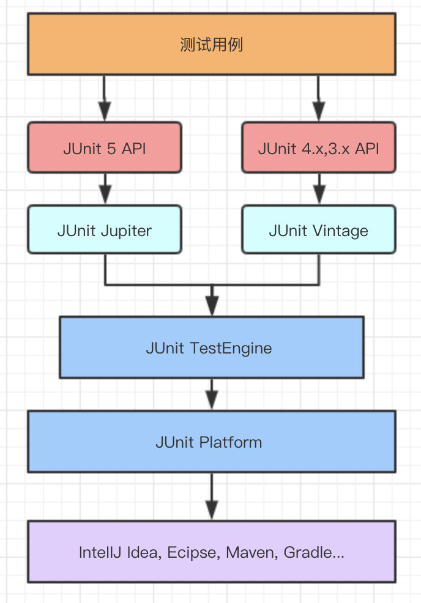

# 学习使用Junit 5进行单元测试

## 0. 前言

#### 基于教程

[单元测试框架-JUnit 5_哔哩哔哩_bilibili](https://www.bilibili.com/video/BV1MZ4y1w7fb?from=search&seid=8335046307141159001&spm_id_from=333.337.0.0)（发布时间：2021-03-29）

#### 参考教材

[Java单元测试之JUnit 5快速上手 - 闻人的技术博客 - 博客园](https://www.cnblogs.com/one12138/p/11536492.html)（发布时间：2019-09-17）

## 1. 单元测试介绍

假设现在有一条电脑组装生产线，它拥有组成一台电脑整机所需要的各种电子元器件。OK，开始组装。组装完成后，你却发现这台电脑无法正常启动，怎么办？这下麻烦了，你需要把电脑拆开，**逐级排查**各个部件。比如电脑A由部件B、C构成，检查B、C，发现是B出了问题；再看看B部件，由D、E两个小部件组成，检查D、E，发现是D出了问题；D部件又由F、G组成……

等等，为什么不在组装前，就先测试每一个要用到的电子元器件呢？这样我们就可以排除有问题的元器件，最大程度地避免组装完成后逐级排查的情况的发生。这就引出了单元测试的概念。

#### 软件测试有哪些？

电子元器件就像软件中的函数或者类，我们称之为**单元**，对单个电子元器件的测试，就像是软件测试中的**单元测试**。

组装完成的功能电路板就像是软件中的**模块**，对电路板的测试就像是软件测试中的**集成测试**。

电脑全部组装完成就像是软件完成了**预发布版本**，全部组装完成后的开机测试就像是软件中的**系统测试**。

#### 单元测试是什么？

单元测试是指：对软件中的**最小可测试单元**，在与程序其他部分相隔离的情况下，进行检查和验证的工作。

最小可测试单元通常是指函数或者类。

#### 进行单元测试的思路

* 检查代码的逻辑判断、循环、数据处理等是否正确
* 通过实际操作发现错误
  * 如果要实现正常的功能，会有哪些正常的输入，这些输入的输出结果是否正确
  * 是否有需要处理的边界输入
  * 各种潜在的非法输入

> 扩展资料：[单元测试用例概述_单元测试-CSDN博客](https://blog.csdn.net/easytdd/article/details/4736701)

## 2. 认识JUnit 5

#### JUnit 5是什么？

JUnit是一个**Java语言的单元测试框架**。

JUnit 5由多个不同的模块组成，而这些模块分属于三个子项目。

> **JUnit 5 = JUnit Platform + JUnit Jupiter + JUnit Vintage**
>
> - **JUnit Platform**： 用于JVM上启动测试框架的基础服务，提供命令行，IDE和构建工具等方式执行测试的支持。
> - **JUnit Jupiter**：包含 JUnit 5 新的编程模型和扩展模型，主要就是用于编写测试代码和扩展代码。
> - **JUnit Vintage**：用于在JUnit 5 中兼容运行 JUnit3.x 和 JUnit4.x 的测试用例。
>
> 基于上面的介绍，可以参考下图对 JUnit 5 的架构和模块有所了解：
>
> 

#### 导入JUnit 5依赖（Maven）

```xml
<dependency>
    <groupId>org.junit.jupiter</groupId>
    <artifactId>junit-jupiter-api</artifactId>
    <version>5.8.2</version>
    <scope>test</scope>
</dependency>
```

#### JUnit 5特性

* 提供全新的断言和测试注解，支持测试类内嵌；
* 更丰富的测试方式：支持动态测试，重复测试，参数化测试等；
* 实现了模块化，让测试执行和测试发现等不同模块解耦，减少依赖；
* 提供对Java 8的支持，如Lambda表达式，Stream API等。
* 与Junit 4相比，Junit 5提供了更强大的断言：
  * 异常断言：在JUnit 4中，想要测试方法的异常情况时，需要用@Rule注解的ExpectedException变量。而JUnit 5提供了一种新的断言方式Assertions.assertThrows()，配合函数式编程即可使用。
  * 超时断言：JUnit 5还提供了Assertions.assertTimeout()为测试方法设置了超时时间。

#### JUnit 5常用注解

注意，“测试方法”和”被测(试)方法“是两回事，我们会在”测试方法“中调用”被测方法“，对”被测方法“进行测试。

其实Java注解的源码往往非常简单（代码量少），遇到不懂的注解，只要你认真看源码和注释，基本上就能懂怎么用了。

| 注解               | 表示&作用                                  | 备注                                                         |
| ------------------ | ------------------------------------------ | ------------------------------------------------------------ |
| @Test              | 该方法是测试方法                           | 与JUnit 4的@Test不同的是，它的职责非常单一，不能声明任何属性。 |
| @Disabled          | 测试类或测试方法不执行                     | 类似于JUnit4中的@lgnore                                      |
| @DisplayName       | 为测试类或测试方法设置展示名称             |                                                              |
| @BeforeEach        | 在每个单元测试之前执行                     |                                                              |
| @AfterEach         | 在每个单元测试之后执行                     |                                                              |
| @BeforeAll         | 在所有单元测试之前执行                     |                                                              |
| @AfterAll          | 在所有单元测试之后执行                     |                                                              |
| @Tag               | 单元测试类别                               | 类似于JUnit4中的@Categories                                  |
| @Timeout           | 测试方法运行如果超过了指定时间将会返回错误 |                                                              |
| @ExtendWith        | 为测试类或测试方法提供扩展类引用           |                                                              |
| @ParameterizedTest | 该方法是参数化测试                         |                                                              |
| @RepeatedTest      | 该方法可重复执行                           |                                                              |


#### JUnit 5注解使用示例

下面是一个简单的JUnit 5测试用例。为了方便演示注解的使用效果，我们没有在测试方法里调用任何被测方法，只是简单地打印一些信息。

```java
package xyz.wuhang;

import org.junit.jupiter.api.*;

@DisplayName("我的第一个测试用例")
//假装它是用来测试XXX类的
public class XXXTest {

    @BeforeAll
    static void initAll() {
        System.out.println("在所有单元测试之前执行");
    }

    @BeforeEach
    void initEach() {
        System.out.println("在每个单元测试之前执行");
    }

    @Test
    @DisplayName("测试方法01")
    void firstTest() {
        System.out.println("正在执行测试方法01");
    }

    @Test
    //这里没有用@DisplayName注解，所以在测试结果(Test Results)中会直接展示方法名
    void SecondTest() {
        System.out.println("正在执行测试方法02");
    }

    @Test
    @Disabled
    @DisplayName("测试方法03")
    void skippedTest() {
        System.out.println("正在执行测试方法03（不会被执行）");
    }

    @AfterEach
    void tearDownEach() {
        System.out.println("tear down a test——在每个单元测试之后执行");
    }

    @AfterAll
    static void tearDownAll() {
        System.out.println("tear down all——在所有单元测试之后执行");
    }
}
```

我们运行一下测试用例，看看效果如何。


这里为什么02比01先执行，我其实也不太清楚，目前只知道JUnit不是以代码书写的先后作为测试方法的执行顺序。

> 扩展阅读：[junit测试方法执行顺序 - 掘金](https://juejin.cn/post/6844903832741216263)

另外注意几点：

* 测试类的命名建议以Test结尾

* 写`@Disabled`注解的时候，不要写成`@Disable`或`@Disabled()`，否则这个注解就失效了。

* 运行整个测试用例（类），和运行单个测试方法是有区别的，你可以通过点击方法头左边的绿色运行符号去运行该方法，此时即使加了`@Disabled`，该方法也会被执行。

## 3. Junit 5应用 

```xml
<dependency>
  <groupId>org.junit.jupiter</groupId>
  <artifactId>junit-jupiter-params</artifactId>
  <version>5.8.2</version>
  <scope>test</scope>
</dependency>
```


怎么用maven test