# 学习使用Maven构建项目

## 0. 前言

### 0.1 基于教程

[（超详细）2021最新Maven教程-Maven基础篇之Maven实战入门-最新IDEA版maven【半天快速掌握,附全套视频资料】_哔哩哔哩_bilibili](https://www.bilibili.com/video/BV1Fz4y167p5?p=2&spm_id_from=pageDriver)

> 发布时间：2021-01-12
>
> Maven版本：3.6.2
>
> IDEA版本：2019版（应该不超过2020）

### 0.2 参考教程&文档

[Maven教程 | 菜鸟教程](https://www.runoob.com/maven/maven-tutorial.html)

[Maven简介 | Maven教程网](http://mvnbook.com/index.html)

**文档：**

官方文档：[Maven– MavenDocumentation](https://maven.apache.org/guides/index.html)

中文翻译文档：[Maven中文手册](https://www.dba.cn/book/maven/)

### 0.3 本机环境

* Maven 3.8.4
* IDEA 2021.1.3
* JDK 11

## 1. Maven概述

### 1.1 Maven简介

**Maven是基于项目对象模型(Project Object Model, POM)，可以通过一小段描述信息来管理项目的构建，报告和文档的项目管理工具。**

这是推荐给纯新手的阅读材料，帮助理解。

> [如何给小白说明maven是什么？ - Martin Wang的回答 - 知乎](https://www.zhihu.com/question/32240102/answer/340029398)

这是推荐给所有学习者的阅读材料，质量超高，以致于我想整篇Copy过来......下面摘抄一段原文。

> 原文：[Maven简介 | Maven教程网](http://mvnbook.com/index.html)
>
> ## Maven读音
>
> Maven的正确发音是\[ˈmeɪvn\](美文)，而不是"马文"。Maven在美国是一个口语化的词语，代表专家、内行的意思，约等于北京话中的老炮儿。
>
> ## Maven的组成
>
> Maven是一个项目管理工具，它包含了：项目对象模型 (POM，Project Object Model)，项目生命周期(Project Lifecycle)，依赖管理系统(Dependency Management System)和各种插件。插件主要用来实现生命周期各个阶段(phase)的目标(goal)。Maven的组成如下所示：
>
> 
>
> ***不过，上述介绍对于完全没有 Maven实践经验的人来说，看了等于没看，并没有用处。只有当读者通读本站内容之后，反过头再看，才能豁然开朗。***
>
> ## 什么是项目构建？
>
> 构建是什么呢？简单地说，构建就是软件项目生产的整个过程，这个过程应该包括：
>
> （1）文档和代码的生成（有些项目会使用代码自动生成工具，比如数据库访问代码的逆向工程）
>
> （2）代码的编译、测试和打包
>
> （3）打包好的代码进行分发或者部署
>
> 由此可见，项目的构建可绝不仅仅是编译软件这件事情。除了写代码，在项目层面做的大部分工作，都包含在构建的过程中。
>
> 有了 Maven这个开源利器，构建中的这些过程都能够进行良好的定义，而且 Maven能够帮我们串起来形成一个自动构建过程，这样比我们手动执行要高效得多。
>
> ## 项目依赖管理的噩梦
>
> Java 最大的一个优势就是有非常强大的生态，整个生态中有无数的框架和API供人使用。我们在创建实际的项目过程中不可避免地需要用到这些框架和API，而它们通常都是以 Jar 包的形式提供。 相信很多人都经历过 Jar Hell 的问题吧。事实上，让一个项目所依赖的外部 Jar 包保持正确的版本和最新的状态，是件非常苦逼的事情。我们编译项目的时候，需要在 ClassPath 上存放依赖的 Jar 包，而这些 Jar 包还会有其他依赖。你一定经历过递归地一个个去下载所有外部依赖的痛苦过程吧，并且还要确保下载的版本都是正确的，当项目越来越复杂的时候，这是件极其麻烦的事情。
>
> Maven的出现让我们获得了解脱，Maven可以自动帮我们做依赖管理，我们需要做的就是在 POM 文件里指定依赖 Jar 包的名称、版本号，Maven会自动下载，并递归地去下载依赖的进一步依赖。
>
> 另外，Maven还提供一个非常方便的功能---快照依赖。快照依赖指的是那些还在开发中的内部依赖包。与其你经常地更新版本号来获取最新版本，不如直接依赖项目的快照版本。快照版本的每一个 Build 版本都会被下载到本地仓库，即使该快照版本已经在本地仓库了。使用快照依赖可以确保本地仓库中的每一个 Build 版本都是最新的，这对我们快速迭代开发是一个非常酷的特性。
>
> ## Maven学习要求
>
> Maven是 Java 项目构建工具，可以用于管理 Java 依赖，还可以用于编译、打包以及发布 Java 项目，类似于 JavaScript 生态系统中的 NPM。因此，每一位高级工程师或软件架构师，都应该至少具备以下两项 Maven技能：
>
> （1）熟练使用 Maven构建项目；
>
> （2）排查并调解项目依赖冲突；

### 1.2 Java世界的项目构建工具

**Ant**

最早的构建工具。大概是2000年出的，是当时最流行的Java项目构建工具。它的缺点是其XML脚本编写格式使得XML文件特别大。

Ant比较老，现在一般是一些传统的软件企业公司在使用。

**Maven**

填补了Ant的缺点，但仍然采用XML作为配置文件格式。Maven第一次支持了从网络上下载的功能。

Maven使用纯Java编写，是当下大多数互联网公司使用的一个构建工具，中文文档也比较齐全。

**Gradle**

吸收了以上两个的优点，比如Ant的灵活和Maven的生命周期管理。被google作为android的管理工具。Gradle不用XML，而是采用DSL作为配置文件格式，使得脚本更加简洁。

Gradle使用groovy编写，是目前比较新型的构建工具。

**我总结一下：**

Ant太老了，没人用；Maven目前是主流，稳定可靠；Gradle比较新，和Maven各有千秋。初学者知道这些就够了。

关于这几个构建工具的对比，尤其是Maven和Gradle，网上有大把讨论分析，感兴趣可以查查看——当然这对初学者来说是没有任何意义的。

### 1.3 Maven的4大特性

**依赖管理系统**

在Maven中，可以用groupId、artifactId、version组成的“坐标”唯一标识一个依赖，任何基于Maven构建的项目自身也**必须定义**这三个属性。

Maven为Java世界引入了一个新的依赖管理系统。当项目需要引入一个外部依赖，只需在配置文件里添加几行；当项目所依赖的jar包升级时，只需修改配置文件的其中一行即可。

**多模块构建**

在Maven中，可以为当前项目定义一个parent POM（实际上是一个pom.xml文件），该POM中可以使用modules配置来定义一组子模块。parent POM不会有实际构建的产出，但parent POM中的build配置以及dependencies配置都会自动继承给子模块。

**一致的项目结构**

Ant时代大家创建Java项目目录时比较随意，并通过Ant配置指定哪些属于source，哪些属于testSource等。

而Maven在设计之初的理念就是“约定大于配置”(Conversion over configuration)。Maven制定了一套项目目录结构作为标准的Java项目结构，解决了不同IDE带来的文件目录不一致的问题。

**一致的构建模型和插件机制**

略

> 扩展阅读：[Maven和Gradle对比 - 黄博文 - 博客园](https://www.cnblogs.com/huang0925/p/5209563.html)

### 1.4 Maven的坐标

**groupId**

定义了当前项目属于哪个“组”，这个“组”的名称往往与项目隶属的公司/组织名称有关，其命名通常是该公司/组织的域名反写。

**artifactId**

定义了当前项目在“组”中唯一的Id，即项目名。

**version**

当前项目的版本。

> 版本格式通常为：x.x.x-里程碑（了解即可）
>
> * 第一个x：大版本，有重大变革
> * 第二个x：小版本，修复bug或增加功能
> * 第三个x：小修改或小更新
> * 里程碑：
>   * SNAPSHOT：快照，开发版
>   * alpha：内部测试
>   * beta：公开测试
>   * Release/RC：发布版
>   * GA：正常版本

## 2. Maven环境配置

### 2.1 下载Maven

下载地址：[Maven– Download Apache Maven](https://maven.apache.org/download.cgi)

### 2.2 配置环境变量

下载.zip后解压到任意目录，然后配一个环境变量MAVEN_HOME指向Maven的安装目录（也可以直接指向bin目录，不过这样不太规范，所谓的"HOME"应该是指安装目录，即bin的上一级），最后再把**%MAVEN_HOME%\bin**加进Path环境变量中。

在命令行运行`mvn -v`检查是否配置成功。

如果出现这种情况：

```bash
Matty's PC@DESKTOP-E8M9L15 MINGW64 ~/Desktop
$ java -version		#给Java配的环境变量能用
java version "11.0.13" 2021-10-19 LTS
Java(TM) SE Runtime Environment 18.9 (build 11.0.13+10-LTS-370)
Java HotSpot(TM) 64-Bit Server VM 18.9 (build 11.0.13+10-LTS-370, mixed mode)

Matty's PC@DESKTOP-E8M9L15 MINGW64 ~/Desktop
$ mvn -v			#给Maven配的环境变量却用不了，说JAVA_HOME配错了
The JAVA_HOME environment variable is not defined correctly,
this environment variable is needed to run this program.
```

说明你把JAVA_HOME环境变量指向了jdk的bin目录里了，这也是不太规范的。

推荐的解决方法：把JAVA_HOME指向bin目录的上一级，再改一下Path就好了。

### <a id="2.3">2.3 修改settings.xml</a>

第一次使用Maven下载之前，要修改conf目录下的配置文件settings.xml。

可以在\<localRepository\>里更改默认下载位置：

> 后面我们会提到本地仓库(localRepository)的概念，说白了就是Maven存放“下载下来的东西”的目录而已。我们现在改的就是本地仓库的位置。

```xml
<!-- 这是原有的注释 -->
<!-- localRepository
| The path to the local repository Mavenwill use to store artifacts.
|
| Default: ${user.home}/.m2/repository
<localRepository>/path/to/local/repo</localRepository>
-->

<!-- 加上这行，更改默认下载位置 -->
<localRepository>/C:/Java/.m2/repository</localRepository>
```

可以在\<mirrors\>里添加阿里巴巴的镜像源，提高下载速度：

```xml
<mirrors>
    <!-- 这是原有的注释 -->
    <!-- mirror
     | Specifies a repository mirror site to use instead of a given repository. The repository that
     | this mirror serves has an ID that matches the mirrorOf element of this mirror. IDs are used
     | for inheritance and direct lookup purposes, and must be unique across the set of mirrors.
     |
    <mirror>
      <id>mirrorId</id>
      <mirrorOf>repositoryId</mirrorOf>
      <name>Human Readable Name for this Mirror.</name>
      <url>http://my.repository.com/repo/path</url>
    </mirror>
     -->
    
    <!-- 加上这段，添加镜像源 -->
    <mirror>
      <id>nexus-aliyun</id>
      <mirrorOf>central</mirrorOf>
      <name>Nexus Aliyun</name>
      <url>https://maven.aliyun.com/nexus/content/groups/public/</url>
    </mirror>
</mirrors>
```

## 3. Maven项目的目录结构

在所有的IDE中创建的Maven项目的目录结构都是一模一样的，不存在目录不兼容问题。

| 目录                                  | 存放                                    |
| ------------------------------------- | --------------------------------------- |
| ${basedir}                            | pom.xml和所有子目录                     |
| ${basedir}/src/main/java              | 项目的Java源码                          |
| ${basedir}/src/main/resources         | 项目的资源文件，如.property文件、图片等 |
| ${basedir}/src/test/java              | 测试使用的Java源码                      |
| ${basedir}/src/test/resources         | 测试使用的资源文件                      |
| ${basedir}/target（自动生成）         | 所有输出物                              |
| ${basedir}/target/classes（自动生成） | 编译后的class文件                       |

* pom.xml是最为核心的配置文件，记录该Maven项目所需要的所有jar包的依赖，和所有插件的依赖。
* 以上所有目录的命名和层次结构都是固定的，注意不要写错大小写和单复数。

## 4. 使用Maven手动创建项目

### 4.1 创建项目目录结构

*学习建议：“手动”两字已经说明这一小节仅仅只是为了加深理解所做的小任务，实际工作中根本不需要我们手动创建目录，也不用手动编写整个pom.xml文件（更不用背/默写），只要能够看懂、会用就好了。*

先根据上一节的内容，手动创建相对应的目录，再在src/main/java里手动创建对应的包目录，写一个简单的.java文件

```java
package xyz.wuhang.demo;

public class HelloWorld {
	public static void main(String[] args) {
		System.out.println("Hello Maven!");
	}
}
```

### 4.2 创建pom.xml

在根目录手动写一个测试用的pom.xml文件，完整内容如下：

> 参考资料：[MavenPOM | 菜鸟教程](https://www.runoob.com/maven/maven-pom.html)

```xml
<!--这几行内容都是固定要这么写的，不用管-->
<?xml version="1.0" encoding="utf-8"?>
<project xmlns="http://maven.apache.org/POM/4.0.0"
         xmlns:xsi="http://www.w3.org/2001/XMLSchema-instance"
         xsi:schemaLocation="http://maven.apache.org/POM/4.0.0
                             http://maven.apache.org/xsd/maven-4.0.0.xsd">    
    <!--Maven3和Maven2都必须用4.0.0的modelVersion，也是固定要这么写的，不用管-->
    <modelVersion>4.0.0</modelVersion>
    
    
    <!-- artifactId和group ID一起唯一标识一个构件。换句话说，你不能有两个不同的项目拥有同样的artifact ID和groupID；
	并且，在某个特定的group ID下，artifact ID也必须是唯一的 -->
    <groupId>xyz.wuhang</groupId>
    <artifactId>AMarvenProject</artifactId>
    <!--项目当前版本。一般格式为:主版本.次版本.增量版本-限定版本号 -->
    <version>0.0.1-SNAPSHOT</version>
	<!--项目产生的构件类型。包括但不限于jar、war、ear、pom-->
    <packaging>jar</packaging>
    
    
    <!--项目的名称, Maven产生的文档用 -->
    <name>mavenPrj01</name>
    <!--项目主页的URL, Maven产生的文档用 -->
    <url>http://maven.apache.org</url>
    
    
    <properties>
        <project.build.sourceEncoding>UTF-8</project.build.sourceEncoding>
    </properties>
    
    
    <!--该元素描述了项目需要的所有依赖。 -->
    <dependencies>
        <!-- 这只是举个例子，如果你不需要junit，可以删掉这个dependency -->
        <dependency>
            <!--依赖的group ID -->
            <groupId>junit</groupId>
            <!--依赖的artifact ID -->
            <artifactId>junit</artifactId>
            <!--依赖的版本号。 -->
            <version>3.8.1</version>
            <!--依赖范围。在项目发布过程中，帮助决定哪些构件被包括进来。 -->
            <scope>test</scope>
        </dependency>
    </dependencies>
    
    
</project>
```

### 4.3 编译Java文件

项目根目录下管理员cmd执行：

```shell
mvn compile
```

编译成功后会出现**BUILD SUCCESS**

* 可能的报错1

  ```xml
  C:\Users\Matty's PC\Desktop\AMavenProject>mvn compile
  [INFO] Scanning for projects...
  [ERROR] [ERROR] Some problems were encountered while processing the POMs:
  [FATAL] Non-parseable POM C:\Users\Matty's PC\Desktop\AMavenProject\pom.xml: processing instruction can not have PITarget with reserved xml name (position: START_DOCUMENT seen <!--\u8fd9\u90e8\u5206\u5185\u5bb9(2-6\u884c)\u90fd\u662f\u56fa\u5b9a\u8981\u8fd9\u4e48\u5199\u7684\uff0c\u4e0d\u7528\u7ba1-->\r\n<?xml ... @2:7)  @ line 2, column 7
  ...
  ```

  报错原因：pom.xml文件的第一行写了中文注释——这是不可以的（哪怕注释格式正确），因为xml文件的第一行必须是XML文档声明，也就是\<xml\>那堆东西。

  解决方法：删除第一行注释。其他地方怎么写注释都没事，但第一行必须是\<xml>开头。

* 可能的报错2

  ```xml
  ...
  [ERROR] Failed to execute goal org.apache.maven.plugins:maven-compiler-plugin:3.1:compile (default-compile) on project AMarvenProject: Compilation failure: Compilation failure:
  [ERROR] 不再支持源选项 5。请使用 6 或更高版本。
  [ERROR] 不再支持目标选项 1.5。请使用 1.6 或更高版本。
  ...
  ```

  报错原因：没有正确指定JDK版本。

  解决方法：在pom.xml中添加如下的属性。

  ```xml
  <properties>
      <!-- 填入你所使用的jdk版本（如1.8、11、14等等） -->
      <maven.compiler.target>11</maven.compiler.target>
      <maven.compiler.source>11</maven.compiler.source>
  </properties>
  ```

### 4.4 执行main方法

项目根目录下管理员cmd执行：

```shell
mvn exec:java -Dexec.mainClass="main方法所在主类的包路径，如xyz.wuhang.demo"
```

执行成功后会出现运行结果（比如打印出一句“Hello Maven!”），当然也会出现**BUILD SUCCESS**

* 可能的报错1

  ```shell
  ...
  [WARNING]
  java.lang.ClassNotFoundException: xyz.wuhang.demo.HelloWorld
      at java.net.URLClassLoader.findClass (URLClassLoader.java:476)
      at java.lang.ClassLoader.loadClass (ClassLoader.java:588)
      at java.lang.ClassLoader.loadClass (ClassLoader.java:521)
      at org.codehaus.mojo.exec.ExecJavaMojo$1.run (ExecJavaMojo.java:246)
      at java.lang.Thread.run (Thread.java:834)
  [INFO] ------------------------------------------------------------------------
  [INFO] BUILD FAILURE
  [INFO] ------------------------------------------------------------------------
  [INFO] Total time:  0.442 s
  [INFO] Finished at: 2022-01-18T17:00:04+08:00
  [INFO] ------------------------------------------------------------------------
  [ERROR] Failed to execute goal org.codehaus.mojo:exec-maven-plugin:3.0.0:java (default-cli) on project AMarvenProject: An exception occured while executing the Java class. xyz.wuhang.demo.HelloWorld -> [Help 1]
  ...
  ```

  报错原因：.java文件不能放在src/**test**/java里，那样虽然编译能通过，但运行会报java.lang.ClassNotFoundException。

  > 压根编译的时候压根就没编译到它，相当于啥都没编译，当然能“编译通过”。
  >
  > 但执行时就找不到了，因为执行命令`mvn exec:java -Dexec.mainClass="xyz.wuhang.demo.HelloWorld"`是去src/**main**/java里找类的。
  
  解决方法：把.java文件移到src/main/java对应的包目录下。

## 5. Maven命令

虽然IDEA等工具为我们提供了图形界面化工具，但其底层还是依靠命令来驱动的，因此了解并熟练运用Maven的命令行操作是很有必要的。

*学习建议：命令这个部分在第一次学习时搞不懂是正常的，毕竟没有真正用过。只需要了解大概的概念，保证后面遇到的时候不陌生即可，等用到的时候再回来看，加深理解。*

### 5.1 Maven命令格式

```
mvn [plugin-name]:[goal-name]
```

建议在项目目录（也就是pom.xml所在目录）下运行Maven命令，否则必须通过参数来指定项目目录。

### 5.2 常用命令表

*学习建议：命令看得多、用得多，就记住了，不用纠结于全部记下来*

| 命令                     | 作用                                                         |
| ------------------------ | ------------------------------------------------------------ |
| mvn -version (或Maven-v) | 打印Maven的版本信息                                          |
| mvn clean                | 清理项目产生的临时文件（实际效果是删除项目目录下的target目录） |
| mvn compile              | 编译src/main/java目录下的源代码                              |
| mvn package              | 打包项目（会在target目录下生成jar/war包）                    |
| mvn deploy               | 部署项目，将项目的jar/war包发布到远程供其他人下载使用        |
| mvn test                 | 执行src/test/java目录下junit的测试用例                       |
| mvn install              | 将项目需要的jar/war包**复制到本地仓库**以供使用              |
| mvn site                 | 生成项目相关信息的网站                                       |
| mvn eclipse:eclipse      | 将项目转化为Eclipse项目                                      |
| mvn dependency:tree      | 以树结构打印出项目中的依赖                                   |
| mvn archetype:generate   | 根据模板创建一个Java项目                                     |
| mvn tomcat7:run          | 在Tomcat7容器中运行web应用                                   |
| mvn jetty:run            | 在Jetty Servlet容器中运行web项目                             |

> Jetty是一个小型服务器，常用于开发端，因为它启动比较快，便于调试。

### 5.3 命令参数-D和-P

很多命令都可以携带参数，以完成更精准的任务。例如`mvn package -Dmaven.test.skip=true`，表示打包项目并跳过单元测试。同理`mvn deploy -Dmaven.test.skip=true`表示部署项目并跳过单元测试。

对不起，我要直接抄这篇文档了，写得实在太好了。

> 原文：[Maven参数配置 | Maven教程网](http://mvnbook.com/maven-properties.html)
>
> Maven命令参数 中的 -D 表示 Properties属性，而 -P 表示 Profiles配置文件。
>
> ## Maven命令参数-D和-P的区别
>
> -D 表示设置 Properties属性，使用命令行设置属性 -D 的正确方法是：
>
> ```
> mvn -DpropertyName=propertyValue clean package
> ```
>
> 如果 propertyName 不存在于 pom.xml 文件中，它将被设置。如果 propertyName 已经存在 pom.xml 文件中，其值将被作为参数传递的值覆盖。要设置多个变量，请使用多个空格分隔符加-D：
>
> ```
> mvn -DpropA=valueA -DpropB=valueB -DpropC=valueC clean package
> ```
>
> 例如，现有 pom.xml 文件如下所示：
>
> ```
> <properties>
>  	<theme>myDefaultTheme</theme>
> </properties>
> ```
>
> 那么在执行过程中 mvn -Dtheme=newValue clean package 会覆盖 theme 的值，具有如下效果：
>
> ```
> <properties>
>  	<theme>newValue</theme>
> </properties>
> ```
>
> -P 代表 Profiles 配置文件的属性，也就是说在 <profiles> 指定的 <id> 中，可以通过-P进行传递或者赋值。
>
> 例如，现有 pom.xml 文件如下所示：
>
> ```
> <profiles>
>        <profile>
>            <id>test</id>
>            ...
>        </profile>
> </profiles>
> ```
>
> 执行 mvn test -Ptest 为触发配置文件。或者如下所示：
>
> ```
> <profile>
> 	<id>test</id>
> 
>     <activation>
>            <property>
>               <name>env</name>
>               <value>test</value>
>            </property>
>     </activation>
>     ...
> </profile>
> ```
>
> 执行mvn test -Penv=test 为触发配置文件。

### 5.4 Maven命令深度理解

对不起，我又要直接抄了，这篇文档写得也很好！

> 原文：[Maven命令深度理解 | Maven教程网](http://mvnbook.com/maven-command.html)
>
> Maven命令看起来简单，一学即会 。其实，Maven命令底层是插件的执行过程。
>
> 了解插件和插件目标才有助于深刻的理解 Maven命令。
>
> ## 插件与命令的关系
>
> Maven本质上是一个插件框架，它的核心并不执行任何具体的构建任务，所有这些任务都交给插件来完成。
>
> 
>
> Maven实际上是一个依赖插件执行的框架，每个任务实际上是由插件完成。所以，Maven命令都是由插件来执行的。
>
> ## Maven命令的分类
>
> Maven提供了两种类型的命令。一种必须在项目中运行，视为项目命令；另外一种则不需要，视为全局命令。
>
> ## Maven命令格式解读
>
> Maven命令都是由插件来执行的，其语法格式如下所示：
>
> ```
> mvn [plugin-name]:[goal-name]
> ```
>
> 例如，下面的命令：
>
> ```
> mvn help:effective-pom
> ```
>
> 这个命令采用了缩写的形式，其全称是这样的：
>
> ```
> org.apache.maven.plugins:maven-help-plugin:2.2:effective-pom
> ```
>
> 此命令以分号为分隔符，包含了 groupId，artifactId，version，goal 四部分。若 groupId 为 org.apache.maven.plugins 则可以使用上述的简写形式，也就是说和下面的命令是等价的：
>
> ```
> mvn help:effective-pom
> 
> mvn org.apache.maven.plugins:maven-help-plugin:2.2:effective-pom
> ```
>
> 都是执行了 maven-help-plugin 这个 plugin 中的 effective-pom 这个 goal。每次都要敲这么长一串命令是很繁琐的，因此才有了上述的简写的形式。
>
> > **提醒：**Maven命名有要求，Maven团队维护官方插件的保留命名方式是 maven-<myplugin>-plugin。

## 6. IDEA集成Maven环境

### 6.1 更改IDEA全局设置

对于2019及2019之前版本的IDEA，是打开File -> Other Settings -> Settings For New Projects

对于2021.1.3版本的IDEA（本机实测），是打开File -> New Projects Setting -> Settings For New Projects

> 为什么不改File -> Settings？因为它可能只对当前项目有效，下一次新建项目又要重新设置。

找到Build, Execution, Deployment -> Build Tools > Maven，或直接搜索"Maven"

把Mavenhome path改成我们自己安装的Maven的MAVEN_HOME（默认设置的是IDEA自带的那个MAVEN），然后把User Settings file和Local repository都改一下（选中下面两个Override才能改），如图所示。


### 6.2 使用Maven创建Java项目

#### 6.2.1 新建Project并选择Maven项目模板，Next

选择Maven的最普通最基础的Java项目模板**maven-archetype-quickstart**进行创建即可，如图。

> 扩展资料：
>
> [Maven三种archetype说明_我是程序媛，我骄傲-CSDN博客_maven-archetype-quickstart](https://blog.csdn.net/cx1110162/article/details/78297654)
>
> [Maven的41种骨架功能介绍 - _zao123 - 博客园](https://www.cnblogs.com/iusmile/archive/2012/11/14/2770118.html)


#### 6.2.2 设定项目的GroupId和ArtifactId，Next

<a id="设定项目的GroupId和ArtifactId"></a>

#### 6.2.3 检查Maven环境，Finished


#### 6.2.4 创建资源文件夹

根据quickstart模板创建的src目录中是没有resources的，所以我们需要手动创建resources目录，并把它mark为资源文件。


也可以Ctrl+Alt+Shift+S一套组合拳调出Project Structure设置，在那里操作。


#### 6.2.5 修改pom.xml (quickstart通用操作)

> 针对Java项目的pom.xml修改方案，是所有用quickstart模板创建的项目的通用操作。

* **必须把JDK版本从默认的1.7改成你正在使用的版本**

* 可以删除多余的junit依赖

* 可以删除多余的\<pluginManagement>配置（可以把标签块折叠起来再删，避免误删）

  > \<pluginManagement>为什么是多余的？
  >
  > \<pluginManagement>一般是用在父pom中的，有点Java抽象类的意思，只是一种声明，实际上Maven并不会为当前项目下载里面的那些插件。所以，如果你构建的不是多模块项目，或者虽然构建了多模块项目但是没有什么需要被子模块继承的插件声明，或者你压根不知道什么是多模块项目，那么这个配置对你来说就是多余的。
  >
  > 扩展资料：
  >
  > [Maven中plugins和pluginManagement的区别 - hxwang - 博客园](https://www.cnblogs.com/whx7762/p/8072755.html)
  >
  > [java - What is pluginManagement in Maven's pom.xml? - Stack Overflow](https://stackoverflow.com/questions/10483180/what-is-pluginmanagement-in-mavens-pom-xml)

#### 6.2.6 设置命令

以设置编译命令为例，直接上图：


**总结一下：**

你可以在在运行按钮旁边的Add Configuration或Edit Configuration那里自定义一个或多个命令（要点击“+”，否则你只是修改了原来的命令，而不是新增了新命令）。

对于常见的基本Maven命令，也可以在右侧栏点开"Maven"，直接点击执行你想要的命令。

**什么原理？**

假设，你新建了一个命令，Name叫做"just run"，Command Line设为"exec:java -Dexec.mainClass="xyz.wuhang.App"。保存好设置后，你运行这条命令的效果，等同于你在项目目录下使用命令行输入"mvn exec:java -Dexec.mainClass="xyz.wuhang.App"。

说白了，和在命令行输入没有任何区别，只不过IDEA帮你省去了手动输入那一步。

### 6.3 使用Maven创建Web项目

#### 6.3.1 创建

选择**maven-archetype-webapp**模板即可，其他步骤与创建Java项目没什么区别。

#### 6.3.2 修改pom.xml (webapp通用操作)

> 针对Web项目的pom.xml修改方案，是所有用webapp模板创建的项目的通用操作。

还要在pom.xml里修改一下配置信息

1. 先进行6.2.5的quckstart通用操作

2. 然后在build标签块的plugins标签块里添加插件声明（webapp要多配置一个服务器插件），如下

   ```xml
   ......
   <build>
       ......
       <!-- 加上 -->
       <plugins>
           <!-- jetty插件 -->
           <plugin>
               <groupId>org.eclipse.jetty</groupId>
               <artifactId>jetty-maven-plugin</artifactId>
               <version>9.4.11.v20180605</version>
   			<!-- configuration部分可以不写，那样会采用默认设置 -->
               <configuration>
                   <!-- 热部署，每10秒扫描一次 -->
                   <scanIntervalSeconds>10</scanIntervalSeconds>
                   <webAppConfig>
                       <!-- 此处为项目的访问路径(contextPath上下文路径) -->
                       <contextPath>/test111</contextPath>
                   </webAppConfig>
               </configuration>
           </plugin>
           
           <!-- tomcat插件 -->
           <plugin>
               <groupId>org.apache.tomcat.maven</groupId>
               <artifactId>tomcat7-maven-plugin</artifactId>
               <version>2.2</version>
   			<!-- 同理，configuration部分也可以不写，那样会采用默认设置 -->
               <configuration>
                   <!--此处配置了访问的端口号 -->
                   <port>8081</port>
                   <path>/test222</path>
                   <!-- 默认为ISO-8859-1 -->
                   <uriEncoding>UTF-8</uriEncoding>
               </configuration>
   		</plugin>   
       </plugins>
   </build>
   ......
   ```

然后IDEA会自动扫描并下载项目需要的插件，这个过程可以在底部栏的Build里看到，如图：


不过好像只有刚打开IDEA的时候才会自动扫描、下载。如果不想反复重启IDEA的话，也可以执行一下Maven的`install`命令。

#### 6.3.3 启动

**设置命令`jetty:run`，表示以jetty方式运行项目。**

5.1命令格式没忘吧？jetty是plugin-name，run是goal-name。

6.2.5设置命令的原理没忘吧？本质上只是在命令行输入这条命令并回车而已。

**也可以设置命令`jetty:run -Djetty.port=9090`。**

5.3的-D命令参数没忘吧？这条命令相当于执行jetty:run命令时把jetty.port的值设置为9090，但设置生效的时间仅限于这条命令执行期间——下次运行的port值还是默认的8080（如果不带上-D的话）。

* 可能的报错1

  按照原视频教学用的jetty插件配置（如下，这是原来的），在我的本机环境下会报500错误，说无法编译jsp文件。在排除掉JDK不匹配的问题后仍然报错。经评论区大佬@80388400963_bili提醒，改成比较新的版本就好了（上面配置写的就是改过的，能用的）
  

#### 6.3.4 如何获取插件信息

Q: 虽然不用自己下载，但我们怎么找需要的插件版本和名称呢？

A: 我们可以在这里找：[Maven– Available Plugins](https://maven.apache.org/plugins/index.html)，也可以去对应软件（比如Tomcat）的官网，找到"MavenPlugin"栏目就可以了。

Q: 找到之后呢？

A: 只需要**复制一段配置代码**放到自己项目的pom.xml就可以了。官网一般会有指引，并给出各个配置选项的详细说明。

### 6.4. 使用Maven创建多模块项目

利用Maven提供的多模块构建的特性，管理与构建Maven环境下的多模块项目。

> 这里我们说的“模块”，是相对于整个“大项目”来说的，但在这里每一个模块本身也是一个“小项目”。
>
> 所以在这一节中我们可能会混用“模块”和“项目”这两个词。

下面以四个模块为例来搭建项目，便于理解。

* 模块maven_parent：父模块
  * 模块maven_dao：数据库访问层
  * 模块maven_service：业务逻辑层
  * 模块maven_controller：用来接收请求，响应数据

> 这其实展现了一个典型的Java Web项目的dao, service, controller三层架构。
>
> 搞不懂这三个模块的作用？没关系，这里我们要学的是如何用Maven创建多模块项目并让它跑起来，而不是学这个项目的架构要如何设计，有什么优缺点。所以大概了解一下这三层架构的概念就好了，不必深究。而且以后学Spring的时候也会遇到的，到时候可以在实际应用中进一步加深理解。

#### 6.4.1 创建maven_parent项目

File -> New -> Project -> Maven，**创建的时候不要使用模板**，Next，然后设置groupId和artifactId，Finished。

#### 6.4.2 创建maven_dao项目

选中你创建好的maven_parent项目，右键New -> Module -> Maven，**使用maven-archetype-quickstart模板**，Next，然后设置groupId（与父模块的groupId一致）和artifactId，Next，Finished。

#### 6.4.3 创建maven_service项目

与创建maven_dao项目的步骤完全一致，只不过改一下artifactId。

#### 6.4.4 创建maven_controller项目

与创建maven_dao项目的步骤基本一致，只不过改一下artifactId，还有模板也要改一下，**使用maven-archetype-webapp模板**。

模块全部创建完成后，效果如图：


#### 6.4.5 修改模块的pom.xml

按照6.2.5的quickstart通用操作和6.3.2的webapp通用操作，修改三个子模块各自对应的pom.xml。

至于父模块，创建的时候没有使用模板，创建之后也不需要自己修改pom.xml，保持默认就好，剩下的IDEA都帮我们做了。

#### 6.4.6 设置模块之间的依赖

简单来说，三个子模块的依赖关系是这样的：

* controller依赖service（controller要调用service的方法）
* service依赖dao（service要调用dao的方法）
* dao不依赖任何人，因为它是最底层的，只会被别人调用

我们先在**maven_dao**/src/main/java目录的xyz.wuhang包下新建dao包，在包里新建UserDao类，写一个静态方法，方便调用。

```java
package xyz.wuhang.dao;

public class UserDao {
    public static void test() {
        System.out.println("UserDao test...");
    }
}
```

然后在**maven_service**/src/main/java目录的xyz.wuhang包下新建service包，在包里新建UserService类，同样写一个静态方法。

```java
package xyz.wuhang.service;

import xyz.wuhang.dao;

public class UserService {
    public static void test() {
        System.out.println("UserService test...");
        //调用maven_dao模块的方法
        UserDao.test();
    }
}
```

出问题了！maven_service根本用不了maven_dao里的东西：

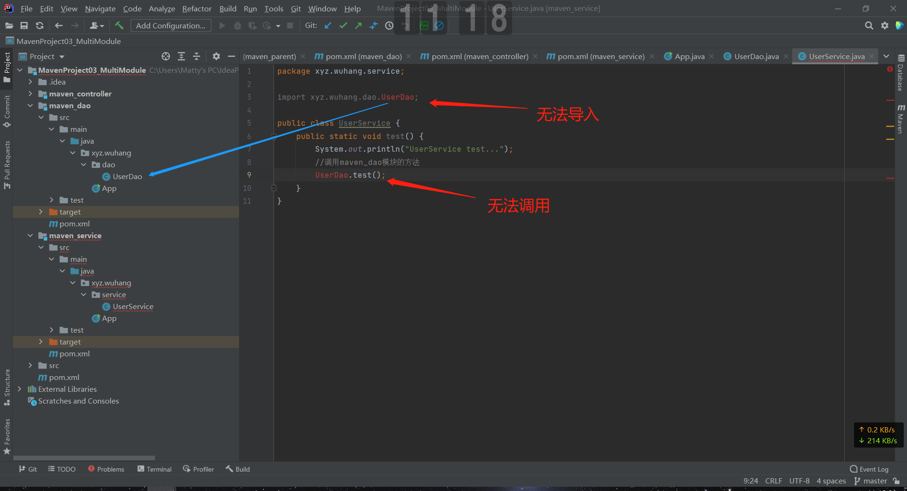

那是因为我们还没有配置依赖呀！

去maven_dao的pom.xml找到它的坐标并复制，

```xml
<groupId>xyz.wuhang</groupId>
<artifactId>maven_dao</artifactId>
<version>1.0-SNAPSHOT</version>
```

然后在maven_service的pom.xml的\<dependencies>里，新建一个\<dependency>标签块，把上面的坐标复制过去，

```xml
<dependencies>
    <!-- 这个依赖是原来就有的，也算是一个引入依赖的格式参考 -->
    <dependency>
		<groupId>junit</groupId>
        <artifactId>junit</artifactId>
        <version>4.12</version>
        <scope>test</scope>
    </dependency>
    <!-- 这个依赖是我们自己加的 -->
    <!-- 引入maven_dao模块的依赖 -->
    <dependency>
        <groupId>xyz.wuhang</groupId>
        <artifactId>maven_dao</artifactId>
        <version>1.0-SNAPSHOT</version>
    </dependency>
</dependencies>
```

然后刷新一下（可以重启IDEA）就能用啦！

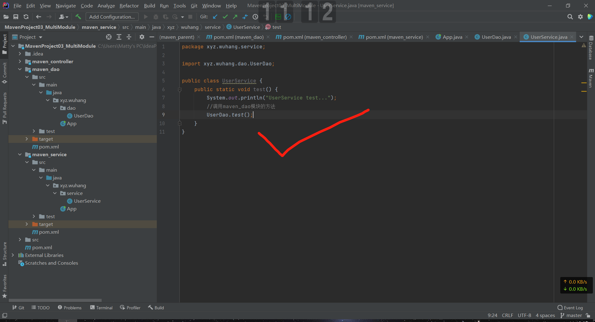

再看**maven_controller**。有了上面报红的教训，这次我们先去它的pom.xml配置一下所需要的依赖，包括maven_service和servlet。

```xml
<dependencies>
	......
    <!-- 引入maven_service模块的依赖 -->
    <dependency>
        <groupId>xyz.wuhang</groupId>
        <artifactId>maven_service</artifactId>
        <version>1.0-SNAPSHOT</version>
    </dependency>
    <!-- 引入servlet的依赖 -->
	<!-- https://mvnrepository.com/artifact/javax.servlet/javax.servlet-api -->
    <dependency>
        <groupId>javax.servlet</groupId>
        <artifactId>javax.servlet-api</artifactId>
		<version>3.1.0</version>
		<scope>provided</scope>
	</dependency>
</dependencies>
```

然后我们自己去**maven_controller**/src/main目录下新建一个java目录（因为webapp模板不会像quickstart模板一样自动给我们创建这个java目录）并mark为source root，然后新建xyz.wuhang.controller包，在包里新建一个Servlet：

```java
package xyz.wuhang.controller;

import xyz.wuhang.service.UserService;
import xyz.wuhang.dao.UserDao;

import javax.servlet.ServletException;
import javax.servlet.annotation.WebServlet;
import javax.servlet.http.HttpServlet;
import javax.servlet.http.HttpServletRequest;
import javax.servlet.http.HttpServletResponse;
import java.io.IOException;

@WebServlet("/user")
public class UserServlet extends HttpServlet {
    @Override
    protected void service(HttpServletRequest req, HttpServletResponse resp) throws ServletException, IOException {
        System.out.println("UserServlet test...");
        //调用maven_service模块的方法
        UserService.test();
    }
}
```

#### 6.4.7 启动项目

还记得我们在创建三个子模块时选用的模板吗？maven_dao和maven_service都是quickstart，相当于6.2的Java项目，而maven_controller是webapp，相当于6.3的Web项目。没错，我们要启动的正是Web项目。

> 那么其他两个模块就没用了吗？
>
> 我们先简化一下问题吧：假设你的父项目（相当于maven_parent）里有a、b两个模块（相当于maven_controller、maven_service）。
>
> 我们知道a依赖b，但是当a正常运行时，b项目似乎并没有在运行。换句话说，当a正在运行的时候，你就算把b的整个目录从磁盘上删掉，a都能继续正常运行！没有任何影响！这是为什么？
>
> 回顾一下7.1Maven加载项目所需构件的机制——“当Maven根据坐标寻找构件的时候，它首先会查看本地仓库，如果本地仓库存在则直接使用”。没错，在a开始运行之前，Maven就已经把指定版本的b打包成jar包存放在本地仓库了，a运行时用的是那个jar包，所以才造成“把b删掉，a还能运行”的假象。事实上，如果你删的是本地仓库里的b，那样就会影响a的运行了。

设置命令时注意一下Working Direcory，要选择maven_controller。

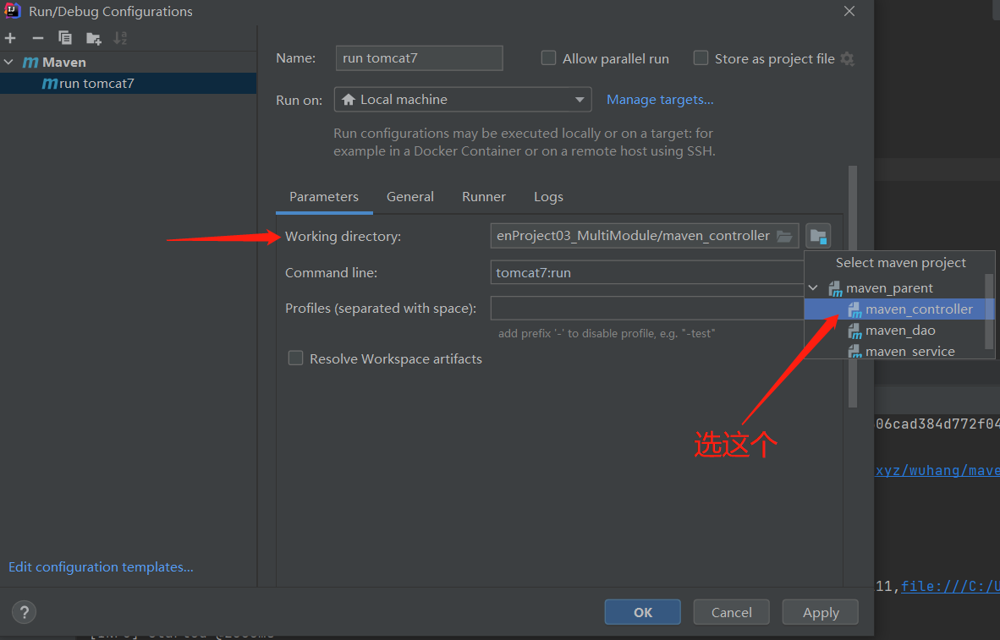

成功运行后，访问一下http://localhost:8081/test222/user，正常的显示页面当然是空白的，只会在控制台输出。效果如下：

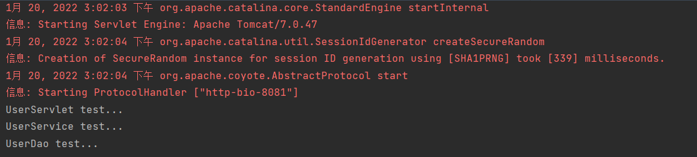

## 7. Maven仓库的基本概念

#### 7.1 本地仓库与远程仓库

对于Maven来说， 仓库只分为两类： **本地仓库**和**远程仓库**。

当Maven根据坐标寻找构件的时候，它首先会查看本地仓库，如果本地仓库存在则直接使用；如果不存在就去远程仓库找，找到之后先下载到本地仓库，然后再从本地仓库取用。（ 当然，如果本地仓库和远程仓库都没有，Maven就会报错）

> 什么是构件？
>
> 菜鸟教程如是说：“在 Maven中，任何一个依赖、插件或者项目构建的输出，都可以称之为构件。”
>
> 简单来说，就是你这个项目的所需要用到的各种外部的依赖、插件、项目等等，比如写JDBC时需要用到的mysql驱动包，跑Web时要用到的tomcat插件，等等。

默认情况下，不管Linux还是Windows，每个用户在自己的用户目录下都有一个路径名为.m2/repository/的本地仓库目录。当然你可以通过settings.xml文件修改本地仓库的位置，详见<a href="#4.1">4.1 修改settings.xml</a>。

远程仓库又分为三种： **中央仓库，私服， 第三方公共库**。

#### 7.2 中央仓库

由于原始的本地仓库是空的，Maven必须知道至少一个可用的远程仓库，才能在执行Maven命令的时候下载到需要的构件。中央仓库就是这样一个默认的远程仓库。

Maven中央仓库是由Maven社区提供的仓库，其中包含了大量常用的库。一般来说，简单的Java项目依赖的构件都可以在这里下载到。

但是对于国人来说，由于国外服务器的访问速度较慢，通常不建议直接从中央仓库下载。

#### 7.3 私服

为了节省带宽和时间，可以在局域网内架设一个私有的仓库服务器，用其代理所有外部的远程仓库，这就是私服（仓库）。

私服是一种特殊的远程仓库，它是架设在局域网内的仓库服务，供局域网内的Maven用户使用，相当于这个局域网的“本地仓库”。当Maven需要下载构件时，它会先去私服中找，如果找不到， 则从外部远程仓库下载并缓存在私服上，再提供给Maven。

此外，一些无法从外部仓库下载，或者说没有被上传到外部仓库的构件，也能从本地上传到私服，提供给局域网中的其他Maven用户，比如公司内部开发使用的项目等等。

#### 7.4 第三方公共库

比如常见的阿里云公共仓库，用它作为下载源，速度更快更稳定。

有两种配置方法，一种是像<a href="#2.3">2.3 修改settings.xml</a>那样照着视频教程去配置，另一种是照着[阿里云公共仓库的官网](https://developer.aliyun.com/mvn/guide)的使用指南去配置。

内容稍有不同，我也不打算深究，能用就行。

#### 7.5 如何获取构件信息

假设我知道自己需要一个tomcat插件，但是我不知道它具体的坐标（groupId、artifactId、version），咋办？

直接到下面这个网站查就好，它会直接给出一段配置代码，点一下就会自动复制到剪切板，连Ctrl+C都不用，简直是把饭喂到嘴边了，伸手党福音。

[MavenRepository: Search/Browse/Explore](https://mvnrepository.com/)

## 8. Maven的打包操作

对于企业级项目，无论是进行本地测试、测试环境测试还是最终的项目上线，都会涉及项目的打包操作。对于不同环境下的打包操作，项目所需要的各种配置资源都会有所区别。

对于Maven项目，我们可以通过配置pom.xml的方式来实现打包时的环境选择，相比较其他形式的打包工具，Maven只需要通过简单的配置，就可以轻松完成不同环境下项目的整体打包，下面我们来尝试一下。

### 8.1 创建项目并完善目录结构

首先，我们按照6.3的步骤创建一个Web项目，效果如图：

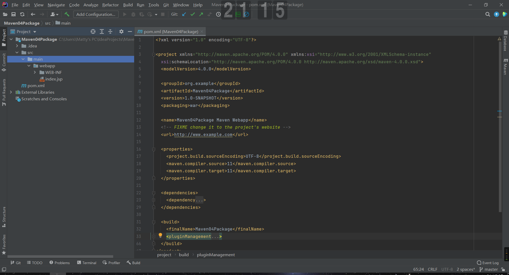

然后，在src/main目录下新建一个java目录(source root)，用来存放Java源码文件；新建一个resouces目录(resources root)，用来存放资源文件；然后再写一些.xml和.properties文件，简单地写上一两行无意义的代码以示区分，具体的结构如图所示：

> resources目录用于存放配置资源，比如.xml和.properties等等。（在此不必深究，用到自然懂，用不到没必要懂）
>
> webapp目录用于存放网站资源，比如jsp、css、js、image等等。

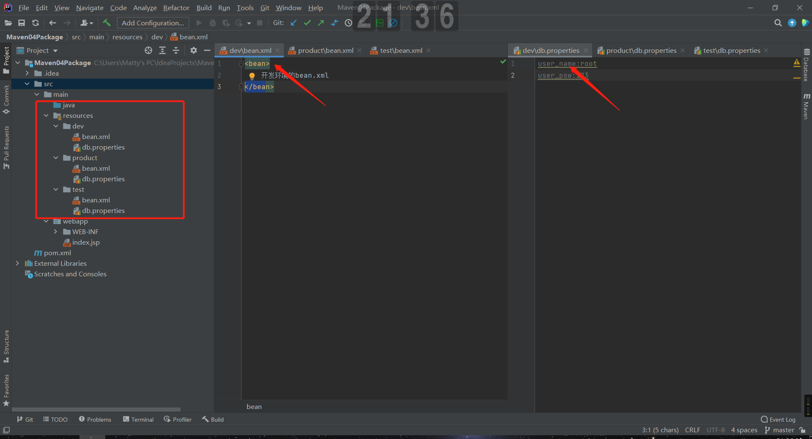

* dev对应本地环境/开发环境
* test对应测试环境
* product对应正式环境

### 8.2 添加<profiles\>配置和<resources\>配置

在pom.xml里添加：

```xml
<!-- 打包环境的配置 -->
<profiles>
    
    <!-- id为dev的profile -->
    <profile>
        <id>dev</id>
        <properties>
            <!-- env里面的值与环境的实际目录名相对应，便于打包时操作 -->
            <env>dev</env>
        </properties>
        <!-- 是否将当前环境设为未指定环境时的默认打包环境 -->
        <activation>
            <activeByDefault>true</activeByDefault>
        </activation>
    </profile>
    
    <profile>
        <id>test</id>
        <properties>
            <env>test</env>
        </properties>
    </profile>
    
    <profile>
        <id>product</id>
        <properties>
            <env>product</env>
        </properties>
    </profile>
</profiles>
```

> profile在这里可以理解为“配置环境”的意思，不同的profile就是不同的配置环境，它们之间用id作为区分。
>
> 以id为dev的profile为例，这个profile（配置环境）的properties（配置资源）的env（存放目录）的值（实际名称）为"dev"，也就是实际存在的src/main/resources/dev目录。

然后在pom.xml的build里添加：

```xml
<!-- 项目配置资源的配置 -->
<resources>
    <resource>
        <!-- 根据打包命令，自动获取env的值，生成用于不同环境的包 -->
        <directory>src/main/resources/${env}</directory>
    </resource>
    <resource>
        <directory>src/main/java</directory>
        <includes>
            <include>**/*.xml</include>
            <include>**/*.properties</include>
            <include>**/*.tld</include>
        </includes>
    </resource>
</resources>
```

> resource在这里可以理解为“项目需要的配置资源”的意思。
>
> 项目在进行打包时，当然要根据不同的环境，比如正式还是测试，打包不同的配置资源文件。

### 8.3 执行打包操作

通过打包操作的实际输出效果，我们来看看上面那两个配置究竟有什么用。

#### 8.3.1 `mvn package`

执行Maven最基础的打包命令，不带任何参数。

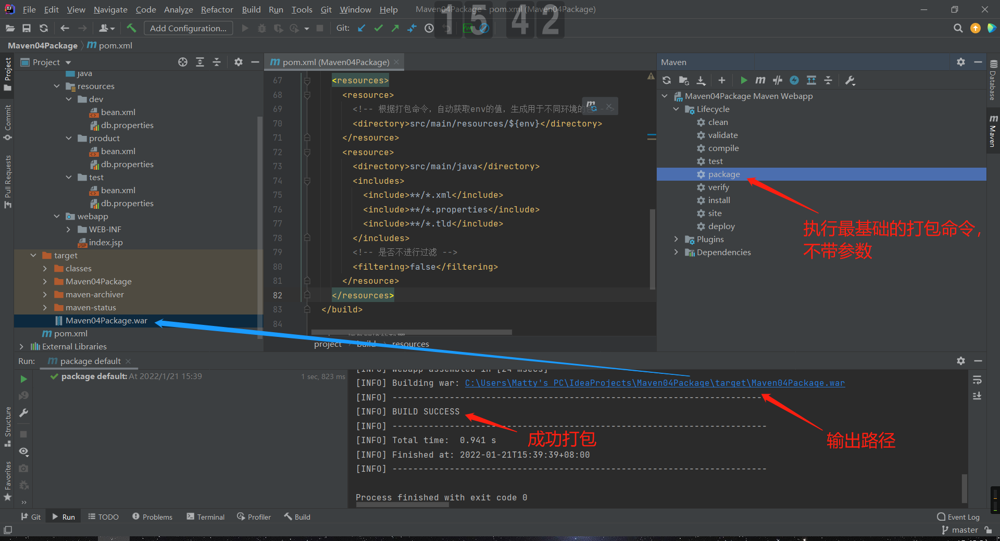

BUILD SUCCESS，打包成功，我们去输出路径下找到这个war包，用压缩软件Bandizip预览一下它的目录结构。

> Java项目会被打包成jar，Web项目会被打包成war包。

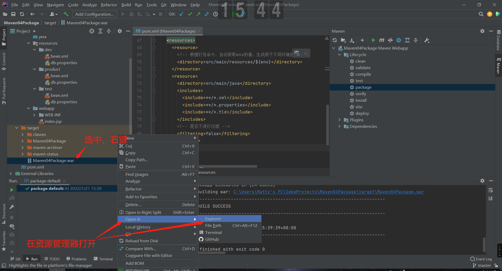

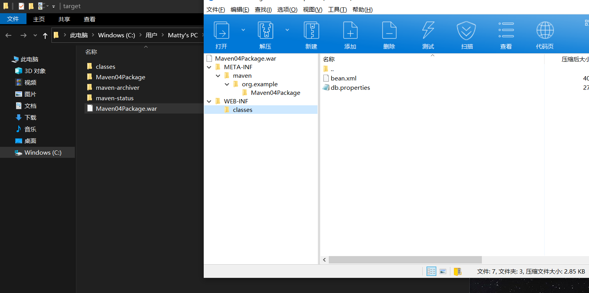

WEB-INF/classes目录下只有2个配置资源文件（刚才在IDEA里有6个），打开看看里面的内容。

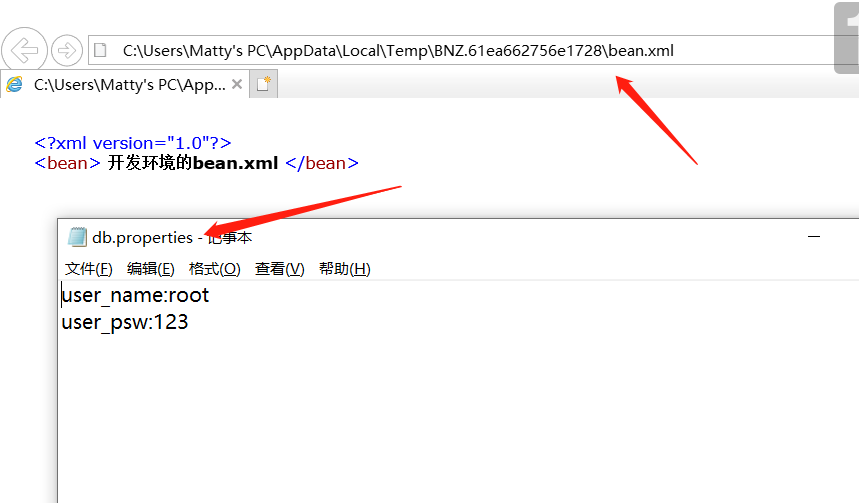

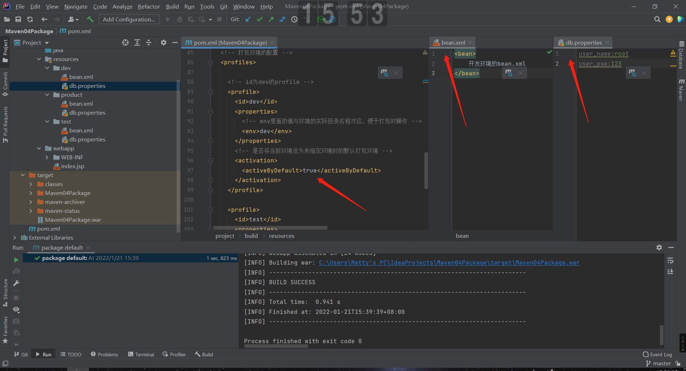

没错，这就是刚才设置的“未指定环境时的默认打包环境”下的配置资源文件！

#### 8.3.2 `mvn clean package -Ptest`

再执行一下带-P参数的打包命令，clean package表示先执行clean再执行package。

> 5.2常用命令表没忘吧，clean的效果是删除target目录，这样我们打包的时候才能生成新的包，否则就算显示BUILD SUCCESS，war包的内容也还是原来的，不会变的。
>
> 5.3的-P命令参数也可以回顾一下，温故而知新。

执行效果如图，可以看到这次打包用到的配置资源文件是测试环境下的。

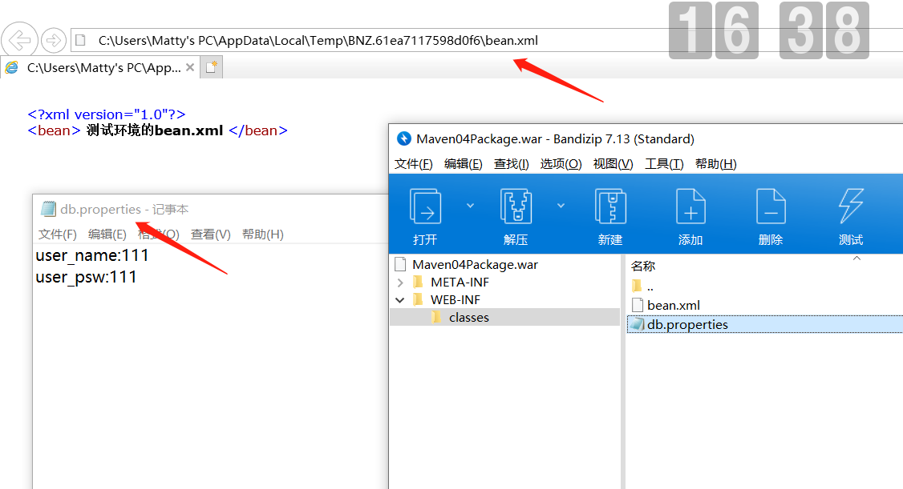

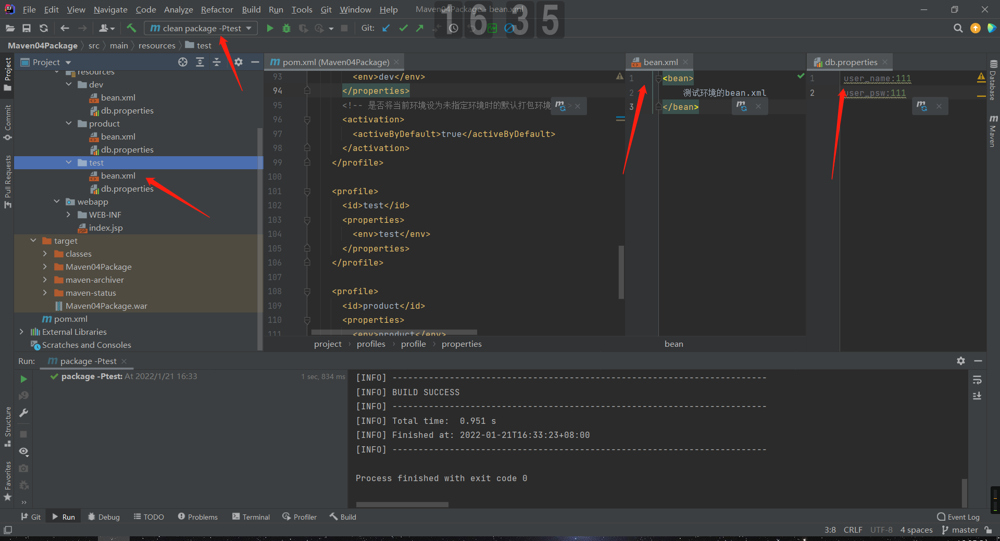

#### 8.3.3 发生了什么？

对照9.2添加的两段配置，就大概理解了：

进行打包操作时，Maven需要找到所有的resource**s**，我们指定了两个resource，

* 一个是固定的，位置在src/main/java，另外还包括\*\*/\*.xml（src/main下的所有带xml后缀的文件）、\*\*/\*.properties（src/main下的所有带properties后缀的文件）和\*\*/\*.tld（src/main下的所有带tld后缀的文件）

* 另一个的位置在src/main/resources/${env}，${env}变量的值取决于Maven最终选用profile**s**里的哪个profile，每个profile都有不同的env值，选用哪个profile，Maven就将哪个profile的env值赋值给${env}，然后去对应的目录下找到配置资源文件，进行打包。

  * 我们通过下面这段配置告诉Maven，打包时默认选择的是这个id为dev的profile，${env}变量最终等于"dev"

    ```xml
    <profile>
      <id>dev</id>
      <properties>
        <env>dev</env>
      </properties>
      <activation>
        <activeByDefault>true</activeByDefault>
      </activation>
    </profile>
    ```

  * 当打包时带了-P参数，比如-Pxxx，那么Maven就会选择id为xxx的profile，${env}变量最终等于"xxxEnv"

    ```xml
    <profile>
      <id>xxx</id>
      <properties>
        <env>xxxEnv</env>
      </properties>
    </profile>
    ```

## 9. Maven依赖的基本概念

这个部分简单了解即可。

### 9.1 Maven依赖范围

下面摘抄[Maven依赖管理 | Maven教程网](http://mvnbook.com/maven-dependency.html)的一段原文，总结得很好。

> **compile**
>
> 编译依赖范围（默认），使用此依赖范围对于编译、测试、运行三种都有效，即在编译、测试和运行的时候都要使用该依赖 Jar 包。
>
> **test**
>
> 测试依赖范围，从字面意思就可以知道此依赖范围只能用于测试，而在编译和运行项目时无法使用此类依赖，典型的是 JUnit，它只用于编译测试代码和运行测试代码的时候才需要。
>
> **provided**
>
> 此依赖范围，对于编译和测试有效，而对运行时无效。比如 servlet-api.jar 在 Tomcat 中已经提供了，我们只需要的是编译期提供而已。
>
> **runtime**
>
> 运行时依赖范围，对于测试和运行有效，但是在编译主代码时无效，典型的就是JDBC驱动实现。
>
> **system**
>
> 系统依赖范围，使用 system 范围的依赖时必须通过 systemPath 元素显示地指定依赖文件的路径，不依赖 Maven 仓库解析，所以可能会造成建构的不可移植。

### 9.2 传递性依赖与依赖冲突

简单总结一下视频教程里的这部分内容吧：

Maven中的依赖分为两种，即**直接依赖**和**传递性依赖**（即间接依赖）。Maven会自动解析各个直接依赖的POM，将那些必要的间接依赖，以传递性依赖的形式引入到当前项目中。

举个最简单的例子，A依赖B，B依赖C，此时C就是A的传递性依赖。

> A -> B -> C

这时Maven不仅会帮我们下载直接依赖B，也下载传递性依赖C，非常方便。

但是问题来了，假设A依赖B，B依赖1.0版本的D，同时A又依赖C，C依赖2.0版本的D。我们知道在一个Maven项目里，同一groupId同一artifactId下只能使用一个version，这就造成了**依赖冲突**（这是最常见的一种情况）。

> A -> B -> D(v1.0)
>
> A -> C -> D(v2.0)

此时可以通过\<exclusion\>标签来手动排除依赖冲突。

```xml
<dependencies>
    <dependency>
        <groupId>B</groupId>
        <artifactId>B</artifactId>
        <version>xxx</version>
        <!-- 排除D冲突 -->
        <exclusions>
            <exclusion>
                <groupId>D</groupId>
                <artifactId>D</artifactId>
            </exclusion>
        </exclusions>
    </dependency>
    <dependency>
        <groupId>C</groupId>
        <artifactId>C</artifactId>
        <version>xxx</version>
    </dependency>
</dependencies>
```

> 扩展资料：
>
> [Maven依赖冲突 | Maven教程网](http://mvnbook.com/maven-dependency-conflict.html)
