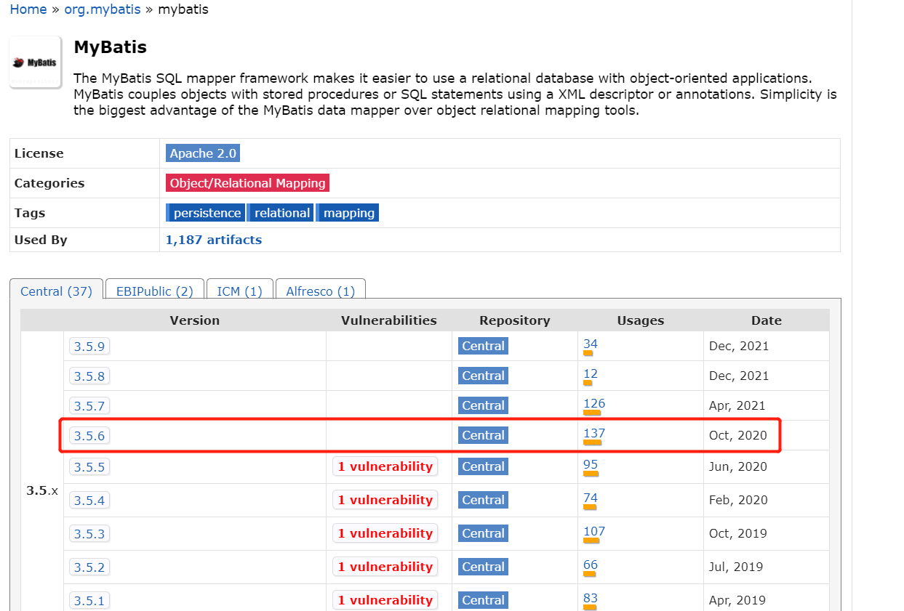
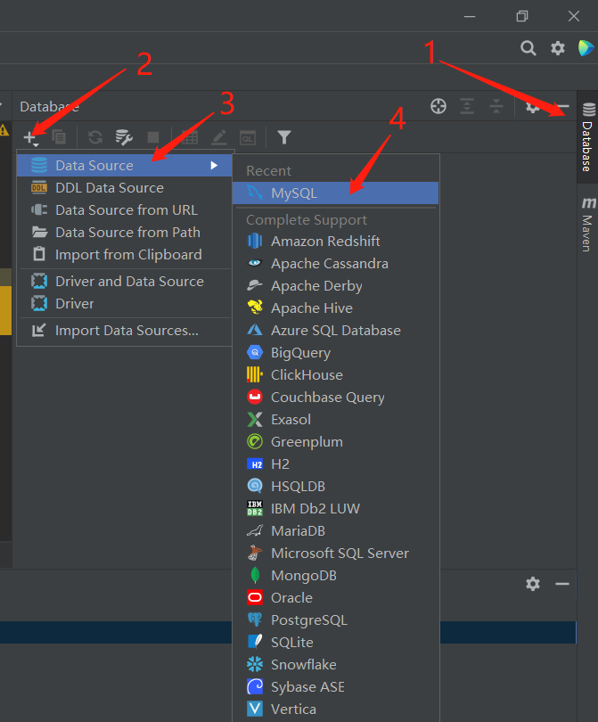
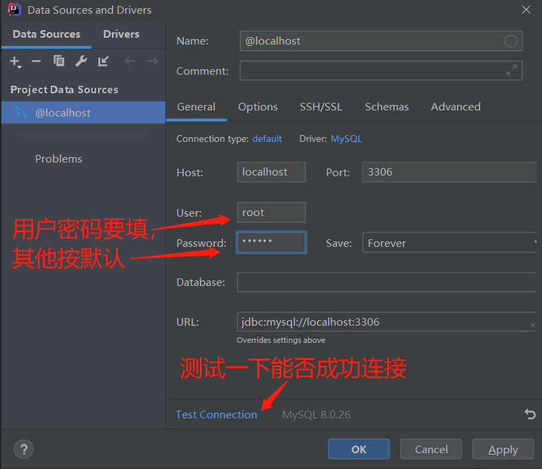
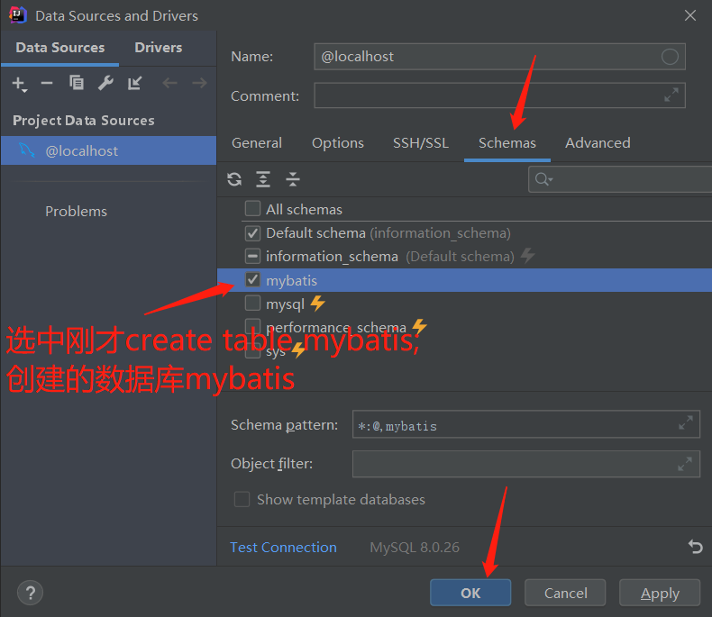
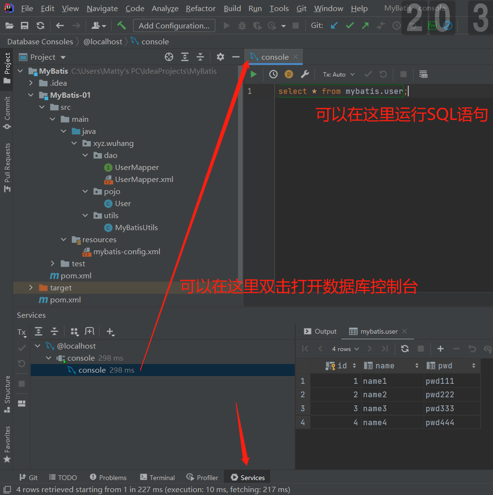
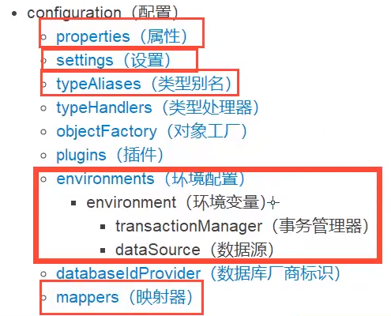

# MyBatis学习笔记

## 前言

**基于教程**

[【狂神说Java】Mybatis最新完整教程IDEA版通俗易懂_哔哩哔哩_bilibili](https://www.bilibili.com/video/BV1NE411Q7Nx?spm_id_from=333.999.0.0)（发布时间：2019-10-02）

**本机环境**

* MyBatis 3.5.6
* JDK 11
* MySql 8.0.26（+对应版本驱动包）
* Maven 3.8.4
* IDEA 2021.1.3

**知识背景**

以下内容达到能够简单使用的程度就可以学习MyBatis。

* Java基础
* JDBC

* MySQL
* Maven
* Junit

**参考资料**

官方中文文档：[mybatis – MyBatis 3 | 简介](https://mybatis.org/mybatis-3/zh/index.html)（非常重要。任何老师讲MyBatis都不可能比官方文档更详细了。）

broken的笔记：[MyBatis | broken's blog](https://guopeixiong.github.io/2021/10/19/MyBatis/)

## 一. 简介

### 1.1 什么是MyBatis


看看**官方文档**首页的介绍：

> MyBatis 是一款优秀的**持久层**框架，它支持自定义 SQL、存储过程以及高级映射。

持久层是什么？这个我们后面再说。

> MyBatis 免除了几乎所有的 JDBC 代码以及设置参数和获取结果集的工作。
>
> MyBatis 可以通过简单的 XML 或注解来配置和映射原始类型、接口和 Java POJO（Plain Old Java Objects，普通老式 Java 对象）为数据库中的记录。

说白了就是方便我们写SQL，方便操作数据库。

再看看MyBatis的**百度百科**：

> MyBatis本是apache的一个开源项目iBatis，

后面我们会发现，MyBatis的很多包名都带了ibatis，就是这个原因。

> 2010年这个项目由apache software foundation迁移到了google code，并且改名为MyBatis。2013年11月迁移到Github。

所以现在找MyBatis应该去Github上找。

> iBATIS一词来源于“internet”和“abatis”的组合，是一个基于Java的**持久层**框架。iBATIS提供的持久层框架包括SQL Maps和Data Access Objects（DAOs）。

这里又出现了“持久层”这个概念。

### 1.2 获取Mybatis

我们再去**Github**上看看，查一下MyBatis，找到这个：

[mybatis/mybatis-3: MyBatis SQL mapper framework for Java](https://github.com/mybatis/mybatis-3)

可以点击Release，在那里下载整个项目或者单独下载源码。

不过，从项目目录上的pom.xml和.mvn可以看出，这是一个Maven项目，我们只需导入依赖即可。

在**Maven中央仓库**找到：[Maven Repository: mybatis](https://mvnrepository.com/search?q=mybatis)

> The MyBatis SQL mapper framework makes it easier to use a relational database with object-oriented applications. MyBatis couples objects with stored procedures or SQL statements using a XML descriptor or annotations. Simplicity is the biggest advantage of the MyBatis data mapper over object relational mapping tools.

我们选择**3.5.6**，一个很新，而且很多人用，同时没有已知安全漏洞(vulnerabilities)的版本。



至于具体的依赖配置，我统一放到2.3吧，这里啰嗦这么多主要是因为，授人以鱼不如授人以渔。

### 1.3 什么是“持久层”框架

#### 1.3.1 持久化

首先我们要知道什么是**数据持久化**。

数据持久化，可以理解为将程序的数据由瞬时状态转化为持久状态的过程。

我们知道，内存的特点是断电即失，所以在内存中的数据就是处于所谓的瞬时状态的。如果我们通过程序，将这些数据保存到硬盘上，或者说存储到数据库或者文件中，这个过程便可称为数据持久化。

> 参考资料：[JDBC学习（一、概述） - 程序员大本营](https://www.pianshen.com/article/9721744815/)

#### 1.3.2 持久层

持久层，就是完成数据持久化工作的代码。这是个逻辑概念。

#### 1.3.3 为什么需要MyBatis

答案是——并不是非MyBatis不可，只是因为用它的人多。

而且目前Java后端的主流的框架学习路线就是MyBatis -> Spring -> SpringMVC -> SpringBoot。这里是第一站。

抄一下百度百科讲的MyBatis的特点：

* 简单易学：本身就很小且简单。没有任何第三方依赖，最简单安装只要两个jar文件+配置几个sql映射文件。易于学习，易于使用。通过文档和源代码，可以比较完全的掌握它的设计思路和实现。
* 灵活：mybatis不会对应用程序或者数据库的现有设计强加任何影响。 sql写在xml里，便于统一管理和优化。通过sql语句可以满足操作数据库的所有需求。
* 解除sql与程序代码的耦合：通过提供DAO层，将业务逻辑和数据访问逻辑分离，使系统的设计更清晰，更易维护，更易单元测试。sql和代码的分离，提高了可维护性。
* 提供映射标签，支持对象与数据库的orm字段关系映射。
* 提供对象关系映射标签，支持对象关系组建维护。
* 提供xml标签，支持编写动态sql。

前三个特点很不错，不过后三点看不懂，没关系，学完就懂了。

## 二. 第一个MyBatis程序

思路：搭建环境 -> 导入MyBatis -> 编写代码并测试

### 2.1 准备数据库

建议不要用图形用户界面去完成以下操作，最好还是手写，毕竟这些都是最基础SQL语句。

核心代码：

```sql
#建数据库
create database mybatis;
use mybatis;
#建表
CREATE TABLE user (
	id INT(20) not null primary key,
	name varchar(30) default null,
	pwd varchar(30) default null	#注意密码缩写如果要用pwd，后面就别写成psw！
);
#插值
insert into user(id, name, pwd) values
	(1, 'name1', 'pwd111'),
	(2, 'name2', 'pwd222'),
	(3, 'name3', 'pwd333'),
	(4, 'name4', 'pwd444');
```

补充一下最常用最基本的几个MySQL命令，权当复习：

| 命令                                        | 作用                     |
| ------------------------------------------- | ------------------------ |
| mysql -u root -p                            | 命令行登录MySQL          |
| show databases;                             | 展示当前连接的所有数据库 |
| show tables;                                | 展示当前数据库的所有表   |
| describe desc table_name;或desc table_name; | 展示当前表的结构         |
| select * from table_name                    | 展示当前表的内容         |

### 2.2 新建父项目

新建一个普通的Maven项目（除非特别指出，否则我们默认在创建Maven项目时不选择任何模板）。

然后删掉src目录，把这个项目作为父项目。

```xml
<!-- 父项目 -->
<groupId>xyz.wuhang</groupId>
<artifactId>MyBatis-Learning</artifactId>
<version>1.0-SNAPSHOT</version>
```

### 2.3 导入依赖

在父项目的pom里导入依赖。等会儿我们创建的子项目会继承这些依赖，不用再导入了。

```xml
<!-- https://mvnrepository.com/artifact/mysql/mysql-connector-java -->
<!-- 导入MySQL驱动 -->
<dependency>
    <groupId>mysql</groupId>
    <artifactId>mysql-connector-java</artifactId>
    <version>8.0.26</version>
</dependency>
<!-- 导入Mybatis -->
<!-- https://mvnrepository.com/artifact/org.mybatis/mybatis -->
<dependency>
    <groupId>org.mybatis</groupId>
    <artifactId>mybatis</artifactId>
    <version>3.5.6</version>
</dependency>
<!-- 导入JUnit 5的"junit-jupiter-api"模块 -->
<!-- 讲真，我不知道它和"junit-jupiter-engine在使用上有什么区别，对这个问题我在刚学Junit 5的时候就开始感到困惑了。" -->
<!-- https://mvnrepository.com/artifact/org.junit.jupiter/junit-jupiter-api -->
<dependency>
    <groupId>org.junit.jupiter</groupId>
    <artifactId>junit-jupiter-api</artifactId>
    <version>5.8.2</version>
    <scope>test</scope>
</dependency>
```

### 2.4 新建子模块

选中父项目，New -> Module -> Maven，新建一个普通的Maven项目。

这里的父项目、子项目基本上可以等同理解为父模块、子模块，不必在意。

```xml
<!-- 子模块01 -->
<parent>
    <artifactId>MyBatis-Learning</artifactId>
    <groupId>xyz.wuhang</groupId>
    <version>1.0-SNAPSHOT</version>
</parent>
<modelVersion>4.0.0</modelVersion>

<artifactId>MyBatis-01</artifactId>
```

后面我们不会再在父项目里写东西了，所以若是有提到src目录，那肯定是某个子模块的src目录（而且父项目的src目录已经删了）。

### 2.5 编写MyBatis的核心配置文件

> XML 配置文件中包含了对 MyBatis 系统的核心设置，包括获取数据库连接实例的数据源（DataSource）以及决定事务作用域和控制方式的事务管理器（TransactionManager）。后面会再探讨 XML 配置文件的详细内容，这里先给出一个简单的示例：

```xml
<?xml version="1.0" encoding="UTF-8" ?>
<!DOCTYPE configuration
  PUBLIC "-//mybatis.org//DTD Config 3.0//EN"
  "http://mybatis.org/dtd/mybatis-3-config.dtd">
<configuration>
  <environments default="development">
    <environment id="development">
      <transactionManager type="JDBC"/>
      <dataSource type="POOLED">
        <!-- 下面几个value要自己填 -->
        <property name="driver" value="com.mysql.cj.jdbc.Driver"/>
        <property name="url" value="jdbc:mysql://localhost:3306"/>
        <property name="username" value="root"/>
        <property name="password" value="123456"/>
      </dataSource>
    </environment>
  </environments>

    <!-- 每一个Mapper都需要在这里注册！才能使得sqlSession.getMapper(XXXMapper.class)时找得到与XXXMapper接口相对应的XXXMapper.xml（“接口实现类”） -->
    <mappers>
        <mapper resource="org/mybatis/example/BlogMapper.xml"/>
    </mappers>
</configuration>
```

将以上内容保存为MyBatis-01/src/main/resources/**mybatis-config.xml**。

当然这只是按照惯例，其实不用这个文件名或者不放在这个目录也都是可以的。

### 2.6 编写工具类

> ### 从 XML 中构建 SqlSessionFactory
>
> 每个基于 MyBatis 的应用都是以一个 SqlSessionFactory 的实例为核心的。SqlSessionFactory 的实例可以通过 SqlSessionFactoryBuilder 获得。而 SqlSessionFactoryBuilder 则可以从 XML 配置文件或一个预先配置的 Configuration 实例来构建出 SqlSessionFactory 实例。
>
> 从 XML 文件中构建 SqlSessionFactory 的实例非常简单，建议使用类路径下的资源文件进行配置。 但也可以使用任意的输入流（InputStream）实例，比如用文件路径字符串或 file:// URL 构造的输入流。MyBatis 包含一个名叫 Resources 的工具类，它包含一些实用方法，使得从类路径或其它位置加载资源文件更加容易。
>
> ```java
> String resource = "org/mybatis/example/mybatis-config.xml";
> InputStream inputStream = Resources.getResourceAsStream(resource);
> SqlSessionFactory sqlSessionFactory = new SqlSessionFactoryBuilder().build(inputStream);
> ```
>
> ......
>
> ### 从 SqlSessionFactory 中获取 SqlSession
>
> 既然有了 SqlSessionFactory，顾名思义，我们可以从中获得 SqlSession 的实例。

上面的引用来自官方文档，我总结一下：我们首先要从XML中构建一个SqlSessionFactoryBuilder实例，并通过这个“SqlSession工厂建造者”实例来获得一个SqlSessionFactory实例，最后通过“SqlSession工厂”实例来获得一个SqlSession实例。

我们可以把这一系列必须要做的固定操作封装成一个工具类。

> SqlSessionFactory 一旦被创建就应该在应用的运行期间一直存在，没有任何理由丢弃它或重新创建另一个实例。 使用 SqlSessionFactory 的最佳实践是在应用运行期间不要重复创建多次，多次重建 SqlSessionFactory 被视为一种代码“坏习惯”。因此 SqlSessionFactory 的最佳作用域是应用作用域。 有很多方法可以做到，最简单的就是使用单例模式或者静态单例模式。

```java
package xyz.wuhang.utils;

import ...
    
public class MyBatisUtils {

    static SqlSessionFactory sqlSessionFactory;

    public static SqlSession getSqlSession() {
        if(sqlSessionFactory != null) {
            return sqlSessionFactory.openSession();
        }
        String resource = "mybatis-config.xml";
        try(InputStream inputStream = Resources.getResourceAsStream(resource)) {
            sqlSessionFactory = new SqlSessionFactoryBuilder().build(inputStream);
        } catch(IOException e) {
            e.printStackTrace();
        }
        return sqlSessionFactory.openSession();
    }

}
```

还记得以前用JDBC连接数据库的步骤吗？上面这段代码的作用也差不多是这么个意思。

> SqlSessionFactory接口甚至还有一个`SqlSession openSession(Connection connection);`方法……奇妙的联动。

* 下载mysql驱动并放进jdk/jre/lib/ext目录里——我们已经在pom里配置好了依赖，Maven会自动帮我们导入
* 加载mysql驱动——在xml里配置好了
* 设置数据库连接的url和账户密码——在xml里配置好了
* 通过url和账户密码获得Connection实例——通过xml获得SqlSessionFactoryBuilder实例，进而获得SqlSessionFactory实例
* 通过Connection实例获得PreparedStatement实例——通过SqlSessionFactory实例获得SqlSession实例
* 通过PreparedStatement来执行任意SQL语句——“SqlSession提供了在数据库执行SQL命令所需的所有方法。”

### 2.7 编写代码

#### 2.7.1 POJO类

我把pojo理解成一个不需要遵守javabean约束的vo，比如这里我们除了写getter、sertter，还要写一个toString。

> 参考资料：
>
> [javaBean与dao、vo的区别](https://www.cnblogs.com/AllenMi/p/14076402.html)
>
> <a href="https://baike.baidu.com/item/POJO/3311958?fr=aladdin#POJO与javabean的区别">pojo与javabean的区别</a>

```xml
package xyz.wuhang.pojo;	//包和类的命名是对这个类的高度概括

public class User {
    private int id;
    private String name;
    private String pwd;

    public User() {
    }

    public User(int id, String name, String pwd) {
        this.id = id;
        this.name = name;
        this.pwd = pwd;
    }

    public int getId() {
        return id;
    }

    public void setId(int id) {
        this.id = id;
    }

    public String getName() {
        return name;
    }

    public void setName(String name) {
        this.name = name;
    }

    public String getPwd() {
        return pwd;
    }

    public void setPwd(String pwd) {
        this.pwd = pwd;
    }

    @Override
    public String toString() {
        return "User{" +
                "id=" + id +
                ", name='" + name + '\'' +
                ", pwd='" + pwd + '\'' +
                '}';
    }
}
```

#### 2.7.2 DAO接口

UserMapper本质上就是以前学JavaWeb时的UserDao，只是到了MyBatis里面我们通常叫它Mapper，两者的实际作用没有任何区别。

```java
package xyz.wuhang.dao;

public interface UserMapper {
    List<User> getUserList();
}
```

#### 2.7.3 “接口实现类”

由原来在JavaWeb中常写的UserDaoImpl类转换为UserMapper配置文件。

UserMapper.xml可以放在UserMapper的同级目录下。

> 事实上 MyBatis 提供的所有特性都可以利用基于 XML 的映射语言来实现

为了能实现在XML里写SQL的时候IDEA能够自动提醒和补全实际存在的数据库名、表名等等，我们需要做两件事，一是为项目添加数据源(Data Source)，也就是数据库，添加成功后我们甚至可以在IDEA内置的数据库控制台上运行SQL语句；二是设置项目的SQL方言(Project SQL Dialet)，毕竟SQL只是一个规范，IDEA必须知道我们使用的是哪个数据库软件的基于SQL的特色“方言”，才能帮我们补全正确的SQL语句。










### ------------------------

### 2.8 测试

在子项目的pom中配置biuld，使得和UserMapper（UserDao）类放在同一路径下的**UserMapper.xml能够作为资源文件被导出**。

```xml
<build>
    <resources>
        <resource>
            <directory>src/main/java</directory>
            <includes>
                <include>**/*.xml</include>
                <include>**/*.properties</include>
            </includes>
        </resource>
    </resources>
</build>
```

记得改完配置要点Maven刷新！

按照惯例，要把测试代码写在**src/test**目录的同名包目录下，测试类取名为XXXTest。

```java
package xyz.wuhang.dao;
...
class UserMapperTest {
    SqlSession sqlSession;
    UserMapper userMapper;

    @BeforeEach
    void initTest() {
        sqlSession = MyBatisUtils.getSqlSession();
        userMapper = sqlSession.getMapper(UserMapper.class);
    }

    @Test
    void getUserListTest() {
        List<User> list = userMapper.getUserList();
        for(User user : list) {
            System.out.println(user);
        }
    }

    @AfterEach
    void closeTest() {
        sqlSession.close();
    }

}
```

## 三. 增删改查

### select

```java
User getUserById(int id);
```

```xml
<!-- 如果参数类型是基本类型，是可以不写的。 -->
<select id="getUserById" parameterType="int" resultType="xyz.wuhang.pojo.User">
    select * from mybatis.user where id = #{id}
</select>
```

### insert

```java
int addUser(User user);
```

```xml
<!-- #{变量名}能够取出参数对象中的对应属性值，并且不依赖其getter方法（没有getter也不会报错） -->
<!-- insert标签没有resultType属性，因为它默认返回int。当然如果接口方法是void，那就不会返回-->
<insert id="addUser" parameterType="xyz.wuhang.pojo.User">
    insert into mybatis.user (id, name, pwd) VALUE (#{id}, #{name}, #{pwd})
</insert>
```

```java
@AfterEach
void closeTest() {
    //记得加上这一句！否则对数据库的增/删/改无法生效！
    //也可以在获取sqlSession对象时调用SqlSessionFactory的openSession(boolean autoCommit)方法
    sqlSession.commit();
    sqlSession.close();
}
```

### update

```java
int updateUser(User user);
```

```xml
<!-- 和insert标签一样，update标签也没有resultType属性，也默认返回int-->
<update id="updateUser" parameterType="xyz.wuhang.pojo.User">
    update mybatis.user
    set name = #{name}, pwd = #{pwd}
    where id = #{id};
</update>
```

### delete

```java
int deleteUserById(int id);
```

```xml
<delete id="deleteUserById">
    delete from mybatis.user where id = #{id}
</delete>
```

### 不规范但好用的Map

```java
//本来这里也可以写成updateUser(User user)的同名重载方法的，但是如果方法名相同，Mapper.xml里就会有两个update带有相同的id，这会导致报错
int updateUser2(Map<String, Object> map);
```

```xml
<!-- 这里的参数类型填map和实际上的参数名map没有任何关系，即使参数名为mapAAA，这里的参数类型也填map -->
<update id="updateUser2" parameterType="map">
    update mybatis.user
    set pwd = #{newPwd}
    where id = #{userId};
</update>
```

```java
Map<String, Object> map = new HashMap<>();
map.put("newPwd", "123456");
map.put("userId", "1");
System.out.println(userMapper.updateUser2(map));
```

### 模糊查询

```java
//模糊查询
List<User> getUserLike(String nameLike);
```
1. Java代码传参数时，使用通配符

   ```xml
   <select id="getUserLike" parameterType="String" resultType="xyz.wuhang.pojo.User">
       <!-- 在MySQL中使用CONCAT函数拼接字符串 -->
       select * from mybatis.user where name like #{nameLike}
   </select>
   ```

   ```java
   List<User> list = userMapper.getUserLike("name%");
   ```

2. 在SQL语句中，拼接通配符

   ```xml
   <!-- 参数只有一个并且是基本数据类型，可以省略不写 -->
   <select id="getUserLike" resultType="xyz.wuhang.pojo.User">
       <!-- 在MySQL中使用CONCAT函数拼接字符串（在别的SQL Dialet里是别的写法） -->
       select * from mybatis.user where name like concat(#{nameLike}, '%')
   </select>
   ```

   ```java
   List<User> list = userMapper.getUserLike("name");
   ```

### 小结

1. 用Map对象传递参数，直接在SQL中取出key即可
   * parameterType="map"
   * #{key_name}
2. 用普通对象传递参数，直接在SQL中取出该对象的属性即可
   * parameterType="xxx.xxx.ClassName"
   * #{attribute_name}
3. 一个参数并且是基本数据类型的情况下，可以直接在SQL中取出
   * parameterType可以不写
   * #{parameter_name}
4. 多个参数用Map或**注解**

## 四. 配置解析

MyBatis 的配置文件包含了会深深影响 MyBatis 行为的设置和属性信息。 配置文档的顶层结构如下：



### 4.1 环境配置（environments）

#### environment（环境变量）

MyBatis 可以配置成适应多种环境，这种机制有助于将 SQL 映射应用于多种数据库之中， 现实情况下有多种理由需要这么做。例如，开发、测试和生产环境需要有不同的配置。我们**要学会配置多套环境。**

<u>不过要记住：尽管可以配置多个环境，但每个 SqlSessionFactory 实例只能选择一种环境。</u>

所以，如果你想连接两个数据库，就需要创建两个 SqlSessionFactory 实例，每个数据库对应一个。而如果是三个数据库，就需要三个实例，依此类推，记起来很简单：

- <u>每个数据库对应一个 SqlSessionFactory 实例</u>

##### 事务管理器 (transactionManager)

在 MyBatis 中有两种类型的事务管理器（也就是 type="[JDBC|MANAGED]"），**MyBatis默认的事务管理器为JDBC**。

了解，知道MyBatis中的事务管理器还有MANAGED即可。——如果为了面试的话可能就要答出两者有什么区别了。
##### 数据源 (dataSource)

有三种内建的数据源类型（也就是 type="[UNPOOLED|POOLED|JNDI]"），**MyBatis默认的数据源类型是POOLED**。

这里涉及数据库连接池的概念，但它的实现已经被MyBatis封装起来了，我们使用的时候不用管。

### 4.2 属性（properties）