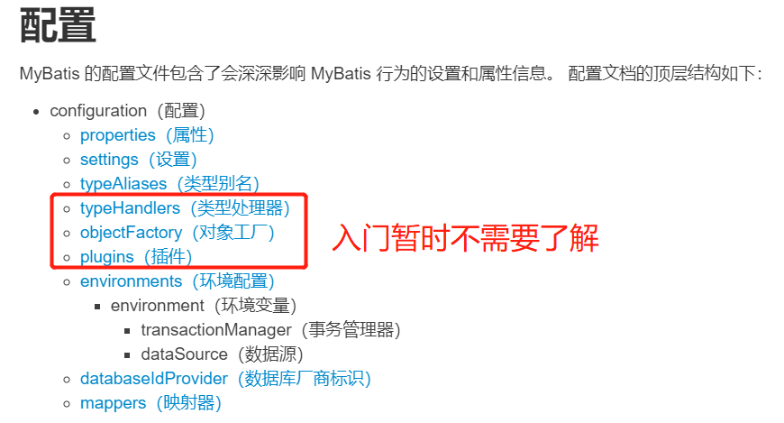

# MyBatis学习笔记

## 零. 前言

**基于教程**

[【狂神说Java】Mybatis最新完整教程IDEA版通俗易懂_哔哩哔哩_bilibili](https://www.bilibili.com/video/BV1NE411Q7Nx?spm_id_from=333.999.0.0)（发布时间：2019-10-02）

**本机环境**

* **MyBatis 3.5.6**
* JDK 11
* MySql 8.0.26（+对应版本驱动包）
* Maven 3.8.4
* IDEA 2021.1.3

**知识背景**

以下内容达到能够简单使用的程度就可以学习MyBatis。

* Java基础
* JDBC

* MySQL
* Maven
* Junit

**参考资料**

官方中文文档：[mybatis – MyBatis 3 | 简介](https://mybatis.org/mybatis-3/zh/index.html)（非常重要。任何老师讲MyBatis都不可能比官方文档更详细了。）

broken的笔记：[MyBatis | broken's blog](https://guopeixiong.github.io/2021/10/19/MyBatis/)（基于同一教程的学习笔记，值得参考）

## 一. MyBatis简介

对应：[mybatis – MyBatis 3 | 简介](https://mybatis.org/mybatis-3/zh/index.html)

### 1.1 什么是MyBatis


看看**官方文档**首页的介绍：

> **MyBatis 是一款优秀的持久层框架**，它支持自定义 SQL、存储过程以及高级映射。

持久层是什么？这个我们后面再说。

> MyBatis 免除了几乎所有的 JDBC 代码以及设置参数和获取结果集的工作。
>
> MyBatis 可以通过简单的 XML 或注解来配置和映射原始类型、接口和 Java POJO（Plain Old Java Objects，普通老式 Java 对象）为数据库中的记录。

说白了就是方便我们写SQL，方便操作数据库。

再看看MyBatis的**百度百科**：

> MyBatis本是apache的一个开源项目iBatis，

后面我们会发现，MyBatis的很多包名都带了ibatis，就是这个原因。

> 2010年这个项目由apache software foundation迁移到了google code，并且改名为MyBatis。2013年11月迁移到Github。

所以现在找MyBatis应该去Github上找。

> iBATIS一词来源于“internet”和“abatis”的组合，是一个基于Java的**持久层**框架。iBATIS提供的持久层框架包括SQL Maps和Data Access Objects（DAOs）。

这里又出现了“持久层”这个概念。

### 1.2 获取Mybatis

我们再去**Github**上看看，查一下MyBatis，找到这个：

[mybatis/mybatis-3: MyBatis SQL mapper framework for Java](https://github.com/mybatis/mybatis-3)

可以点击Release，在那里下载整个项目或者单独下载源码。

不过，从项目目录上的pom.xml和.mvn可以看出，这是一个Maven项目，我们只需导入依赖即可。

在**Maven中央仓库**找到：[Maven Repository: mybatis](https://mvnrepository.com/search?q=mybatis)

> The MyBatis SQL mapper framework makes it easier to use a relational database with object-oriented applications. MyBatis couples objects with stored procedures or SQL statements using a XML descriptor or annotations. Simplicity is the biggest advantage of the MyBatis data mapper over object relational mapping tools.

我们选择**3.5.6**，一个很新，而且很多人用，同时没有已知安全漏洞(vulnerabilities)的版本。


至于具体的依赖配置，我统一放到2.3吧，这里啰嗦这么多主要是因为，授人以鱼不如授人以渔。

### 1.3 什么是“持久层”框架

#### 1.3.1 持久化

首先我们要知道什么是**数据持久化**。

数据持久化，可以理解为将程序的数据由瞬时状态转化为持久状态的过程。

我们知道，内存的特点是断电即失，所以在内存中的数据就是处于所谓的瞬时状态的。如果我们通过程序，将这些数据保存到硬盘上，或者说存储到数据库或者文件中，这个过程便可称为数据持久化。

> 参考资料：[JDBC学习（一、概述） - 程序员大本营](https://www.pianshen.com/article/9721744815/)

#### 1.3.2 持久层

持久层，就是完成数据持久化工作的代码。这是个逻辑概念。

#### 1.3.3 为什么需要MyBatis

答案是——并不是非MyBatis不可，只是因为用它的人多。

而且目前Java后端的主流的框架学习路线就是MyBatis -> Spring -> SpringMVC -> SpringBoot。这里是第一站。

抄一下百度百科讲的MyBatis的特点：

* 简单易学：本身就很小且简单。没有任何第三方依赖，最简单安装只要两个jar文件+配置几个sql映射文件。易于学习，易于使用。通过文档和源代码，可以比较完全的掌握它的设计思路和实现。
* 灵活：mybatis不会对应用程序或者数据库的现有设计强加任何影响。 sql写在xml里，便于统一管理和优化。通过sql语句可以满足操作数据库的所有需求。
* 解除sql与程序代码的耦合：通过提供DAO层，将业务逻辑和数据访问逻辑分离，使系统的设计更清晰，更易维护，更易单元测试。sql和代码的分离，提高了可维护性。
* 提供映射标签，支持对象与数据库的orm字段关系映射。
* 提供对象关系映射标签，支持对象关系组建维护。
* 提供xml标签，支持编写动态sql。

前三个特点很不错，不过后三点看不懂，没关系，学完就懂了。

## 二. 第一个MyBatis程序

对应：[mybatis – MyBatis 3 | 入门](https://mybatis.org/mybatis-3/zh/getting-started.html)

思路：搭建环境 -> 导入MyBatis -> 编写代码并测试

代码在MyBatis-01子模块

### 2.1 准备数据库

建议不要用图形用户界面去完成以下操作，最好还是手写，毕竟这些都是最基础SQL语句。

核心代码：

```sql
#建数据库
create database mybatis;
use mybatis;
#建表
CREATE TABLE user (
	id INT(20) not null primary key,
	name varchar(30) default null,
	pwd varchar(30) default null	#注意密码缩写如果要用pwd，后面就别写成psw！
);
#插值
insert into user(id, name, pwd) values
	(1, 'name1', 'pwd111'),
	(2, 'name2', 'pwd222'),
	(3, 'name3', 'pwd333'),
	(4, 'name4', 'pwd444');
```

补充一下最常用最基本的几个MySQL命令，权当复习：

| 命令                                        | 作用                     |
| ------------------------------------------- | ------------------------ |
| mysql -u root -p                            | 命令行登录MySQL          |
| show databases;                             | 展示当前连接的所有数据库 |
| show tables;                                | 展示当前数据库的所有表   |
| describe desc table_name;或desc table_name; | 展示当前表的结构         |
| select * from table_name                    | 展示当前表的内容         |

### 2.2 新建父项目

新建一个普通的Maven项目（除非特别指出，否则我们默认在创建Maven项目时不选择任何模板）。

然后删掉src目录，把这个项目作为父项目。

```xml
<!-- 父项目 -->
<groupId>xyz.wuhang</groupId>
<artifactId>MyBatis-Learning</artifactId>
<version>1.0-SNAPSHOT</version>
```

### 2.3 导入依赖

在父项目的pom里导入依赖。等会儿我们创建的子项目会继承这些依赖，不用再导入了。

```xml
<!-- https://mvnrepository.com/artifact/mysql/mysql-connector-java -->
<!-- 导入MySQL驱动 -->
<dependency>
    <groupId>mysql</groupId>
    <artifactId>mysql-connector-java</artifactId>
    <version>8.0.26</version>
</dependency>
<!-- 导入Mybatis -->
<!-- https://mvnrepository.com/artifact/org.mybatis/mybatis -->
<dependency>
    <groupId>org.mybatis</groupId>
    <artifactId>mybatis</artifactId>
    <version>3.5.6</version>
</dependency>
<!-- 导入JUnit 5的"junit-jupiter-api"模块 -->
<!-- 讲真，我不知道它和"junit-jupiter-engine在使用上有什么区别，对这个问题我在刚学Junit 5的时候就开始感到困惑了。" -->
<!-- https://mvnrepository.com/artifact/org.junit.jupiter/junit-jupiter-api -->
<dependency>
    <groupId>org.junit.jupiter</groupId>
    <artifactId>junit-jupiter-api</artifactId>
    <version>5.8.2</version>
    <scope>test</scope>
</dependency>
```

### 2.4 新建子模块

选中父项目，New -> Module -> Maven，新建一个普通的Maven项目。

这里的父项目、子项目基本上可以等同理解为父模块、子模块，不必在意。

```xml
<!-- 子模块01 -->
<parent>
    <artifactId>MyBatis-Learning</artifactId>
    <groupId>xyz.wuhang</groupId>
    <version>1.0-SNAPSHOT</version>
</parent>
<modelVersion>4.0.0</modelVersion>

<artifactId>MyBatis-01</artifactId>
```

后面我们不会再在父项目里写东西了，所以若是有提到src目录，那肯定是某个子模块的src目录（而且父项目的src目录已经删了）。

### 2.5 编写MyBatis的核心配置文件

> XML 配置文件中包含了对 MyBatis 系统的核心设置，包括获取数据库连接实例的数据源（DataSource）以及决定事务作用域和控制方式的事务管理器（TransactionManager）。后面会再探讨 XML 配置文件的详细内容，这里先给出一个简单的示例：

```xml
<?xml version="1.0" encoding="UTF-8" ?>
<!DOCTYPE configuration
  PUBLIC "-//mybatis.org//DTD Config 3.0//EN"
  "http://mybatis.org/dtd/mybatis-3-config.dtd">
<configuration>
  <environments default="development">
    <environment id="development">
      <transactionManager type="JDBC"/>
      <dataSource type="POOLED">
        <!-- 下面几个value要自己填 -->
        <property name="driver" value="com.mysql.cj.jdbc.Driver"/>
        <property name="url" value="jdbc:mysql://localhost:3306"/>
        <property name="username" value="root"/>
        <property name="password" value="123456"/>
      </dataSource>
    </environment>
  </environments>

    <!-- 每一个Mapper都需要在这里注册！才能使得sqlSession.getMapper(XXXMapper.class)时找得到与XXXMapper接口相对应的XXXMapper.xml（“接口实现类”） -->
    <mappers>
        <mapper resource="org/mybatis/example/BlogMapper.xml"/>
    </mappers>
</configuration>
```

将以上内容保存为MyBatis-01/src/main/resources/**mybatis-config.xml**。

当然这只是按照惯例，其实不用这个文件名或者不放在这个目录也都是可以的。

### 2.6 编写工具类

> ### 从 XML 中构建 SqlSessionFactory
>
> 每个基于 MyBatis 的应用都是以一个 SqlSessionFactory 的实例为核心的。SqlSessionFactory 的实例可以通过 SqlSessionFactoryBuilder 获得。而 SqlSessionFactoryBuilder 则可以从 XML 配置文件或一个预先配置的 Configuration 实例来构建出 SqlSessionFactory 实例。
>
> 从 XML 文件中构建 SqlSessionFactory 的实例非常简单，建议使用类路径下的资源文件进行配置。 但也可以使用任意的输入流（InputStream）实例，比如用文件路径字符串或 file:// URL 构造的输入流。MyBatis 包含一个名叫 Resources 的工具类，它包含一些实用方法，使得从类路径或其它位置加载资源文件更加容易。
>
> ```java
> String resource = "org/mybatis/example/mybatis-config.xml";
> InputStream inputStream = Resources.getResourceAsStream(resource);
> SqlSessionFactory sqlSessionFactory = new SqlSessionFactoryBuilder().build(inputStream);
> ```
>
> ......
>
> ### 从 SqlSessionFactory 中获取 SqlSession
>
> 既然有了 SqlSessionFactory，顾名思义，我们可以从中获得 SqlSession 的实例。

上面的引用来自官方文档，我总结一下：我们首先要从XML中构建一个SqlSessionFactoryBuilder实例，并通过这个“SqlSession工厂建造者”实例来获得一个SqlSessionFactory实例，最后通过“SqlSession工厂”实例来获得一个SqlSession实例。

我们可以把这一系列必须要做的固定操作封装成一个工具类。

> SqlSessionFactory 一旦被创建就应该在应用的运行期间一直存在，没有任何理由丢弃它或重新创建另一个实例。 使用 SqlSessionFactory 的最佳实践是在应用运行期间不要重复创建多次，多次重建 SqlSessionFactory 被视为一种代码“坏习惯”。因此 SqlSessionFactory 的最佳作用域是应用作用域。 有很多方法可以做到，最简单的就是使用单例模式或者静态单例模式。

```java
package xyz.wuhang.utils;

import ...
    
public class MyBatisUtils {

    static SqlSessionFactory sqlSessionFactory;

    public static SqlSession getSqlSession() {
        //单例模式
        if(sqlSessionFactory != null) {
            return sqlSessionFactory.openSession();
        }
        String resource = "mybatis-config.xml";
        try(InputStream inputStream = Resources.getResourceAsStream(resource)) {
            sqlSessionFactory = new SqlSessionFactoryBuilder().build(inputStream);
        } catch(IOException e) {
            e.printStackTrace();
        }
        return sqlSessionFactory.openSession();
    }

}
```

还记得以前用JDBC连接数据库的步骤吗？上面这段代码的作用也差不多是这么个意思。

> SqlSessionFactory接口甚至还有一个`SqlSession openSession(Connection connection);`方法……奇妙的联动。

* 下载mysql驱动并放进jdk/jre/lib/ext目录里——我们已经在pom里配置好了依赖，Maven会自动帮我们导入
* 加载mysql驱动——在xml里配置好了
* 设置数据库连接的url和账户密码——在xml里配置好了
* 通过url和账户密码获得Connection实例——通过xml获得SqlSessionFactoryBuilder实例，进而获得SqlSessionFactory实例
* 通过Connection实例获得PreparedStatement实例——通过SqlSessionFactory实例获得SqlSession实例
* 通过PreparedStatement来执行任意SQL语句——“SqlSession提供了在数据库执行SQL命令所需的所有方法。”

### 2.7 编写代码

#### 2.7.2 POJO类

我把pojo理解成一个不需要遵守javabean约束的vo，比如这里我们除了写getter、sertter，还要写一个toString。

> 参考资料：
>
> [javaBean与dao、vo的区别](https://www.cnblogs.com/AllenMi/p/14076402.html)
>
> <a href="https://baike.baidu.com/item/POJO/3311958?fr=aladdin#POJO与javabean的区别">pojo与javabean的区别</a>

```xml
package xyz.wuhang.pojo;	//包和类的命名是对这个类的高度概括

public class User {
    private int id;
    private String name;
    private String pwd;

    public User() {
    }

    public User(int id, String name, String pwd) {
        this.id = id;
        this.name = name;
        this.pwd = pwd;
    }

    public int getId() {
        return id;
    }

    public void setId(int id) {
        this.id = id;
    }

    public String getName() {
        return name;
    }

    public void setName(String name) {
        this.name = name;
    }

    public String getPwd() {
        return pwd;
    }

    public void setPwd(String pwd) {
        this.pwd = pwd;
    }

    @Override
    public String toString() {
        return "User{" +
                "id=" + id +
                ", name='" + name + '\'' +
                ", pwd='" + pwd + '\'' +
                '}';
    }
}
```

#### 2.7.2 DAO接口

UserMapper本质上就是以前学JavaWeb时的UserDao，只是到了MyBatis里面我们通常叫它Mapper，两者的实际作用没有任何区别。

```java
package xyz.wuhang.dao;

public interface UserMapper {
    List<User> getUserList();
}
```

#### 2.7.3 “接口实现类”

由原来在JavaWeb中常写的UserDaoImpl类转换为UserMapper配置文件。

UserMapper.xml可以放在UserMapper的同级目录下。

> 事实上 MyBatis 提供的所有特性都可以利用基于 XML 的映射语言来实现

为了能实现在XML里写SQL的时候IDEA能够自动提醒和补全实际存在的数据库名、表名等等，我们需要做两件事，一是为项目添加数据源(Data Source)，也就是数据库，添加成功后我们甚至可以在IDEA内置的数据库控制台上运行SQL语句；二是设置项目的SQL方言(Project SQL Dialet)，毕竟SQL只是一个规范，IDEA必须知道我们使用的是哪个数据库软件的基于SQL的特色“方言”，才能帮我们补全正确的SQL语句。


### ------------------------

### 2.8 测试

在子项目的pom中配置biuld，使得和UserMapper（UserDao）类放在同一路径下的**UserMapper.xml能够作为资源文件被导出**。

```xml
<build>
    <resources>
        <resource>
            <directory>src/main/java</directory>
            <includes>
                <include>**/*.xml</include>
                <include>**/*.properties</include>
            </includes>
        </resource>
    </resources>
</build>
```

记得改完配置要点Maven刷新！

按照惯例，要把测试代码写在**src/test**目录的同名包目录下，测试类取名为XXXTest。

```java
package xyz.wuhang.dao;
...
class UserMapperTest {
    SqlSession sqlSession;
    UserMapper userMapper;

    @BeforeEach
    void initTest() {
        sqlSession = MyBatisUtils.getSqlSession();
        userMapper = sqlSession.getMapper(UserMapper.class);
    }

    @Test
    void getUserListTest() {
        List<User> list = userMapper.getUserList();
        for(User user : list) {
            System.out.println(user);
        }
    }

    @AfterEach
    void closeTest() {
        sqlSession.close();
    }

}
```

### 2.9 增删改查

#### select

```java
User getUserById(int id);
```

```xml
<!-- 如果参数类型是基本类型，是可以不写的。 -->
<select id="getUserById" parameterType="int" resultType="xyz.wuhang.pojo.User">
    select * from mybatis.user where id = #{id}
</select>
```

#### insert

```java
int addUser(User user);
```

```xml
<!-- #{变量名}能够取出参数对象中的对应属性值，并且不依赖其getter方法（没有getter也不会报错） -->
<!-- insert标签没有resultType属性，因为它默认返回int。当然如果接口方法是void，那就不会返回-->
<insert id="addUser" parameterType="xyz.wuhang.pojo.User">
    insert into mybatis.user (id, name, pwd) VALUE (#{id}, #{name}, #{pwd})
</insert>
```

```java
@AfterEach
void closeTest() {
    //记得加上这一句！否则对数据库的增/删/改无法生效！
    //也可以在获取sqlSession对象时调用SqlSessionFactory的openSession(boolean autoCommit)方法
    sqlSession.commit();
    sqlSession.close();
}
```

#### update

```java
int updateUser(User user);
```

```xml
<!-- 和insert标签一样，update标签也没有resultType属性，也默认返回int-->
<update id="updateUser" parameterType="xyz.wuhang.pojo.User">
    update mybatis.user
    set name = #{name}, pwd = #{pwd}
    where id = #{id};
</update>
```

#### delete

```java
int deleteUserById(int id);
```

```xml
<delete id="deleteUserById">
    delete from mybatis.user where id = #{id}
</delete>
```

#### 不规范但好用的Map

```java
//本来这里也可以写成updateUser(User user)的同名重载方法的，但是如果方法名相同，Mapper.xml里就会有两个update带有相同的id，这会导致报错
int updateUser2(Map<String, Object> map);
```

```xml
<!-- 这里的参数类型填map和实际上的参数名map没有任何关系，即使参数名为mapAAA，这里的参数类型也填map -->
<!-- 这里涉及到类型别名的概念，详见4.3 -->
<update id="updateUser2" parameterType="map">
    update mybatis.user
    set pwd = #{newPwd}
    where id = #{userId};
</update>
```

```java
Map<String, Object> map = new HashMap<>();
map.put("newPwd", "123456");
map.put("userId", "1");
System.out.println(userMapper.updateUser2(map));
```

#### 模糊查询

```java
//模糊查询
List<User> getUserLike(String nameLike);
```
1. Java代码传参数时，使用通配符

   ```xml
   <select id="getUserLike" parameterType="String" resultType="xyz.wuhang.pojo.User">
       <!-- 在MySQL中使用CONCAT函数拼接字符串 -->
       select * from mybatis.user where name like #{nameLike}
   </select>
   ```

   ```java
   List<User> list = userMapper.getUserLike("name%");
   ```

2. 在SQL语句中，拼接通配符

   ```xml
   <!-- 参数只有一个并且是基本数据类型，可以省略不写 -->
   <select id="getUserLike" resultType="xyz.wuhang.pojo.User">
       <!-- 在MySQL中使用CONCAT函数拼接字符串（在别的SQL Dialet里是别的写法） -->
       select * from mybatis.user where name like concat(#{nameLike}, '%')
   </select>
   ```

   ```java
   List<User> list = userMapper.getUserLike("name");
   ```

#### 小结

1. 用Map对象传递参数，直接在SQL中取出key即可
   * parameterType="map"
   * #{key_name}
2. 用普通对象传递参数，直接在SQL中取出该对象的属性即可
   * parameterType="xxx.xxx.ClassName"
   * #{attribute_name}
3. 一个参数并且是基本数据类型的情况下，可以直接在SQL中取出
   * parameterType可以不写
   * #{parameter_name}
4. 多个参数用Map或**注解**

## 三. 配置的优化

代码在MyBatis-02子模块

对应：[mybatis – MyBatis 3 | 配置](https://mybatis.org/mybatis-3/zh/configuration.html)

MyBatis 的配置文件包含了会深深影响 MyBatis 行为的设置和属性信息。 配置文档的顶层结构如下：


### 4.1 属性（properties）

这些属性可以在外部进行配置，并可以进行动态替换。**你既可以在典型的 Java 属性文件中配置这些属性，**例如：

```properties
#新建一个配置文件db.properties，放在resources目录下方便引用
#这些属性的命名是任意的，因为它们本质上就是键值对。
driver=com.mysql.cj.jdbc.Driver
url=jdbc:mysql://localhost:3306
username=root
password=123456
```

```xml
<configuration>
    <!-- 在核心配置文件mybatis-config.xml中引入外部配置文件 -->
    <properties resource="db.properties"/>
	
    <environments default="test">
        <environment id="test">
            <transactionManager type="JDBC"/>
            <dataSource type="POOLED">
                <property name="driver" value="${driver}"/>
                <property name="url" value="${url}"/>
                <property name="username" value="${username}"/>
                <property name="password" value="${password}"/>
            </dataSource>
        </environment>
        ...
    </environments>
    ...
</configuration>
```

**也可以在 properties 元素的子元素中设置**，例如：

```properties
driver=com.mysql.cj.jdbc.Driver
url=jdbc:mysql://localhost:3306
```

```xml
<configuration>
    <properties resource="db.properties">
        <property name="username" value="root"/>
        <property name="password" value="123456"/>
	</properties>
	
    <environments default="test">
        <environment id="test">
            <transactionManager type="JDBC"/>
            <dataSource type="POOLED">
                <property name="driver" value="${driver}"/>
                <property name="url" value="${url}"/>
                <property name="username" value="${username}"/>
                <property name="password" value="${password}"/>
            </dataSource>
        </environment>
        ...
    </environments>
    ...
</configuration>
```

### 4.2 设置（settings）

一个配置完整的 settings 元素的示例如下：

不用全都记，太多了记不住的，知道去哪里查就行。

主要关注一下这两个：

| 设置名             | 描述                                                         | 有效值                                                       | 默认值 |
| :----------------- | :----------------------------------------------------------- | :----------------------------------------------------------- | :----- |
| logImpl            | 指定 MyBatis 所用日志的具体实现，未指定时将自动查找。        | SLF4J \| LOG4J(deprecated since 3.5.9) \| LOG4J2 \| JDK_LOGGING \| COMMONS_LOGGING \| STDOUT_LOGGING \| NO_LOGGING | 未设置 |
| lazyLoadingEnabled | 延迟加载的全局开关。当开启时，所有关联对象都会延迟加载。 特定关联关系中可通过设置 `fetchType` 属性来覆盖该项的开关状态。 | true \| false                                                | false  |

格式如下：

```xml
<settings>
  <setting name="lazyLoadingEnabled" value="true"/>
  ...
</settings>
```

### 4.3 类型别名（typeAliases）

**类型别名可为 Java 类型设置一个缩写名字**。 它仅用于 XML 配置，意在降低冗余的全限定类名书写。例如：

* mybatis-config.xml

```xml
...
<typeAliases>
        <typeAlias type="xyz.wuhang.pojo.User" alias="User"/>
</typeAliases>
...
```

* UserMapper.xml

```xml
<mapper namespace="xyz.wuhang.mapper.UserMapper">
    <select id="getUserList" resultType="User">
        select * from mybatis.user;
    </select>
</mapper>
```

当这样配置时，`User` 可以用在任何使用 `xyz.wuhang.pojo.User` 的地方。

**也可以指定一个包名，MyBatis 会在包名下面搜索需要的 Java Bean**，比如：

* mybatis-config.xml

```xml
...
<typeAliases>
	<package name="xyz.wuhang.pojo"/>
</typeAliases>
...
```

* UserMapper.xml

```xml
<mapper namespace="xyz.wuhang.mapper.UserMapper">
    <select id="getUserList" resultType="user">
        select * from mybatis.user;
    </select>
</mapper>
```

每一个在包 `xyz.wuhang.pojo` 中的 Java Bean，**在没有注解的情况下，默认会使用 Bean 的首字母小写的类名作为它的别名**，比如 `xyz.wuhang.pojo.User` 的别名为 `user`；**若有注解，则别名为其注解值。**见下面的例子：

```java
import org.apache.ibatis.type.Alias;

@Alias("AliasOfUser")
public class User {
    ...
}
```

实体类较少的时候可以使用第一种，实体类较多的时候建议使用第二种。

第一种可以DIY别名，第二种不行，除非用注解。

| 别名（MyBatis内置的）（不区分大小写） | 映射的类型 | <-<-<-<-<-<-<-<-<-<-<-<-<-<-<-<-<-<-<-<-<-<-<-<-<-<-<-<-<-<-<-<-<-<- |
| :------------------------------------ | :--------- | ------------------------------------------------------------ |
| _byte                                 | byte       |                                                              |
| _long                                 | long       |                                                              |
| _short                                | short      |                                                              |
| _int                                  | int        |                                                              |
| _integer                              | int        |                                                              |
| _double                               | double     |                                                              |
| _float                                | float      |                                                              |
| _boolean                              | boolean    |                                                              |
| string                                | String     |                                                              |
| byte                                  | Byte       |                                                              |
| long                                  | Long       |                                                              |
| short                                 | Short      |                                                              |
| int                                   | Integer    |                                                              |
| integer                               | Integer    |                                                              |
| double                                | Double     |                                                              |
| float                                 | Float      |                                                              |
| boolean                               | Boolean    |                                                              |
| date                                  | Date       |                                                              |
| decimal                               | BigDecimal |                                                              |
| bigdecimal                            | BigDecimal |                                                              |
| object                                | Object     |                                                              |
| map                                   | Map        |                                                              |
| hashmap                               | HashMap    |                                                              |
| list                                  | List       |                                                              |
| arraylist                             | ArrayList  |                                                              |
| collection                            | Collection |                                                              |
| iterator                              | Iterator   |                                                              |

### 4.4 环境配置（environments）

* **environment（环境变量）**

  MyBatis 可以配置成适应多种环境，这种机制有助于将 SQL 映射应用于多种数据库之中， 现实情况下有多种理由需要这么做。例如，开发、测试和生产环境需要有不同的配置。我们**要学会配置多套环境。**

  <u>不过要记住：尽管可以配置多个环境，但每个 SqlSessionFactory 实例只能选择一种环境。</u>

  所以，如果你想连接两个数据库，就需要创建两个 SqlSessionFactory 实例，每个数据库对应一个。而如果是三个数据库，就需要三个实例，依此类推，记起来很简单：<u>每个数据库对应一个 SqlSessionFactory 实例</u>

  * **事务管理器（transactionManager）**

    在 MyBatis 中有两种类型的事务管理器（也就是 type="[JDBC|MANAGED]"），**MyBatis默认的事务管理器为JDBC**。

    了解，知道MyBatis中的事务管理器还有MANAGED即可。——如果为了面试的话可能就要答出两者有什么区别了。

  * **数据源（dataSource）**

    有三种内建的数据源类型（也就是 type="[UNPOOLED|POOLED|JNDI]"），**MyBatis默认的数据源类型是POOLED**。这里涉及数据库连接池的概念，但它的实现已经被MyBatis封装起来了，我们使用的时候不用管。

### 4.5 其他配置



### 4.6 映射器（mappers）

既然 MyBatis 的行为已经由上述元素配置完了，我们现在就要来定义 SQL 映射语句了。 但首先，我们需要告诉 MyBatis 到哪里去找到这些语句。

在运行这行代码`sqlSession.getMapper(UserMapper.class);`的时候，你必须**告诉MyBatis去哪里找这个接口（映射器）对应的实现类（映射文件）**，毕竟这个文件理论上来说可以放在硬盘中的任何地方。

> 注意映射器与映射文件的区别。
>
> 有点像键值对的感觉，映射器必须注册成功，MyBatis才能找到它对应的映射文件，否则会报错说MapperRegister不认识这个接口。

**推荐方法：使用相对于类路径的资源引用**

类路径就是classpath，具体地说就是项目的target/classes目录。

```xml
<!-- 使用相对于类路径的资源引用 -->
<mappers>
	<mapper resource="xyz/wuhang/mapper/UserMapper.xml"/>
</mappers>
```

**其他方法**


> 注意映射器接口（UserMapper接口）与映射器接口实现类（UserMapper.xml）的区别。

第一种不推荐，路径与项目毫无关系，不利于维护；

第二种和第三种都必须保证映射器与接口【同名】且【在同一包下】才能用。由此也得出这样的命名方式和存放路径是最规范的。

## 五. 作用域和生命周期

不同作用域和生命周期类别是至关重要的，因为错误的使用会导致非常严重的并发问题。

**SqlSessionFactoryBuilder**

* 一旦创建了 SqlSessionFactory，就不再需要它了。
* 最佳作用域是**方法作用域**（也就是局部方法变量）。以保证所有的 XML 解析资源可以被释放给更重要的事情。

**SqlSessionFactory**

* 可以想象成：数据库连接池

* 一旦被创建就应该在应用的运行期间一直存在，没有任何理由丢弃它或重新创建另一个实例。

* 最佳作用域是**应用作用域**。
* 单例模式或静态单例模式

**SqlSession**

* 可以想象成：数据库连接池中的一个数据库连接

* 每个线程都应该有它自己的 SqlSession 实例。SqlSession 的实例不是线程安全的，因此是不能被共享的，
* 最佳的作用域是**请求或方法作用域**


## 六. ResultMap结果集映射

### 6.1 属性名与字段名不一致的问题

如果实体类的属性名password和数据库的列名pwd不一致，执行`select * from mybatis.user`会出现id和name查的都对，但是pwd=null的情况。

解决方法一是起别名：

> SQL查到pwd的值后，我们把它称为password的值，即**重命名列名**，这样MyBatis就会把它存进“同名”属性password。

```xml
<!-- 这里可以直接写User是因为配置了typeAlias -->
<select id="getUserList" resultType="User">
    select id, name, pwd as password from mybatis.user;
</select>
```

解决方法二是使用结果集映射

> 执行SQL语句`select id, name, pwd from user`后，默认把查到的pwd的值赋值给User的同名属性pwd，但它没有这个属性，所以我们特别指定要把pwd的值赋值给User的password属性。

```xml
<resultMap id="UserMap" type="UserReSultMap">
    <result property="password"/>
</resultMap>

<select id="getUserList" resultMap="UserReSultMap">
    select * from mybatis.user;
</select>
```

### 6.2 ResultMap简介

`resultMap` 元素是 MyBatis 中最重要最强大的元素。

ResultMap 的设计思想是，对简单的语句做到零配置，对于复杂一点的语句，只需要描述语句之间的关系就行了。

……

*如果这个世界总是这么简单就好了。*

***高级结果映射***

*MyBatis 创建时的一个思想是：数据库不可能永远是你所想或所需的那个样子。 我们希望每个数据库都具备良好的第三范式或 BCNF 范式，可惜它们并不都是那样。 如果能有一种数据库映射模式，完美适配所有的应用程序，那就太好了，但可惜也没有。 而 ResultMap 就是 MyBatis 对这个问题的答案。*

……

等后面学一对多，多对一再看。

## 七. 日志

### 7.1 MyBatis日志设置

如果一个数据库操作出现问题，我们可以怎样排错？

曾经：sout、debug

现在：日志

| 设置名  | 描述                                                  | 有效值                                                       | 默认值 |
| :------ | :---------------------------------------------------- | :----------------------------------------------------------- | :----- |
| ……      |                                                       |                                                              |        |
| logImpl | 指定 MyBatis 所用日志的具体实现，未指定时将自动查找。 | SLF4J \| LOG4J(deprecated since 3.5.9) \| LOG4J2 \| JDK_LOGGING \| COMMONS_LOGGING \| STDOUT_LOGGING \| NO_LOGGING | 未设置 |

MyBatis的日志实现类有很多，

* SLF4J
* LOG4J(deprecated since 3.5.9) 【常用】
* LOG4J2
* JDK_LOGGING：JDK自带的，不需要导包。
* COMMONS_LOGGING
* STDOUT_LOGGING：MyBatis自带的，不需要导包。【常用】
* NO_LOGGING：不输出日志。

```xml
<settings>
    <setting name="logImpl" value="STDOUT_LOGGING"/>
</settings>
```

### 7.2 Log4j

#### 7.2.1 Log4j简介

百度百科介绍：

* Log4j是**Apache**的一个开源项目，通过使用Log4j，我们可以控制**日志信息输送的目的地**是控制台、文件、GUI组件，甚至是套接口服务器、NT的事件记录器、UNIX Syslog守护进程等；

* 我们也可以控制每一条**日志的输出格式**；通过定义每一条**日志信息的级别**，我们能够更加细致地控制日志的生成过程。

* 最令人感兴趣的就是，这些可以通过一个**配置文件**来灵活地进行配置，而不需要修改应用的代码。

#### 7.2.2 Log4j配置

pom.xml：（建议改父pom）

```xml
<!-- https://mvnrepository.com/artifact/log4j/log4j -->
<dependency>
    <groupId>log4j</groupId>
    <artifactId>log4j</artifactId>
    <version>1.2.17</version>
</dependency>
```

mybatis-config.xml：

```xml
<settings>
    <setting name="logImpl" value="LOG4J"/>
</settings>
```

log4j.properties：（文件放在resources目录下就好；以下照搬狂神推荐配置，有需要再做改动）

```properties
#将等级为DEBUG的日志信息输出到console和file这两个目的地，console和file的定义在下面的代码
log4j.rootLogger=DEBUG,console,file

#控制台输出的相关设置
log4j.appender.console=org.apache.log4j.ConsoleAppender
log4j.appender.console.Target=System.out
log4j.appender.console.Threshold=DEBUG
log4j.appender.console.layout=org.apache.log4j.PatternLayout
log4j.appender.console.layout.ConversionPattern=[%c]-%m%n

#文件输出的相关设置
log4j.appender.file=org.apache.log4j.RollingFileAppender
log4j.appender.file.File=./log/myLog.log
log4j.appender.file.MaxFileSize=10mb
log4j.appender.file.Threshold=DEBUG
log4j.appender.file.layout=org.apache.log4j.PatternLayout
log4j.appender.file.layout.ConversionPattern=[%p][%d{yy-MM-dd}][%c]%m%n

#日志输出级别
log4j.logger.org.mybatis=DEBUG
log4j.logger.java.sql=DEBUG
log4j.logger.java.sql.Statement=DEBUG
log4j.logger.java.sql.ResultSet=DEBUG
log4j.logger.java.sql.PreparedStatement=DEBUG
```

#### 7.2.3 Log4j简单使用

```java
......
import org.apache.log4j.Logger;

class UserMapperTest {
    ......
    static Logger logger = Logger.getLogger(UserMapperTest.class);

    @Test
    void loggingTest() {
        logger.info("info: log4jTest");
        logger.debug("debug: log4jTest");
        logger.error("error: log4jTest");
    }
    ......
}
```

根据前面的配置，这段代码运行后，不仅会在控制台输出，可以在当前项目的相对路径./log/myLog.log看到日志文件。

## 八. 分页

### 8.1 MySql的limit关键字

```sql
select * from mybatis.user limit 0, 2;	#startIndex, pageSize
select * from mybatis.user limit 1;	#pageSize
```

[mysql中limit的用法详解[数据分页常用] - 博观而约取，厚积而薄发。 - PHP博客](http://www.phpweblog.net/peiyinjin/archive/2008/04/17/3199.html)

### 8.2 MyBatis基于limit语法实现分页

```java
List<User> getUserByLimit(Map<String, Integer> map);
```

```xml
<select id="getUserByLimit" resultType="User">
    select * from mybatis.user limit #{startIndex}, #{pageSize};
</select>
```

```java
@Test
void getUserByLimit() {
    Map<String, Integer> map = new HashMap<>();
    map.put("startIndex", 0);
    map.put("pageSize", 5);
    List<User> list = userMapper.getUserByLimit(map);
    for(User user : list) {
        System.out.println(user);
    }
}
```

### 8.3 MyBatis基于RowBounds实现分页

8.2本质上还是在Java代码里写SQL，而这种方法则是完全面向对象的。

不过现在用的比较少了，有点过时了，了解即可。

```java
List<User> getUserByRowBounds();
```

```xml
<select id="getUserByRowBounds" resultType="User">
        select * from mybatis.user;
</select>
```

```java
@Test
void rowBoundsTest() {
    RowBounds rowBounds = new RowBounds(1, 2);
    List<User> list = sqlSession.selectList("xyz.wuhang.mapper.UserMapper.getUserByRowBounds", null, rowBounds);
    for(User user : list) {
        System.out.println(user);
    }
}
```

这里使用了SqlSession的`List<E> selectList(String statement, Object parameter, RowBounds rowBounds);`方法来调用映射语句，这种方法并不常用，通常我们还是先getMappeer，再用映射器来调用映射文件中的映射语句。

至于RowBounds，它的源码非常非常简单，一看就懂的，相信我。

### 8.4 MyBatis分页插件

[MyBatis 分页插件 PageHelper](https://pagehelper.github.io/)

国人开发的，官网简洁，官方文档也非常友好。

了解即可，知道有这么个东西就行，以后如果要用到，再学就行了。

## 九. 使用注解开发

### 9.1 如何使用

MyBatis主要是用配置的，所以注解了解即可（但是其他框架大多是用注解）。

> 使用注解来映射简单语句会使代码显得更加简洁，但对于稍微复杂一点的语句，Java 注解不仅力不从心，还会让你本就复杂的 SQL 语句更加混乱不堪。 因此，如果你需要做一些很复杂的操作，最好用 XML 来映射语句。
>
> 选择何种方式来配置映射，以及认为是否应该要统一映射语句定义的形式，完全取决于你和你的团队。 换句话说，永远不要拘泥于一种方式，你可以很轻松的在基于注解和 XML 的语句映射方式间自由移植和切换。

 ```java
...
import org.apache.ibatis.annotations.Select;

public interface UserMapper {    
	...
        
    @Select("select * from mybatis.user")
    List<User> getUserListByAnnotation();
}
 ```
```java
@Test
void selectAnnotationTest() {
    List<User> list = userMapper.getUserListByAnnotation();
    for(User user : list) {
        System.out.println(user);
    }
}
```

### 9.2 使用注解完成CURD

```java
public interface UserMapper {

    @Select("select * from user")
    List<User> getUsers();

    //方法存在多个参数，则所有的参数前面必须加上@Param("xxx")注解
    @Select("select * from user where id = #{xxx}")
    User getUserByID(@Param("xxx") int id);


    @Insert("insert into user(id,name,pwd) values (#{id},#{name},#{password})")
    int addUser(User user);

    
    @Update("update user set name=#{name},pwd=#{password} where id = #{id}")
    int updateUser(User user);

    
    @Delete("delete from user where id = #{uid}")
    int deleteUser(@Param("uid") int id);
}
```

p.s.上面这几个方法都很简单，我没有自己实测过。

**@Param()注解的用法**

* 基本数据类型的参数需要加上
* 引用类型不用
* 如果只有一个基本类型的参数可以不用加，但是建议加上
* 在SQL语句引用的就是@param()中设置的属性名

### 9.3 映射文件与注解的区别

使用注解并不是纯Java代码层面的实现，我们仍然**需要注册映射器**（mybatis-config.xml的<mappers\>），而且UserMapper.xml必须存在，namespace也必须写对，哪怕<mapper\>标签块里什么都没有。

如果仅仅用了@param注解，在UserMapper.xml映射文件中也可以读取到这个“参数别名”——事实上，是必须读取它，像这样：

```java
User getUserByID(@Param("user_id") int id);
```

```xml
<select id="getUserByID" resultType="User">
    select * from mybatis.user where id = #{user_id}
</select>
```

所以，我更愿意把MyBatis中的**注解看做是映射文件的一种扩展，而不是替代**。

### 9.4 #{}和${}的区别

简单来说就是#{}是预编译的，能防止SQL注入，更安全，一般都用它。

> 2、#{} 和 ${} 的区别
>
> （1）
>
> 1）#{} 为参数占位符 ?，即sql 预编译
>
> 2）${} 为字符串替换，即 sql 拼接
>
> （2）
>
> 1）#{}：动态解析 -> 预编译 -> 执行
>
> 2）${}：动态解析 -> 编译 -> 执行
>
> （3）
>
> 1）#{} 的变量替换是在DBMS 中
>
> 2）${} 的变量替换是在 DBMS 外
>
> （4）
>
> 1）变量替换后，#{} 对应的变量自动加上单引号 ''
>
> 2）变量替换后，${} 对应的变量不会加上单引号 ''
>
> （5）
>
> 1）#{} 能防止sql 注入
>
> 2）${} 不能防止sql 注入
>
> 原文：[MyBatis中#{}和${}的区别_siwuxie095's blog-CSDN博客_mybatis中$和&区别](https://blog.csdn.net/siwuxie095/article/details/79190856)

## 十. Lombok

### 10.1 Lombok简介

官网：[Project Lombok](https://projectlombok.org/)

Project Lombok is a **java library** that automatically plugs into your editor and build tools, spicing up your java.
**Never write another getter or equals method again, with one annotation your class has a fully featured builder, Automate your logging variables, and much more.**


### 10.2 Lombok使用

1. 安装插件

   据说IDEA2020版本以上就内置了Lombok插件（我的2021.1.3版本确实有），所以不需要。

2. 导入依赖

```xml
<!-- https://mvnrepository.com/artifact/org.projectlombok/lombok -->
<dependency>
    <groupId>org.projectlombok</groupId>
    <artifactId>lombok</artifactId>
    <version>1.18.22</version>
    <scope>provided</scope>
</dependency>
```

3. 使用

   

   

### 10.3 Lombok常用注解

@Data：无参构造+getter/setter+toString+equals+hashCode

@AllArgsConstructor：顾名思义……

@Getter、@Setter：顾名思义……

……


### 10.4 Lombok小结

是偷懒神器，但是关于它，有一些争议。


## 十一. 复杂查询

### 11.1 多对一查询

代码在MyBatis-04子模块

#### 11.1.1 搭建环境


```java
@Data
public class Student {
    int stuId;
    String stuName;
    Teacher teacher;
}
```

```java
@Data
public class Teacher {
    int tchId;
    String tchName;
}
```

```sql
CREATE TABLE teacher (
    tchId INT(20) not null primary key,
    tchName varchar(30) default null
);

insert into teacher(tchId, tchName) values
	(1, '秦疆'),
    (2, '吴老师');

CREATE TABLE student (
    stuId INT(10) not null primary key,
    stuName varchar(30) default null,
    tchId INT(10) DEFAULT NULL,
    constraint FK_Stu_Tch foreign key (tchId) references teacher (tchId)
);

insert into student(stuId, stuName, tchId) values
	(1, 'name1', '1'),
	(2, 'name2', '1'),
	(3, 'name3', '1'),
	(4, 'name4', '1'),
    (5, 'name5 中文显示测试', '1');
```

如何实现SQL语句`select * from student, teacher where student.tchId = teacher.tchId;`的效果？

失败的尝试：

```java
List<Student> getAllStudents();
```

```xml
<select id="getAllStudents" resultType="Student">
    select *
    from mybatis.student, mybatis.teacher
    where student.tchId = teacher.tchId;
</select>
```


失败了，为什么？

其实这条语句是可以拿到我们想要的值的，就像这样：


但是它拿到tchId和tchName之后（默认会赋值给返回类型Student的同名属性），由于Student的属性里没有叫做tchId或者tchName的属性，所以tchId和tchName的值相当于被浪费了，而由于没有值可以给Student的属性teacher对象，所以它是null。

> p.s. 如果往Student类里加一个`String tchName`，然后再跑一次，那么Student的tchName属性可以得到值，但teacher属性仍是null。

而以下两种方式，就是相当于专门告诉MyBatis，指定拿到tchId和tchName的值后要赋值给谁。

**这部分要多看官方文档，官方文档写得更详细，而这个部分狂神讲得比较乱，并且不规范。**

#### 11.1.2 关联的嵌套Select查询

这种方式的SQL语句简单，但配置文件会比较复杂。

```xml
<select id="getAllStudents" resultMap="StudentAndTeacher">
    #          select stuId, stuName, tchId from mybatis.student
    select * from mybatis.student
</select>

<resultMap id="StudentAndTeacher" type="Student">
    <!-- 对于列名与对象的属性名同名的情况，不需要专门指定，MyBatis就会自动匹配，把前者的值赋给后者。 -->
    <result column="stuId" property="stuId"/>
    <result column="stuName" property="stuName"/>
    <!-- SQL语句查到了tchId的值，但是Student没有同名属性，那么这个值用来干嘛呢？
        用来作为子查询的匹配条件。MyBatis会自动填入tchId的值到#{这里填什么都行，反正都会被替换成tchId的值}。
        而子查询的查到的tchId和tchName，将会被赋值给Teacher对象的同名属性，而这个对象又会被返回到父查询，成为Student的teacher属性-->
    <association column="tchId" property="teacher" javaType="Teacher" select="getTeacherById"/>
</resultMap>

<!-- 子查询 -->
<select id="getTeacherById" resultType="Teacher">
    <!-- 事实上#{}里面填什么都行，MyBatis会自动匹配成#{tchId}。但是where不能不写，否则报错。 -->
    select * from mybatis.teacher where tchId = #{tchId}
</select>
```

#### 11.1.3 关联的嵌套结果映射

这种方式的SQL语句比较复杂，但配置文件写起来简单易懂。

```xml
<!-- 事实上这条SQL语句已经从数据库把我们想要的数据拿过来了，但是这些数据并没有被正确地赋值 -->
<select id="getAllStudents2" resultMap="StudentAndTeacher2">
    #         select s.stuId, s.stuName, s.tchId, t.tchName
    select *
    from mybatis.student s, mybatis.teacher t
    where s.tchId = t.tchId
</select>

<resultMap id="StudentAndTeacher2" type="Student">
    <!-- 对于列名与对象的属性名同名的情况，不需要专门指定，MyBatis就会自动匹配，把前者的值赋给后者。 -->
    <result column="stuId" property="stuId"/>
    <result column="stuName" property="stuName"/>
    <!-- 告诉MyBatis，返回类型Student关联了其他类型，
        具体来说就是，Student有一个teacher属性实际上是Teacher对象（不指出javaType也行，MyBatis会自动检测）-->
    <association property="teacher" javaType="Teacher">
        <!-- 告诉MyBatis，把SQL语句拿到的tchId和tchName的值分别赋值给teacher的同名属性 -->
        <result column="tchId" property="tchId"/>
        <result column="tchName" property="tchName"/>
    </association>
</resultMap>
```

#### 11.1.4 更简洁的方法

```xml
<select id="getAllStudents2" resultMap="StudentAndTeacher2">
    #select s.stuId, s.stuName, s.tchId, t.tchName
    select *
    from mybatis.student s, mybatis.teacher t
    where s.tchId = t.tchId
</select>

<resultMap id="StudentAndTeacher2" type="Student">
    <result column="stuId" property="stuId"/>
    <result column="stuName" property="stuName"/>
    <result column="tchId" property="teacher.tchId"/>
    <result column="tchName" property="teacher.tchName"/>
</resultMap>
```

### 11.2 一对多查询

#### 11.2.1 搭建环境

代码在MyBatis-05子模块

```java
@Data
public class Student {
    int stuId;
    String stuName;
    int tchId;
}
```

```java
@Data
public class Teacher {
    int tchId;
    String tchName;
    List<Student> students;
}
```

```java
List<Teacher> getTeacherById(int tchId);
```

```xml
<select id="getTeacherById" resultType="Teacher">
    select *
    from mybatis.teacher
    where tchId = #{tchId};
</select>
```


#### 11.2.2 集合的嵌套Select查询

```xml
<select id="getTeacherById" resultMap="TeacherResultMap">
    select *
    from mybatis.teacher
    where tchId = #{tchId};
</select>
<resultMap id="TeacherResultMap" type="Teacher">
    <id property="tchId" column="tchId"/>
    <result property="tchName" column="tchName"/>
    <collection property="students" javaType="arraylist" ofType="Student" column="tchId" select="getStudentByTchId"/>
</resultMap>
<select id="getStudentByTchId" resultType="Student">
    select * from mybatis.student where tchId = #{hhh}
</select>
```

#### 11.2.3 集合的嵌套结果映射

```xml
<select id="getTeacherById" resultMap="TeacherResultMap">
    select *
    from mybatis.teacher t, mybatis.student s
    where t.tchId = #{tchId} and s.tchId = t.tchId
</select>
<resultMap id="TeacherResultMap" type="Teacher">
    <id property="tchId" column="tchId"/>
    <result property="tchName" column="tchName"/>
    <collection property="students" javaType="arraylist" ofType="Student">
        <id property="stuId" column="stuId"/>
        <result property="stuName" column="stuName"/>
        <result property="tchId" column="tchId"/>
    </collection>
</resultMap>
```

### 11.3 小结

* 【多对一】对象就用association
* 【一对多】集合就用collection
* 再次强调，这个部分的学习要多看官方文档：[mybatis – MyBatis 3 | XML 映射器 - 结果映射](https://mybatis.org/mybatis-3/zh/sqlmap-xml.html#Result_Maps)，写得真的很详细！

## 十二. 动态SQL

动态SQL就是指根据不同的条件生成不同的SQL语句。

> 动态 SQL 是 MyBatis 的强大特性之一。如果你使用过 JDBC 或其它类似的框架，你应该能理解根据不同条件拼接 SQL 语句有多痛苦，例如拼接时要确保不能忘记添加必要的空格，还要注意去掉列表最后一个列名的逗号。利用动态 SQL，可以彻底摆脱这种痛苦。
>
> ……
>
> 如果你之前用过 JSTL 或任何基于类 XML 语言的文本处理器，你对动态 SQL 元素可能会感觉似曾相识。在 MyBatis 之前的版本中，需要花时间了解大量的元素。借助功能强大的基于 OGNL 的表达式，MyBatis 3 替换了之前的大部分元素，大大精简了元素种类，现在要学习的元素种类比原来的一半还要少。
>
> - if
> - choose (when, otherwise)
> - trim (where, set)
> - foreach

### 12.1 搭建环境

代码在MyBatis-06子模块。

```sql
USE mybatis;
CREATE TABLE blog (
   id VARCHAR(50) NOT NULL COMMENT '博客id' PRIMARY KEY,
   title VARCHAR(100) NOT NULL COMMENT '博客标题',
   author VARCHAR(30) NOT NULL COMMENT '博客作者',
   create_time DATETIME NOT NULL COMMENT '创建时间',
   views INT(30) NOT NULL COMMENT '浏览量'
)ENGINE=INNODB DEFAULT CHARSET=utf8;
```

```java
@Data
@NoArgsConstructor
@AllArgsConstructor
public class Blog {
    String id;
    String title;
    String author;
    Date createTime;
    int views;
}
```

```java
public interface BlogMapper {
	int addBlog(Blog blog);
}
```

```xml
<mapper namespace="xyz.wuhang.mapper.BlogMapper">
    <!-- 注意别写成select标签了-->
    <insert id="addBlog" parameterType="Blog">
        insert into mybatis.blog(id, title, author, create_time, views)
        VALUE (#{id}, #{title}, #{author}, #{createTime}, #{views});
    </insert>
</mapper>
```

```java
@Test
void test() {
    Blog blog1 = new Blog(IdUtils.randomId(), "Maven教程", "wuhang", new Date(), 3);
    Blog blog2 = new Blog(IdUtils.randomId(), "Junit教程", "wuhang", new Date(), 2);
    Blog blog3 = new Blog(IdUtils.randomId(), "MyBatis教程", "wuhang", new Date(), 0);
    Blog blog4 = new Blog(IdUtils.randomId(), "基金教程", "kuang", new Date(), 22000);
    mapper.addBlog(blog1);
    mapper.addBlog(blog2);
    mapper.addBlog(blog3);
    mapper.addBlog(blog4);
}
```

### 12.2 常用标签

#### 12.2.1 if标签

```java
List<Blog> getBlogs(Map map);
```

```xml
<select id="getBlogs" resultType="Blog" parameterType="map">
    select *
    from mybatis.blog
    where true
    <if test="blogTitle != null">
        and title like concat('%', #{blogTitle}, '%')
    </if>
    <if test="blogAuthor != null">
        and author like concat('%', #{blogAuthor}, '%')
    </if>
</select>
```

```java
@Test
void queryBlogTest() {
    Map<String, Object> map = new HashMap<>();
    map.put("blogTitle", "Maven教");
    map.put("blogAuthor", "wu");
    List<Blog> blogs = mapper.getBlogs(map);
    for(Blog blog : blogs) {
        System.out.println(blog);
    }
}
```

#### 12.2.2 where标签

> *where* 元素只会在子元素返回任何内容的情况下才插入 “WHERE” 子句。而且，若子句的开头为 “AND” 或 “OR”，*where* 元素也会将它们去除。

```xml
<select id="getBlogs" resultType="Blog" parameterType="map">
    select *
    from mybatis.blog
    <where>
        <if test="blogTitle != null">
            <!-- 这里的SQL语句（片段）前面加不加and都行，where标签会自动处理，
                但后面不能乱加and，因为where标签只能处理前缀的and或者or -->
            title like concat('%', #{blogTitle}, '%')
        </if>
        <if test="blogAuthor != null">
            <!-- 这里的SQL语句（片段）前面加不加and都行，where标签会自动处理，
                但后面不能乱加and，因为where标签只能处理前缀的and或者or -->
            and author like concat('%', #{blogAuthor}, '%')
        </if>
    </where>
</select>
```

#### 12.2.3 set标签

*set* 元素可以用于动态包含需要更新的列，忽略其它不更新的列。

这个例子中，*set* 元素会动态地在行首插入 SET 关键字，并会删掉额外的逗号（这些逗号是在使用条件语句给列赋值时引入的）。

```java
int updateBlog(Map map);
```

```xml
<update id="updateBlog" parameterType="map">
    update mybatis.blog
    <set>
        <!-- 这里的SQL语句（片段）后面加不加逗号都行，set标签会自动处理，
            但前面不能乱加逗号，因为set只能处理后缀的逗号 -->
        <if test="blogTitle != null">
            title = #{blogTitle},
        </if>
        <!-- 这里的SQL语句（片段）后面加不加逗号都行，set标签会自动处理，
            但前面不能乱加逗号，因为set只能处理后缀的逗号 -->
        <!-- 如果这一句的前缀加1个逗号会怎样？
        如果blogTitle和blogAuthor都不为空，并且上一句没加后缀的逗号的话，那也是可以的。
        因为两个SQL片段自然拼接起来刚刚好，那么并不需要“处理后缀”。
        如果这一句的前缀加2个逗号会怎样？
        由于这两个SQL片段无法自然拼接，但是set标签无法处理前缀，只会处理后缀（准确的说是只能增加或者删除SQL片段的后缀）所以会报错。-->
        <if test="blogAuthor != null">
            author = #{blogAuthor}
        </if>
    </set>
    where id = #{blogId}
</update>
```

```java
@Test
void updateBlogTest() {
    Map<String, Object> map = new HashMap<>();
    map.put("blogAuthor", "狂神2");
    map.put("blogId", "a618e84e-1d3f-4922-bc94-8cba47894948");
    System.out.println(mapper.updateBlog(map));
}
```

#### 12.2.4 trim标签

和 *where* 元素等价的自定义 trim 元素为：

```xml
<trim prefix="WHERE" prefixOverrides="AND |OR ">
  ...
</trim>
```

和 *set* 元素等价的自定义 trim 元素为：

```xml
<trim prefix="SET" suffixOverrides=",">
  ...
</trim>
```

#### 12.2.5 choose标签

choose标签就像java中**每个case都带break**的swtch语句，是**多选一**的。

```xml
<select id="getBlogs" resultType="Blog" parameterType="map">
    select *
    from mybatis.blog
    <choose>
        <when test="blogTitle != null">
            title like concat('%', #{blogTitle}, '%')
        </when>
        <when test="blogAuthor != null">
            author like concat('%', #{blogAuthor}, '%')
        </when>
        <otherwise>
            views > 1
        </otherwise>
    </choose>
</select>
```

#### 12.2.6 sql标签

可以提高代码的复用性。

不过提取出来的SQL最好是基于单表查询的，简单的if判断就好，不要提取太复杂的，否则可复用性就降低了。

```xml
<select id="getBlogs" resultType="Blog" parameterType="map">
    select *
    from mybatis.blog
    <where>
        <include refid="if-title-author"/>
    </where>
</select>

<sql id="if-title-author">
    <if test="blogTitle != null">
        title like concat('%', #{blogTitle}, '%')
    </if>
    <if test="blogAuthor != null">
        and author like concat('%', #{blogAuthor}, '%')
    </if>
</sql>
```

#### 12.2.7 foreach标签

还是先把博客ID改成1到4吧，方便测试。

如果实现像`select * from mybatis.blog where id = (1,2,3);`这样的查询？

```java
List<Blog> getBlogsByForEach(List blogIds);
```

```xml
<select id="getBlogsByForEach" resultType="Blog" parameterType="list">
    select *
    from mybatis.blog
    where id in
    <!-- 注意collection如果等于"参数名blogIds"会报错，
        因为【List型参数】的【默认参数名】是【list】，Collection参数默认叫collection，第一个参数默认叫arg0。
        这里可以用参数名list、collection或者arg0；如果想用自定义的参数名，需要加@Param-->
    <foreach collection="collection" item="blogId" open="(" separator="," close=")">
        #{blogId}
    </foreach>
</select>
```

```java
@Test
void queryBlogTest() {
    ArrayList<String> list = new ArrayList<>();
    list.add("1");
    list.add("2");
    list.add("3");
    List<Blog> blogs = mapper.getBlogsByForEach(list);
    for(Blog blog : blogs) {
        System.out.println(blog);
    }
}
```

### 12.3 小结

动态SQL其实就是拼接SQL语句。

在写的时候，先去数据库控制台跑一下纯SQL看能不能成功，能的话再写映射语句。

## 十三. 缓存

1. 为什么使用缓存？

   减少和数据库的交互次数，减少系统开销，提高系统效率。

   > 通过网络去读取数据库中的数据库文件，与读取本机内存中的数据相比，后者显然更快。

2. 什么样的数据能够使用缓存？

   * 经常查询并且不经常改变（增删改）的数据可以使用缓存

   * 经常改变（增删改）并且不经常查询的数据不建议使用缓存

### 13.1 MyBatis缓存简介

MyBatis系统中默认定义了两级缓存：**一级缓存**和**二级缓存**

默认情况下只开启一级缓存。一级缓存是SqlSession级别的缓存，又叫本地缓存(local cache)。sqlSession一关闭，一级缓存就没有了。

二级缓存需要手动开启和配置，是基于namespace级别的缓存，作用域是单个mapper，不同mapper拥有不同的二级缓存。

为了提高扩展性，MyBatis定义了缓存接口org.apache.ibatis.cache.Cache，可以通过实现Cache接口来自定义二级缓存。

### 13.2 一级缓存

回MyBatis-01模块看看，那里有已经写好的增删改查了，测试比较方便。

测试的时候开启日志功能，可以看到整个过程中发生了几次JDBC Connection的关闭。

#### 测试1

由于两次查的是同一id，那么第二次就不需要真的去数据库里查，直接从本机的一级缓存中取出数据即可，因为第一次查完已经把数据存在一级缓存了；

如果这个id在同一个SqlSession（即在当前连接）中没有被查过（即没有被缓存到一级缓存），就需要再查一次数据库；

```java
@Test
@DisplayName("缓存测试")
void cacheTest() {
    //getUserList查到的userList.get(0)和下面的user1并不是同一个引用，我暂时不知道是为什么。
    //userMapper.getUserList();
    //System.out.println("==============");
    User user1 = userMapper.getUserById(1);
    System.out.println("==============");
    User user2 = userMapper.getUserById(1);
    System.out.println(user1 == user2);
}
```


#### 测试2

增删改操作，可能会改变原来的数据，所以MyBatis必定会刷新缓存！

```java
@Test
@DisplayName("缓存测试")
void cacheTest() {
    User user1 = userMapper.getUserById(1);
    System.out.println("==============");
    userMapper.deleteUserById(9);
    System.out.println("==============");
    User user2 = userMapper.getUserById(1);
    System.out.println(user1 == user2);
}
```


增删改操作也可以替换为手动清理缓存，对第二次查询的影响是一样的：

```java
sqlSession.clearCache();
```

### 13.3 二级缓存

#### 13.3.1 开启二级缓存

在mybatis-config.xml显式地开启二级缓存。

```xml
<settings>
    <setting name="cacheEnabled" value="true"/>
</settings>
```

| 设置名       | 描述                                                     | 有效值        | 默认值 |
| :----------- | :------------------------------------------------------- | :------------ | :----- |
| cacheEnabled | 全局性地开启或关闭所有映射器配置文件中已配置的任何缓存。 | true \| false | true   |

要启用当前mapper的二级缓存，只需要在你的SQL映射文件中添加一行：

```xml
<cache/>
```

这个简单语句的效果如下:

- 映射语句文件中的所有 select 语句的结果将会被缓存。

  ```xml
  <!-- 相当于给所有select标签的useCache属性设为true。当然这个可以不用显式声明。 -->
  <select id="..." resultType="..." useCache="true">
  ...
  </select>
  ```

- 映射语句文件中的所有 insert、update 和 delete 语句会刷新缓存。

- 缓存会使用最近最少使用算法（LRU, Least Recently Used）算法来清除不需要的缓存。

- 缓存不会定时进行刷新（也就是说，没有刷新间隔）。

- 缓存会保存列表或对象（无论查询方法返回哪种）的 1024 个引用。

- 缓存会被视为读/写缓存，这意味着获取到的对象并不是共享的，可以安全地被调用者修改，而不干扰其他调用者或线程所做的潜在修改。

这些属性可以通过 cache 元素的属性来修改。

#### 12.3.2 测试1

我们想要的是，即使一个连接关闭了，在这个连接中得到的一级缓存，能够放到二级缓存里，这样我们再开启另一个连接时，如果二级缓存里有需要的数据，就可以直接从二级缓存里拿。

二级缓存的作用域是namespace，在我们的例子中其作用域就是UserMapper，即同一个userMapper对象。

开始测试：

```xml
<cache readOnly="true"/>
```

```java
//    @BeforeEach
//    void initTest() {
//        sqlSession = MyBatisUtils.getSqlSession();
//        userMapper = sqlSession.getMapper(UserMapper.class);
//    }

//    @AfterEach
//    void closeTest() {
//        sqlSession.commit();
//        sqlSession.close();
//    }

    @Test
    @DisplayName("缓存测试")
    void cacheTest() {
        SqlSession session1 = MyBatisUtils.getSqlSession();
        UserMapper mapper1 = session1.getMapper(UserMapper.class);
        User user1 = mapper1.getUserById(1);
        session1.close();

        System.out.println("==============");
        SqlSession session2 = MyBatisUtils.getSqlSession();
        UserMapper mapper2 = session2.getMapper(UserMapper.class);
        System.out.println("==============");
        User user2 = mapper2.getUserById(1);
        System.out.println(user1 == user2);
        System.out.println("==============");
        session2.close();
    }
```


注意：

如果不配置<cache\>标签的readOnly="true"的话，则pojo类必须实现可序列化接口，否则在使用二级缓存时会报错。

> [Mybatis为何要求持久层的javabean序列化？_yzh_1346983557的博客-CSDN博客_mybatis 序列化](https://blog.csdn.net/yzh_1346983557/article/details/84786246)
>
> MyBatis使用SerializedCache序列化缓存来实现可读写缓存类，并通过序列化和反序列化来保证通过缓存获取数据时，得到的是一个新的实例。如果配置为只读缓存，MyBatis就会使用Map来存储缓存值，这种情况下，从缓存中获取的对象就是同一个实例。
>
> MyBatis中配置缓存时，缓存元素\<cache>有个readOnly属性，readOnly属性可以被设置为 true 或 false。只读缓存将对所有调用者返回同一个实例，因为对象没有进行序列化，所以速度最快。可写的缓存将通过序列化来返回一个缓存对象的拷贝。因为对象进行了序列化，会比较慢，但是得到的都是新的对象，线程安全。默认值是 false。即Mybatis的二级缓存默认是可写的，可写缓存会使用序列化。
>
> 序列化缓存
> \* 先将对象序列化成2进制，再缓存,好处是将对象压缩了，省内存
> \* 坏处是速度慢了（因为对象需要进行序列化）
>
> 总结：Mybatis通过序列化得到对象的新实例，保证多线程安全（因为是从缓存中取数据，速度还是比从数据库获取要快）。具体说就是对象序列化后存储到缓存中，从缓存中取数据时是通过反序列化反序列化得到新的实例。

### 13.4 MyBatis缓存原理


> 二级缓存是事务性的。这意味着，当 SqlSession 完成并提交时，或是完成并回滚，但没有执行 flushCache=true 的insert / delete / update 语句时，二级缓存会获得更新。

超精品好文推荐：[聊聊MyBatis缓存机制 - 美团技术团队](https://tech.meituan.com/2018/01/19/mybatis-cache.html)（一级缓存+二级缓存）*（介绍+实验+源码分析+总结）

如果还没到看源码的阶段，可以重点看实验部分，也能收获满满。

> ### 总结
>
> 1. MyBatis一级缓存的生命周期和SqlSession一致。
> 2. MyBatis一级缓存内部设计简单，只是一个没有容量限定的HashMap，在缓存的功能性上有所欠缺。
> 3. MyBatis的一级缓存最大范围是SqlSession内部，有多个SqlSession或者分布式的环境下，数据库写操作会引起脏数据，建议设定缓存级别为Statement。
>
> ## 二级缓存
>
> ### 二级缓存介绍
>
> 在上文中提到的一级缓存中，其最大的共享范围就是一个SqlSession内部，如果多个SqlSession之间需要共享缓存，则需要使用到二级缓存。开启二级缓存后，会使用CachingExecutor装饰Executor，进入一级缓存的查询流程前，先在CachingExecutor进行二级缓存的查询，具体的工作流程如下所示。
>
> 
>
> 二级缓存开启后，同一个namespace下的所有操作语句，都影响着同一个Cache，即二级缓存被多个SqlSession共享，是一个全局的变量。
>
> 当开启缓存后，数据的查询执行的流程就是 **二级缓存 -> 一级缓存 -> 数据库**。

2022.02.12