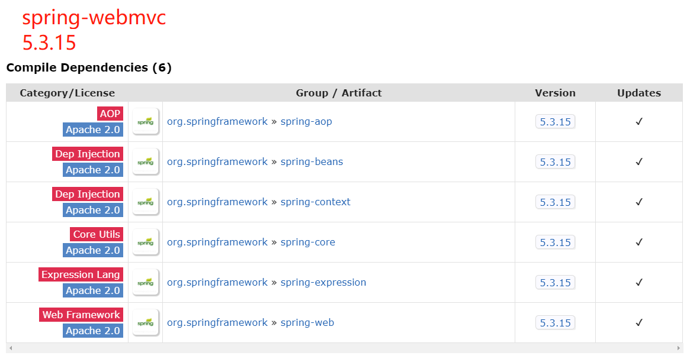
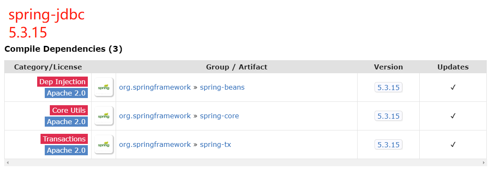
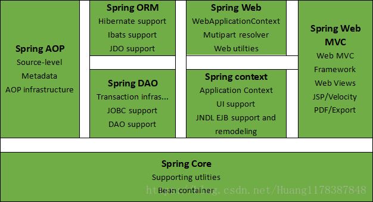
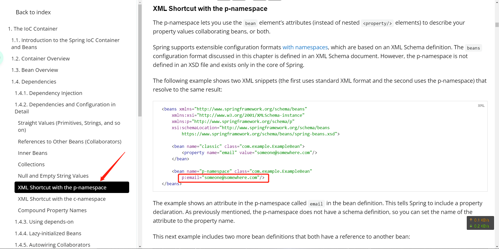
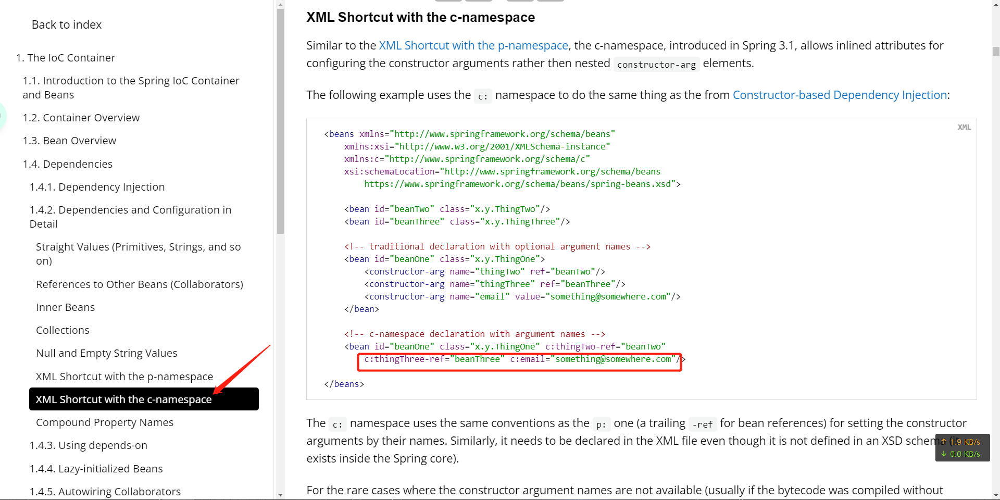
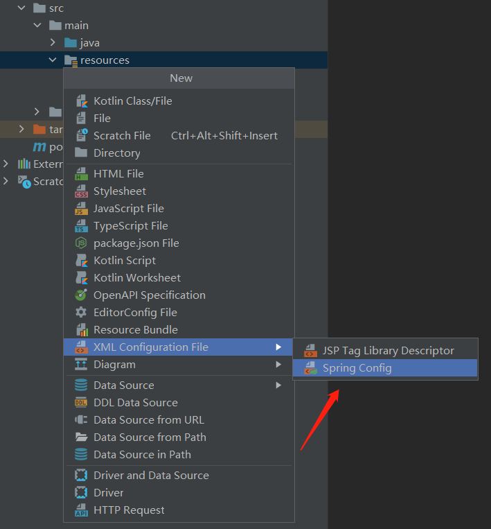
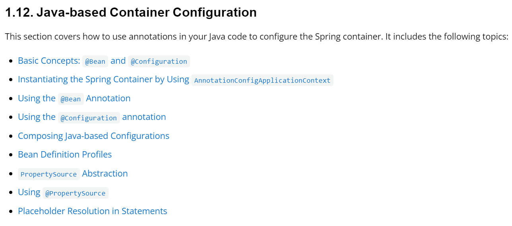

# Spring5学习笔记

## 零. 前言

### 基于教程

[【狂神说Java】Spring5最新完整教程IDEA版通俗易懂_哔哩哔哩_bilibili](https://www.bilibili.com/video/BV1WE411d7Dv?spm_id_from=333.999.0.0)（发布时间：2019-10-13）

《Java EE框架整合开发入门到实战》 - 清华大学出版社（出版时间：2018-09）

### 本机环境版本

* *Spring Framework 5.3.15*

* JDK 11.0.3

### 参考资料

官方：

[Spring Framework](https://spring.io/projects/spring-framework#learn)

* [Spring Framework Documentation](https://docs.spring.io/spring-framework/docs/current/reference/html/)
  * [Core Technologies](https://docs.spring.io/spring-framework/docs/current/reference/html/core.html#spring-core)

[Newest 'spring+or+spring-mvc+or+spring-aop' Questions - Stack Overflow](https://stackoverflow.com/questions/tagged/spring+or+spring-mvc+or+spring-aop)

非官方：

[Spring | broken's blog](https://guopeixiong.github.io/2021/10/21/Spring/)（基于同一教程的学习笔记，值得参考）

[Spring Framework 中文文档 - Spring Framework 5.1.3.RELEASE Reference | Docs4dev](https://www.docs4dev.com/docs/zh/spring-framework/5.1.3.RELEASE/reference/)

[Spring 5.X系列教程:满足你对Spring5的一切想象-持续更新 - flydean - 博客园](https://www.cnblogs.com/flydean/p/spring5.html)

## 一. 简介

### 1.1 spring是什么

**Spring是一个轻量级的控制反转(IoC)和面向切面(AOP)的容器框架。**

> # [Spring Framework Overview](https://docs.spring.io/spring-framework/docs/current/reference/html/overview.html#overview)
>
> Version 5.3.15
>
> <u>Spring makes it easy to create Java enterprise applications.</u> It provides everything you need to embrace the Java language in an enterprise environment, with support for Groovy and Kotlin as alternative languages on the JVM, and with the flexibility to create many kinds of architectures depending on an application’s needs. ...
>
> <u>Spring supports a wide range of application scenarios.</u> ...
>
> <u>Spring is open source. It has a large and active community</u> that provides continuous feedback based on a diverse range of real-world use cases. This has helped Spring to successfully evolve over a very long time.
>
> ## 1. What We Mean by "Spring"
>
> The term "Spring" means different things in different contexts. <u>It can be used to refer to the Spring Framework project itself, which is where it all started. Over time, other Spring projects have been built on top of the Spring Framework.</u> Most often, when people say "Spring", they mean the entire family of projects. <u>This reference documentation focuses on the foundation: the Spring Framework itself.</u>
>
> The Spring Framework is divided into modules. Applications can choose which modules they need. <u>At the heart are the modules of the core container</u>, including a configuration model and a dependency injection mechanism. <u>Beyond that, the Spring Framework provides foundational support for different application architectures,</u> including messaging, transactional data and persistence, and web. It also includes the Servlet-based Spring MVC web framework and, in parallel, the Spring WebFlux reactive web framework.
>
> ...
>
> ## 2. History of Spring and the Spring Framework
>
> <u>Spring came into being in 2003 as a response to the complexity of the early [J2EE](https://en.wikipedia.org/wiki/Java_Platform,_Enterprise_Edition) specifications.</u> While some consider Java EE and Spring to be in competition, Spring is, in fact, complementary to Java EE. The Spring programming model does not embrace the Java EE platform specification; rather, it integrates with carefully selected individual specifications from the EE umbrella:
>
> - Servlet API ([JSR 340](https://jcp.org/en/jsr/detail?id=340))
> - WebSocket API ([JSR 356](https://www.jcp.org/en/jsr/detail?id=356))
> - Concurrency Utilities ([JSR 236](https://www.jcp.org/en/jsr/detail?id=236))
> - JSON Binding API ([JSR 367](https://jcp.org/en/jsr/detail?id=367))
> - Bean Validation ([JSR 303](https://jcp.org/en/jsr/detail?id=303))
> - JPA ([JSR 338](https://jcp.org/en/jsr/detail?id=338))
> - JMS ([JSR 914](https://jcp.org/en/jsr/detail?id=914))
> - as well as JTA/JCA setups for transaction coordination, if necessary.
>
> The Spring Framework also supports the Dependency Injection ([JSR 330](https://www.jcp.org/en/jsr/detail?id=330)) and Common Annotations ([JSR 250](https://jcp.org/en/jsr/detail?id=250)) specifications, which application developers may choose to use instead of the Spring-specific mechanisms provided by the Spring Framework.
>
> ...
>
> ## 3. Design Philosophy
>
> When you learn about a framework, it’s important to know not only what it does but what principles it follows. Here are the guiding principles of the Spring Framework:
>
> - <u>Provide choice at every level.</u> Spring lets you defer design decisions as late as possible. For example, you can switch persistence providers through configuration without changing your code. The same is true for many other infrastructure concerns and integration with third-party APIs.
> - <u>Accommodate diverse perspectives.</u> Spring embraces flexibility and is not opinionated about how things should be done. It supports a wide range of application needs with different perspectives.
> - <u>Maintain strong backward compatibility.</u> Spring’s evolution has been carefully managed to force few breaking changes between versions. Spring supports a carefully chosen range of JDK versions and third-party libraries to facilitate maintenance of applications and libraries that depend on Spring.
> - <u>Care about API design.</u> The Spring team puts a lot of thought and time into making APIs that are intuitive and that hold up across many versions and many years.
> - <u>Set high standards for code quality.</u> The Spring Framework puts a strong emphasis on meaningful, current, and accurate javadoc. It is one of very few projects that can claim clean code structure with no circular dependencies between packages.
>
> ## 4. Feedback and Contributions
>
> <u>For how-to questions or diagnosing or debugging issues, we suggest using Stack Overflow.</u> Click [here](https://stackoverflow.com/questions/tagged/spring+or+spring-mvc+or+spring-aop+or+spring-jdbc+or+spring-r2dbc+or+spring-transactions+or+spring-annotations+or+spring-jms+or+spring-el+or+spring-test+or+spring+or+spring-remoting+or+spring-orm+or+spring-jmx+or+spring-cache+or+spring-webflux+or+spring-rsocket?tab=Newest) for a list of the suggested tags to use on Stack Overflow. If you’re fairly certain that there is a problem in the Spring Framework or would like to suggest a feature, please use the [GitHub Issues](https://github.com/spring-projects/spring-framework/issues).
>
> ...
>
> ## 5. Getting Started
>
> If you are just getting started with Spring, you may want to begin using the Spring Framework by creating a [Spring Boot](https://projects.spring.io/spring-boot/)-based application. Spring Boot provides a quick (and opinionated) way to create a production-ready Spring-based application. It is based on the Spring Framework, favors convention over configuration, and is designed to get you up and running as quickly as possible.
>
> <u>You can use [start.spring.io](https://start.spring.io/) to generate a basic project</u> or follow one of the ["Getting Started" guides](https://spring.io/guides), such as [Getting Started Building a RESTful Web Service](https://spring.io/guides/gs/rest-service/). As well as being easier to digest, these guides are very task focused, and most of them are based on Spring Boot. They also cover other projects from the Spring portfolio that you might want to consider when solving a particular problem.

### 1.2 spring的优点

* 开源、免费
* 轻量级、非侵入式
* 控制反转、面向切面
* 支持事务的处理
* 支持几乎所有Java框架的整合（“spring是个大杂烩”）

### 1.3 Maven导入Spring相关依赖

```xml
<!-- springframework的一个比较顶层的模块 -->
<!-- https://mvnrepository.com/artifact/org.springframework/spring-webmvc -->
<dependency>
    <groupId>org.springframework</groupId>
    <artifactId>spring-webmvc</artifactId>
    <version>5.3.15</version>
</dependency>
<!-- spring和mybatis整合要用到 -->
<!-- https://mvnrepository.com/artifact/org.springframework/spring-jdbc -->
<dependency>
    <groupId>org.springframework</groupId>
    <artifactId>spring-jdbc</artifactId>
    <version>5.3.15</version>
</dependency>
```





---

2022.02.12正式开始，看了P1

应该就看了这一次

### ---

2022.03.24重新开始

此时我已经跟着学校课程快“学完”Spring了，所以接下来的基础/概念部分笔记可能会比较简略。

---

### 1.4 spring七大模块

详细介绍可看：[Spring七大模块详解_压到我腿毛了的博客-CSDN博客_spring框架的七大模块](https://blog.csdn.net/Huang1178387848/article/details/82697242)

我就只摘里面的一张图：



### 1.5 现代化的Java开发

现代化的Java开发，其实就是Spring开发！

* Spring Boot

  * 快速开发的脚手架

  * 基于Spring Boot可以快速开发单个微服务

  * 约定大于配置

* Spring Cloud

  * 基于Spring Boot实现


## 二. 控制反转

* 视频P3-P6

### 2.1 概念

Spring官方文档如是说：

> This chapter covers the Spring Framework implementation of the **Inversion of Control (IoC) principle**. IoC is also known as **dependency injection (DI)**.

也就是说，IoC和DI的概念几乎是等同的。

**在Spring中实现控制反转的是IoC容器(The IoC Container)，其实现方式是依赖注入。**

扩展阅读：

[Spring IoC有什么好处呢？ - Mingqi的回答 - 知乎](https://www.zhihu.com/question/23277575/answer/169698662)

[浅谈控制反转与依赖注入 - 胡小国的文章 - 知乎](https://zhuanlan.zhihu.com/p/33492169)

### 2.2 实践

新建p6包

```java
package p6AndP7;

public class User {
    private String name;
    
    /**
     * 如果在配置文件里没有配置bean的constructor-arg，则必须要有无参构造方法
     */
    public User() {
        System.out.println("调用User的无参构造方法");
    }
    
    /**
     * 如果在配置文件里配置了bean的property，则必须要有对应成员变量的setter方法
     */
    public void setName(String name) {
        this.name = name;
    }
    
    public void showName() {
        System.out.println(name);
    }
}
```
```xml
<?xml version="1.0" encoding="UTF-8"?>
<beans xmlns="http://www.springframework.org/schema/beans"
       xmlns:xsi="http://www.w3.org/2001/XMLSchema-instance"
       xsi:schemaLocation="http://www.springframework.org/schema/beans
        https://www.springframework.org/schema/beans/spring-beans.xsd">

    <bean id="myUser" class="p6.User">
        <property name="name" value="小吴"/>
    </bean>

</beans>
```

```java
package p6AndP7;

import org.springframework.context.ApplicationContext;
import org.springframework.context.support.ClassPathXmlApplicationContext;

public class TestP6 {
    public static void main(String[] args) {
        ApplicationContext applicationContext = new ClassPathXmlApplicationContext("p6AndP7/configP6.xml");
        System.out.println("---在加载配置文件时，IoC容器就已经帮我们new好了Bean（实例化Spring管理的对象）---");
        User user = (User) applicationContext.getBean("myUser");
        user.showName();
    }
}
```

运行结果：

```
调用User的无参构造方法
---在加载配置文件时，IoC容器就已经帮我们new好了Bean（实例化Spring管理的对象）---
小吴

Process finished with exit code 0
```

## 三. Spring配置

* 视频P7

怎么配置Bean以及bean标签怎么用就不说了，很简单。

### 3.1 别名

可以通过两种方式配置Bean的一个或多个别名，通过别名获得的Bean对象引用与通过id获得的完全相同（singleton作用域下）。

```xml
<!-- bean标签的name属性中可以配置多个别名，别名之间可以用空格/逗号/分号分隔 -->
<bean id="myUser" class="User" name="alias3,alias4;alias5 alias6">
    <property name="name" value="小吴"/>
</bean>

<!-- 一个alias标签只能配置一个别名 -->
<alias name="myUser" alias="userAlias1"/>
<alias name="myUser" alias="userAlias2"/>
...
```

### 3.2 import标签

多用于团队开发。可以将多个配置文件导入并合并为一个配置文件。

```xml
<import resource="another-config1.xml"/>
<import resource="another-config2.xml"/>
...
```

## 四. 依赖注入

* 视频P8-P10

### 4.1 搭建测试环境

```java
package p8ToP10;

public class Student {
    //各种不同类型的成员变量（Student对象的“依赖”），如何通过配置文件进行“注入”？
    String name;
    String[] namesOfFriends;
    Teacher favoriteTeacher;
    Teacher[] allTeachers;
    List<String> notebooks;
    Set<String> textbooks;
    Map<String, String> grades;
    String anEmptyString;
    String aNullValue;
    
    //getter setter
    //toString
}
```

```java
package p8ToP10;

public class Teacher {
    String teacherName;
    long teacherId;
        
    //getter setter
    //toString
}
```

### 4.2 Setter方式注入实践

```xml
<?xml version="1.0" encoding="UTF-8"?>
<beans xmlns="http://www.springframework.org/schema/beans"
       xmlns:xsi="http://www.w3.org/2001/XMLSchema-instance"
       xsi:schemaLocation="http://www.springframework.org/schema/beans
        https://www.springframework.org/schema/beans/spring-beans.xsd">

    <bean id="teacherWu" class="p8ToP10.Teacher">
        <property name="teacherName" value="吴老师"/>
        <property name="teacherId" value="136"/>
    </bean>

    <bean id="teacherLin" class="p8ToP10.Teacher">
        <property name="teacherName" value="林老师"/>
        <property name="teacherId" value="134"/>
    </bean>

    <bean id="aStudent" class="p8ToP10.Student">
        <!-- 值类型注入 -->
<!--        <property name="name" value="小吴同学"/>-->
        <property name="name">
            <value>小吴同学</value>
        </property>

        <!-- 值类型的数组注入 -->
        <property name="namesOfFriends">
            <array>
                <value>朋友名字1</value>
                <value>朋友名字2</value>
                <value>朋友名字3</value>
            </array>
        </property>

        <!-- 引用类型注入 -->
<!--        <property name="favoriteTeacher" ref="teacherWu"/>-->
        <property name="favoriteTeacher">
            <ref bean="teacherWu"/>
        </property>

        <!-- 引用类型的数组注入 -->
        <property name="allTeachers">
            <array>
                <ref bean="teacherWu"/>
                <ref bean="teacherLin"/>
            </array>
        </property>

        <!-- List注入（仅演示值类型） -->
        <property name="notebooks">
            <list>
                <value>笔记本111</value>
                <value>笔记本111</value>
                <value>笔记本222</value>
            </list>
        </property>

        <!-- Set注入（仅演示值类型） -->
        <property name="textbooks">
            <set>
                <value>语文课本</value>
                <value>数学课本</value>
                <value>英语课本</value>
            </set>
        </property>

        <!-- Map注入（仅演示值类型） -->
        <property name="grades">
            <map>
                <entry key="语文" value="85"/>
                <entry key="数学" value="80"/>
                <entry key="英语" value="90"/>
            </map>
        </property>

        <!-- 空字符串注入 -->
        <property name="anEmptyString" value=""/>

        <!-- null值注入 -->
        <property name="aNullValue">
            <null/>
        </property>
        
    </bean>
</beans>
```

```java
package p8ToP10;

public class TestP8ToP10 {
    public static void main(String[] args) {
        ApplicationContext applicationContext = new ClassPathXmlApplicationContext("p8ToP10/config.xml");
        //小技巧：可以传一个requiredType参数，这样就不用强转了
        Student aStudent = applicationContext.getBean("aStudent", Student.class);
        System.out.println(aStudent);
    }
}
```

### 4.3 构造器方式注入

就是用在bean标签里用constructor-arg子标签，我已经掌握了，课本里也有，所以这里略过。

**值得注意的是，setter方式注入本质上是调用Bean类的setter方法，所以该类一定要有setter方法。**

**而构造器方式注入，同理，也需要有有参构造方法才能注入成功。**

### 4.4 其他注入方式

使用p（parameter）命名空间或者c（contructor）命名空间进行注入。

用起来很简单的。

> 注意：不能直接使用，需要导入XML约束：
>
> ```xml
> xmlns:p="http://www.springframework.org/schema/p"
> xmlns:c="http://www.springframework.org/schema/c"
> ```

参考官网：





## 五. Bean的作用域

可以在bean标签的**scope**属性中配置一个bean的作用域。Be like：

```xml
<bean id="beanId" class="..." scope="singleton"/>
```

### 5.1 singleton作用域

默认的作用域。

使用singleton定义的Bean在Spring容器中只有一个Bean实例。类似于单例模式（Single Pattern）。

> #### 1.5.1. The Singleton Scope
>
> **Only one shared instance of a singleton bean is managed, and all requests for beans with an ID or IDs that match that bean definition result in that one specific bean instance being returned by the Spring container.**
>
> To put it another way, when you define a bean definition and it is scoped as a singleton, the Spring IoC container creates exactly one instance of the object defined by that bean definition. **This single instance is stored in a cache of such singleton beans, and all subsequent requests and references for that named bean return the cached object.** The following image shows how the singleton scope works:
>
> 
>
> Spring’s concept of a singleton bean differs from the singleton pattern as defined in the Gang of Four (GoF) patterns book. **The GoF singleton hard-codes the scope of an object such that one and only one instance of a particular class is created per ClassLoader. The scope of the Spring singleton is best described as being per-container and per-bean.** This means that, if you define one bean for a particular class in a single Spring container, the Spring container creates one and only one instance of the class defined by that bean definition.

### 5.2 prototype作用域

应用了原型模式（Prototype Pattern），每次获取该Bean都会得到不同的引用对象。

> #### 1.5.2. The Prototype Scope
>
> **The non-singleton prototype scope of bean deployment results in the creation of a new bean instance every time a request for that specific bean is made.** That is, the bean is injected into another bean or you request it through a `getBean()` method call on the container. **As a rule, you should use the prototype scope for all stateful beans and the singleton scope for stateless beans.**
>
> The following diagram illustrates the Spring prototype scope:
>
> 
>
> ......
>
> **In contrast to the other scopes, Spring does not manage the complete lifecycle of a prototype bean. The container instantiates, configures, and otherwise assembles a prototype object and hands it to the client, with no further record of that prototype instance.** Thus, although initialization lifecycle callback methods are called on all objects regardless of scope, in the case of prototypes, configured destruction lifecycle callbacks are not called. The client code must clean up prototype-scoped objects and release expensive resources that the prototype beans hold. To get the Spring container to release resources held by prototype-scoped beans, try using a custom [bean post-processor](https://docs.spring.io/spring-framework/docs/current/reference/html/core.html#beans-factory-extension-bpp), which holds a reference to beans that need to be cleaned up.
>
> **In some respects, the Spring container’s role in regard to a prototype-scoped bean is a replacement for the Java `new` operator.** All lifecycle management past that point must be handled by the client. (For details on the lifecycle of a bean in the Spring container, see [Lifecycle Callbacks](https://docs.spring.io/spring-framework/docs/current/reference/html/core.html#beans-factory-lifecycle).)

### 5.3 其他作用域

> #### 1.5.4. Request, Session, Application, and WebSocket Scopes
>
> The `request`, `session`, `application`, and `websocket` scopes are available only if you use a web-aware Spring `ApplicationContext` implementation (such as `XmlWebApplicationContext`). If you use these scopes with regular Spring IoC containers, such as the `ClassPathXmlApplicationContext`, an `IllegalStateException` that complains about an unknown bean scope is thrown.

其他几个作用域request、session、application、websocket都只能在Web Spring应用程序上下文中使用，等学到Spring MVC再具体学习。

* request：一次HTTP request对应一个Bean实例，对不同的HTTP请求返回不同的Bean实例。
* session：一个HTTP Session对应一个Bean实例。
* application：为每个ServletContext对象创建一个Bean实例，即一个应用共享一个Bean实例。
* websocket：为每个WebSocket对象创建一个Bean实例。

## 六. Bean的装配

Bean的装配可以理解为将Bean依赖注入到Spring容器中，装配方式即Bean依赖注入的方式。

Spring容器支持基于XML配置的装配（手动装配）、基于注解的装配以及自动装配等多种装配方式。

### 6.1 XML配置手动装配

前面已经学过了，就是在XML文件里配置bean标签嘛，也是Spring最基础的用法。

这里刚好可以玩一下p命名空间。

```java
public class Dog {
    String dogName;
    
    //getter setter toString
}
```

```java
public class Cat {
    String catName;
    
    //getter setter toString
}
```

```java
public class Person {
    private Dog dog;
    private Cat cat;
    
    //getter setter toString
}
```

```xml
<bean id="myCat" class="p12ToP13.Cat" p:catName="小猫咪"/>

<bean id="myDog" class="p12ToP13.Dog" p:dogName="小狗狗"/>

<bean id="I" class="p12ToP13.Person" p:cat-ref="myCat" p:dog-ref="myDog"/>
```

插播一个新建Spring配置文件的小技巧：



```java
public static void main(String[] args) {
    ApplicationContext applicationContext = new ClassPathXmlApplicationContext("p12-/beans.xml");
    Person i = applicationContext.getBean("I", Person.class);
    System.out.println(i);
}
```

```输出结果
Person{dog=Dog{dogName='小狗狗'}, cat=Cat{catName='小猫咪'}}
```

### 6.2 XML配置自动装配

**autowire**的wire(v.)有"连线、接线"的意思，翻译过来就是"自动装配"。

若使用自动装配，则Spring容器会自动在上下文中寻找并装配符合条件的Bean。

还是先配置“猫”和“狗''两个宠物依赖。

```xml
<bean id="myCat" class="p12ToP13.Cat" p:catName="小猫咪"/>

<bean id="myDog" class="p12ToP13.Dog" p:dogName="小狗狗"/>
```
#### 6.2.1 byName

```xml
<!--     byName自动注入，默认的Bean依赖的id名是类名小写。此时Spring容器找不到id名为"dog"的Bean，所以注入失败-->
<bean id="I" class="p12ToP13.Person" autowire="byName"/>
```

```
Person{dog=null, cat=null}
```

#### 6.2.2 byType

```xml
<!--     byName自动注入，找与依赖类型相同的Bean -->
<bean id="I" class="p12ToP13.Person" autowire="byType"/>
```

```
Person{dog=Dog{dogName='小狗狗'}, cat=Cat{catName='小猫咪'}}
```

### 6.3 基于注解的装配

看下一节的@Autowired注解。

## 七. 基于注解开发Spring

对应官方文档的[1.9 Annotation-based Container Configuration](https://docs.spring.io/spring-framework/docs/current/reference/html/core.html#beans-annotation-config)

### 7.1 注解 vs XML

> ### 1.9. Annotation-based Container Configuration
>
> Are annotations better than XML for configuring Spring?
>
> The introduction of annotation-based configuration raised the question of whether this approach is “better” than XML. The short answer is “it depends.” The long answer is that each approach has its pros and cons, and, usually, it is up to the developer to decide which strategy suits them better. **Due to the way they are defined, annotations provide a lot of context in their declaration, leading to shorter and more concise configuration. However, XML excels at wiring up components without touching their source code or recompiling them.** Some developers prefer having the wiring close to the source while others argue that annotated classes are no longer POJOs and, furthermore, that the configuration becomes decentralized and harder to control.

使用注解配置好还是XML配置好？Spring官方：各有优缺点。

注解配置的优点是能够在短短的声明中包含很多信息，使得代码更加简洁与精细，但缺点是需要改动源码并重新编译。

XML配置虽然内容比较繁杂，但通过这种方式装配Bean不需要接触源代码，更不需要重新编译源码。

狂神：最佳实践：XML配置用来管理Bean，注解配置只负责完成属性（依赖）的注入。

### 7.2 基于注解配置

> 这部分笔记主要是摘抄课本里的，而代码在写JavaEE上机实验的时候敲过，就不再重复写了。

注意，配置了组件扫描\<context:component-scan\>之后，就不需要配置开启注解支持\<context:annotation-config/\>了，因为在spring-context.xsd（Xml Schema Definition）中已经说明：

> <xsd:element name="component-scan">
>    \<xsd:annotation\>
>       \<xsd:documentation\>\<![CDATA\[
>
> ......
>
> Note: **This tag implies the effects of the 'annotation-config' tag**

#### @Component

表示一个组件类，即一个Bean。

可以用在任意一层（DAO/Service/Controller），但为了使类的标注更加清晰，推荐使用下面的几个注解。

#### @Repository

该注解用于将数据库访问层的类（DAO）标记为Bean。

#### @Service

该注解用于将业务逻辑层的类（Service）标记为Bean。

#### @Controller

该注解用于将控制层的类（Controller）标记为Bean。

#### @Autowired

该注解可以对类的成员变量、方法以及构造方法进行标注，完成自动装配。

自动匹配相同**类型**的Bean。

如果匹配名称（Bean的id），则需要配合**@Qualifier**注解使用。

#### @Resource

JDK自带注解，作用与Spring的@Autowired注解类型。

不同之处在于，@Resource是优先按照**名称**来装配Bean的，只有当找不到匹配名称的Bean时，才会按照类型来装配。

### 7.3 基于纯Java配置

对应官方文档的[1.12 Java-based Container Configuration](https://docs.spring.io/spring-framework/docs/current/reference/html/core.html#beans-java)



#### 7.3.1 @Configuration和@Bean

> Annotating a class with `@Configuration` indicates that its primary purpose is as a source of bean definitions. Furthermore, `@Configuration` classes let inter-bean dependencies be defined by calling other `@Bean` methods in the same class. The simplest possible `@Configuration` class reads as follows:
>
> Java
>
> ```java
> @Configuration
> public class AppConfig {
> 
>  @Bean
>  public MyService myService() {
>      return new MyServiceImpl();
>  }
> }
> ```
> The preceding `AppConfig` class is equivalent to the following Spring `<beans/>` XML:
>
> ```xml
> <beans>
>     <bean id="myService" class="com.acme.services.MyServiceImpl"/>
> </beans>
> ```

狂神：

* 在Spring Boot中这样的纯Java配置随处可见。
* Spring和MyBatis不一样，Spring推荐用注解，因为更简单，而MyBatis推荐用XML，因为能够配置更复杂的操作。

#### 7.3.2 实践

```java
public class User {
    
    @Value("一个名字")
    String name;
    
    @Override
    public String toString() {
        return "User{" +
                "name='" + name + '\'' +
                '}';
    }
}
```

```java
@Configuration
public class MyConfig {

    @Bean
    public User getUser() {
        return new User();
    }
}
```

```java
public static void main(String[] args) {
    ApplicationContext applicationContext = new AnnotationConfigApplicationContext(MyConfig.class);
    User user = applicationContext.getBean("getUser", User.class);
    System.out.println(user);
}
```

```
User{name='一个名字'}
```

注意：如果不用@Bean注解，通过给配置类加上@ComponentScan("包路径")（相当于在XML里配置\<context:component-scan\>），并给Bean类加上@Component注解，也可以获取到Bean对象。

## 八. 代理模式

狂神将静态代理和动态代理讲了三节课，但是讲得很乱，举例不当，有些地方的代码写得也不合理，这里就不记笔记了。

课本第4章 Spring AOP，虽然文字解释很少，大部分靠自己悟，但至少有写上去的东西都是正确的。这部分还是看我的代码演示+注释吧：[IDEA/JavaEE/src/main/java/textbook/chapter04 at master · Matty-GCU/IDEA · GitHub](https://github.com/Matty-GCU/IDEA/tree/master/JavaEE/src/main/java/textbook/chapter04)