# Spring5学习笔记

## 零. 前言

### 基于教程

[【狂神说Java】Spring5最新完整教程IDEA版通俗易懂_哔哩哔哩_bilibili](https://www.bilibili.com/video/BV1WE411d7Dv?spm_id_from=333.999.0.0)（发布时间：2019-10-13）

《Java EE框架整合开发入门到实战》 - 清华大学出版社（出版时间：2018-09）

### 本机环境版本

* *Spring Framework 5.3.15*

* JDK 11.0.3

### 参考资料

官方：

[Spring Framework](https://spring.io/projects/spring-framework#learn)

* [Spring Framework Documentation](https://docs.spring.io/spring-framework/docs/current/reference/html/)
  * [Core Technologies](https://docs.spring.io/spring-framework/docs/current/reference/html/core.html#spring-core)

[Newest 'spring+or+spring-mvc+or+spring-aop' Questions - Stack Overflow](https://stackoverflow.com/questions/tagged/spring+or+spring-mvc+or+spring-aop)

[mybatis-spring](https://mybatis.org/spring/zh/index.html)

非官方：

[Spring | broken's blog](https://guopeixiong.github.io/2021/10/21/Spring/)（基于同一教程的学习笔记，值得参考）

[Spring Framework 中文文档 - Spring Framework 5.1.3.RELEASE Reference | Docs4dev](https://www.docs4dev.com/docs/zh/spring-framework/5.1.3.RELEASE/reference/)

[Spring 5.X系列教程:满足你对Spring5的一切想象-持续更新 - flydean - 博客园](https://www.cnblogs.com/flydean/p/spring5.html)

### 本机环境

* **Spring 5.3.15**
* JDK 11
* MySQL 8.0.26
* Maven 3.8.4
* IDEA 2021.1.3
* MyBatis 3.5.6

## 一. 简介

### 1.1 spring是什么

**Spring是一个轻量级的控制反转(IoC)和面向切面(AOP)的容器框架。**

> # [Spring Framework Overview](https://docs.spring.io/spring-framework/docs/current/reference/html/overview.html#overview)
>
> Version 5.3.15
>
> <u>Spring makes it easy to create Java enterprise applications.</u> It provides everything you need to embrace the Java language in an enterprise environment, with support for Groovy and Kotlin as alternative languages on the JVM, and with the flexibility to create many kinds of architectures depending on an application’s needs. ...
>
> <u>Spring supports a wide range of application scenarios.</u> ...
>
> <u>Spring is open source. It has a large and active community</u> that provides continuous feedback based on a diverse range of real-world use cases. This has helped Spring to successfully evolve over a very long time.
>
> ## 1. What We Mean by "Spring"
>
> The term "Spring" means different things in different contexts. <u>It can be used to refer to the Spring Framework project itself, which is where it all started. Over time, other Spring projects have been built on top of the Spring Framework.</u> Most often, when people say "Spring", they mean the entire family of projects. <u>This reference documentation focuses on the foundation: the Spring Framework itself.</u>
>
> The Spring Framework is divided into modules. Applications can choose which modules they need. <u>At the heart are the modules of the core container</u>, including a configuration model and a dependency injection mechanism. <u>Beyond that, the Spring Framework provides foundational support for different application architectures,</u> including messaging, transactional data and persistence, and web. It also includes the Servlet-based Spring MVC web framework and, in parallel, the Spring WebFlux reactive web framework.
>
> ...
>
> ## 2. History of Spring and the Spring Framework
>
> <u>Spring came into being in 2003 as a response to the complexity of the early [J2EE](https://en.wikipedia.org/wiki/Java_Platform,_Enterprise_Edition) specifications.</u> While some consider Java EE and Spring to be in competition, Spring is, in fact, complementary to Java EE. The Spring programming model does not embrace the Java EE platform specification; rather, it integrates with carefully selected individual specifications from the EE umbrella:
>
> - Servlet API ([JSR 340](https://jcp.org/en/jsr/detail?id=340))
> - WebSocket API ([JSR 356](https://www.jcp.org/en/jsr/detail?id=356))
> - Concurrency Utilities ([JSR 236](https://www.jcp.org/en/jsr/detail?id=236))
> - JSON Binding API ([JSR 367](https://jcp.org/en/jsr/detail?id=367))
> - Bean Validation ([JSR 303](https://jcp.org/en/jsr/detail?id=303))
> - JPA ([JSR 338](https://jcp.org/en/jsr/detail?id=338))
> - JMS ([JSR 914](https://jcp.org/en/jsr/detail?id=914))
> - as well as JTA/JCA setups for transaction coordination, if necessary.
>
> The Spring Framework also supports the Dependency Injection ([JSR 330](https://www.jcp.org/en/jsr/detail?id=330)) and Common Annotations ([JSR 250](https://jcp.org/en/jsr/detail?id=250)) specifications, which application developers may choose to use instead of the Spring-specific mechanisms provided by the Spring Framework.
>
> ...
>
> ## 3. Design Philosophy
>
> When you learn about a framework, it’s important to know not only what it does but what principles it follows. Here are the guiding principles of the Spring Framework:
>
> - <u>Provide choice at every level.</u> Spring lets you defer design decisions as late as possible. For example, you can switch persistence providers through configuration without changing your code. The same is true for many other infrastructure concerns and integration with third-party APIs.
> - <u>Accommodate diverse perspectives.</u> Spring embraces flexibility and is not opinionated about how things should be done. It supports a wide range of application needs with different perspectives.
> - <u>Maintain strong backward compatibility.</u> Spring’s evolution has been carefully managed to force few breaking changes between versions. Spring supports a carefully chosen range of JDK versions and third-party libraries to facilitate maintenance of applications and libraries that depend on Spring.
> - <u>Care about API design.</u> The Spring team puts a lot of thought and time into making APIs that are intuitive and that hold up across many versions and many years.
> - <u>Set high standards for code quality.</u> The Spring Framework puts a strong emphasis on meaningful, current, and accurate javadoc. It is one of very few projects that can claim clean code structure with no circular dependencies between packages.
>
> ## 4. Feedback and Contributions
>
> <u>For how-to questions or diagnosing or debugging issues, we suggest using Stack Overflow.</u> Click [here](https://stackoverflow.com/questions/tagged/spring+or+spring-mvc+or+spring-aop+or+spring-jdbc+or+spring-r2dbc+or+spring-transactions+or+spring-annotations+or+spring-jms+or+spring-el+or+spring-test+or+spring+or+spring-remoting+or+spring-orm+or+spring-jmx+or+spring-cache+or+spring-webflux+or+spring-rsocket?tab=Newest) for a list of the suggested tags to use on Stack Overflow. If you’re fairly certain that there is a problem in the Spring Framework or would like to suggest a feature, please use the [GitHub Issues](https://github.com/spring-projects/spring-framework/issues).
>
> ...
>
> ## 5. Getting Started
>
> If you are just getting started with Spring, you may want to begin using the Spring Framework by creating a [Spring Boot](https://projects.spring.io/spring-boot/)-based application. Spring Boot provides a quick (and opinionated) way to create a production-ready Spring-based application. It is based on the Spring Framework, favors convention over configuration, and is designed to get you up and running as quickly as possible.
>
> <u>You can use [start.spring.io](https://start.spring.io/) to generate a basic project</u> or follow one of the ["Getting Started" guides](https://spring.io/guides), such as [Getting Started Building a RESTful Web Service](https://spring.io/guides/gs/rest-service/). As well as being easier to digest, these guides are very task focused, and most of them are based on Spring Boot. They also cover other projects from the Spring portfolio that you might want to consider when solving a particular problem.

### 1.2 spring的优点

* 开源、免费
* 轻量级、非侵入式
* 控制反转、面向切面
* 支持事务的处理
* 支持几乎所有Java框架的整合（“spring是个大杂烩”）

### 1.3 Maven导入Spring相关依赖

```xml
<!-- springframework的一个比较顶层的模块 -->
<!-- https://mvnrepository.com/artifact/org.springframework/spring-webmvc -->
<dependency>
    <groupId>org.springframework</groupId>
    <artifactId>spring-webmvc</artifactId>
    <version>5.3.15</version>
</dependency>
<!-- spring和mybatis整合要用到 -->
<!-- https://mvnrepository.com/artifact/org.springframework/spring-jdbc -->
<dependency>
    <groupId>org.springframework</groupId>
    <artifactId>spring-jdbc</artifactId>
    <version>5.3.15</version>
</dependency>
```

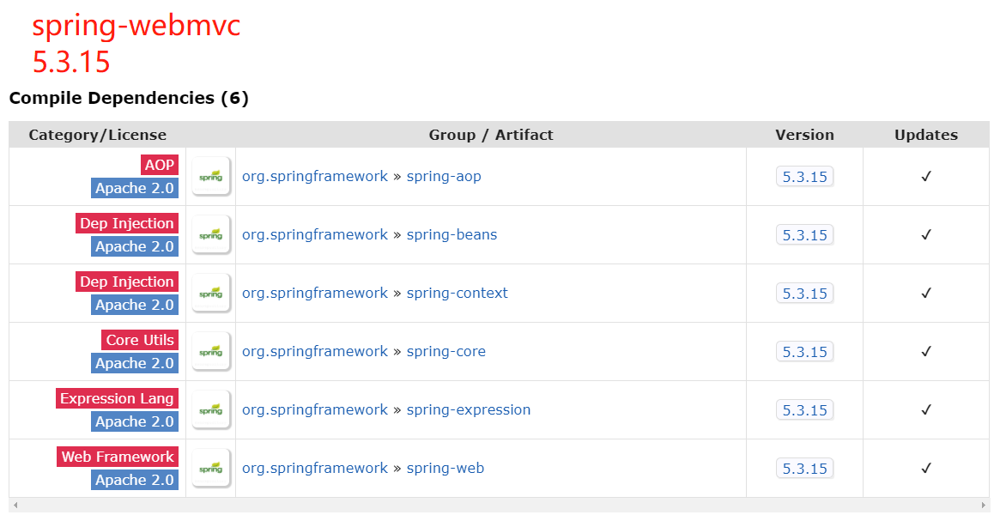

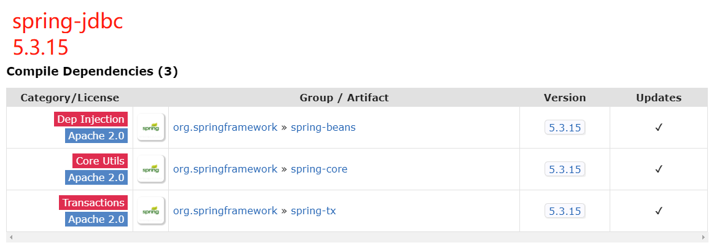

---

2022.02.12正式开始，看了P1

应该就看了这一次

### ---

2022.03.24重新开始

此时我已经跟着学校课程快“学完”Spring了，所以接下来的基础/概念部分笔记可能会比较简略。

---

### 1.4 spring七大模块

详细介绍可看：[Spring七大模块详解_压到我腿毛了的博客-CSDN博客_spring框架的七大模块](https://blog.csdn.net/Huang1178387848/article/details/82697242)

我就只摘里面的一张图：

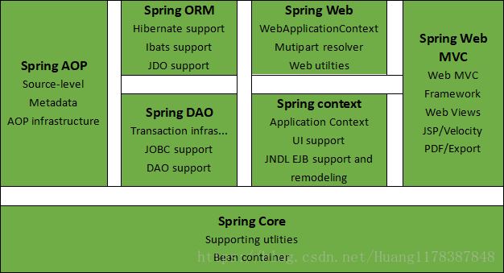

### 1.5 现代化的Java开发

现代化的Java开发，其实就是Spring开发！

* Spring Boot

  * 快速开发的脚手架

  * 基于Spring Boot可以快速开发单个微服务

  * 约定大于配置

* Spring Cloud

  * 基于Spring Boot实现


## 二. 控制反转

* 视频P3-P6

### 2.1 概念

Spring官方文档如是说：

> This chapter covers the Spring Framework implementation of the **Inversion of Control (IoC) principle**. IoC is also known as **dependency injection (DI)**.

也就是说，IoC和DI的概念几乎是等同的。

**在Spring中实现控制反转的是IoC容器(The IoC Container)，其实现方式是依赖注入。**

扩展阅读：

[Spring IoC有什么好处呢？ - Mingqi的回答 - 知乎](https://www.zhihu.com/question/23277575/answer/169698662)

[浅谈控制反转与依赖注入 - 胡小国的文章 - 知乎](https://zhuanlan.zhihu.com/p/33492169)

### 2.2 实践

新建p6包

```java
package p6AndP7;

public class User {
    private String name;
    
    /**
     * 如果在配置文件里没有配置bean的constructor-arg，则必须要有无参构造方法
     */
    public User() {
        System.out.println("调用User的无参构造方法");
    }
    
    /**
     * 如果在配置文件里配置了bean的property，则必须要有对应成员变量的setter方法
     */
    public void setName(String name) {
        this.name = name;
    }
    
    public void showName() {
        System.out.println(name);
    }
}
```
```xml
<?xml version="1.0" encoding="UTF-8"?>
<beans xmlns="http://www.springframework.org/schema/beans"
       xmlns:xsi="http://www.w3.org/2001/XMLSchema-instance"
       xsi:schemaLocation="http://www.springframework.org/schema/beans
        https://www.springframework.org/schema/beans/spring-beans.xsd">

    <bean id="myUser" class="p6.User">
        <property name="name" value="小吴"/>
    </bean>

</beans>
```

```java
package p6AndP7;

import org.springframework.context.ApplicationContext;
import org.springframework.context.support.ClassPathXmlApplicationContext;

public class TestP6 {
    public static void main(String[] args) {
        ApplicationContext applicationContext = new ClassPathXmlApplicationContext("p6AndP7/configP6.xml");
        System.out.println("---在加载配置文件时，IoC容器就已经帮我们new好了Bean（实例化Spring管理的对象）---");
        User user = (User) applicationContext.getBean("myUser");
        user.showName();
    }
}
```

运行结果：

```
调用User的无参构造方法
---在加载配置文件时，IoC容器就已经帮我们new好了Bean（实例化Spring管理的对象）---
小吴

Process finished with exit code 0
```

## 三. Spring配置

* 视频P7

怎么配置Bean以及bean标签怎么用就不说了，很简单。

### 3.1 别名

可以通过两种方式配置Bean的一个或多个别名，通过别名获得的Bean对象引用与通过id获得的完全相同（singleton作用域下）。

```xml
<!-- bean标签的name属性中可以配置多个别名，别名之间可以用空格/逗号/分号分隔 -->
<bean id="myUser" class="User" name="alias3,alias4;alias5 alias6">
    <property name="name" value="小吴"/>
</bean>

<!-- 一个alias标签只能配置一个别名 -->
<alias name="myUser" alias="userAlias1"/>
<alias name="myUser" alias="userAlias2"/>
...
```

### 3.2 import标签

多用于团队开发。可以将多个配置文件导入并合并为一个配置文件。

```xml
<import resource="another-config1.xml"/>
<import resource="another-config2.xml"/>
...
```

## 四. 依赖注入

* 视频P8-P10

### 4.1 搭建测试环境

```java
package p8ToP10;

public class Student {
    //各种不同类型的成员变量（Student对象的“依赖”），如何通过配置文件进行“注入”？
    String name;
    String[] namesOfFriends;
    Teacher favoriteTeacher;
    Teacher[] allTeachers;
    List<String> notebooks;
    Set<String> textbooks;
    Map<String, String> grades;
    String anEmptyString;
    String aNullValue;
    
    //getter setter
    //toString
}
```

```java
package p8ToP10;

public class Teacher {
    String teacherName;
    long teacherId;
        
    //getter setter
    //toString
}
```

### 4.2 Setter方式注入实践

```xml
<?xml version="1.0" encoding="UTF-8"?>
<beans xmlns="http://www.springframework.org/schema/beans"
       xmlns:xsi="http://www.w3.org/2001/XMLSchema-instance"
       xsi:schemaLocation="http://www.springframework.org/schema/beans
        https://www.springframework.org/schema/beans/spring-beans.xsd">

    <bean id="teacherWu" class="p8ToP10.Teacher">
        <property name="teacherName" value="吴老师"/>
        <property name="teacherId" value="136"/>
    </bean>

    <bean id="teacherLin" class="p8ToP10.Teacher">
        <property name="teacherName" value="林老师"/>
        <property name="teacherId" value="134"/>
    </bean>

    <bean id="aStudent" class="p8ToP10.Student">
        <!-- 值类型注入 -->
<!--        <property name="name" value="小吴同学"/>-->
        <property name="name">
            <value>小吴同学</value>
        </property>

        <!-- 值类型的数组注入 -->
        <property name="namesOfFriends">
            <array>
                <value>朋友名字1</value>
                <value>朋友名字2</value>
                <value>朋友名字3</value>
            </array>
        </property>

        <!-- 引用类型注入 -->
<!--        <property name="favoriteTeacher" ref="teacherWu"/>-->
        <property name="favoriteTeacher">
            <ref bean="teacherWu"/>
        </property>

        <!-- 引用类型的数组注入 -->
        <property name="allTeachers">
            <array>
                <ref bean="teacherWu"/>
                <ref bean="teacherLin"/>
            </array>
        </property>

        <!-- List注入（仅演示值类型） -->
        <property name="notebooks">
            <list>
                <value>笔记本111</value>
                <value>笔记本111</value>
                <value>笔记本222</value>
            </list>
        </property>

        <!-- Set注入（仅演示值类型） -->
        <property name="textbooks">
            <set>
                <value>语文课本</value>
                <value>数学课本</value>
                <value>英语课本</value>
            </set>
        </property>

        <!-- Map注入（仅演示值类型） -->
        <property name="grades">
            <map>
                <entry key="语文" value="85"/>
                <entry key="数学" value="80"/>
                <entry key="英语" value="90"/>
            </map>
        </property>

        <!-- 空字符串注入 -->
        <property name="anEmptyString" value=""/>

        <!-- null值注入 -->
        <property name="aNullValue">
            <null/>
        </property>
        
    </bean>
</beans>
```

```java
package p8ToP10;

public class TestP8ToP10 {
    public static void main(String[] args) {
        ApplicationContext applicationContext = new ClassPathXmlApplicationContext("p8ToP10/config.xml");
        //小技巧：可以传一个requiredType参数，这样就不用强转了
        Student aStudent = applicationContext.getBean("aStudent", Student.class);
        System.out.println(aStudent);
    }
}
```

### 4.3 构造器方式注入

就是用在bean标签里用constructor-arg子标签，我已经掌握了，课本里也有，所以这里略过。

**值得注意的是，setter方式注入本质上是调用Bean类的setter方法，所以该类一定要有setter方法。**

**而构造器方式注入，同理，也需要有有参构造方法才能注入成功。**

### 4.4 其他注入方式

使用p（parameter）命名空间或者c（contructor）命名空间进行注入。

用起来很简单的。

> 注意：不能直接使用，需要导入XML约束：
>
> ```xml
> xmlns:p="http://www.springframework.org/schema/p"
> xmlns:c="http://www.springframework.org/schema/c"
> ```

参考官网：

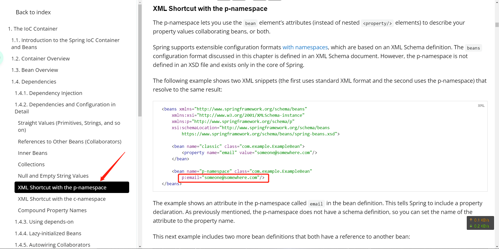

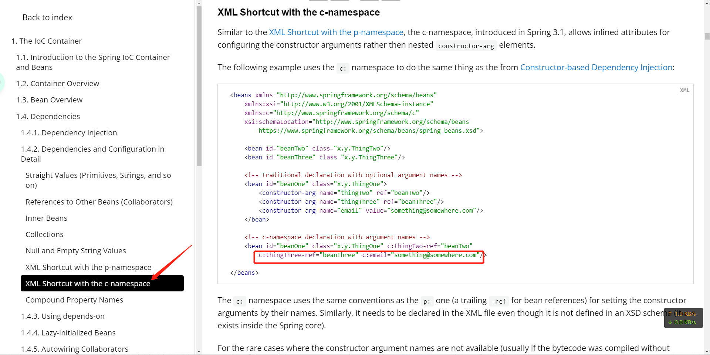

## 五. Bean的作用域

可以在bean标签的**scope**属性中配置一个bean的作用域。Be like：

```xml
<bean id="beanId" class="..." scope="singleton"/>
```

### 5.1 singleton作用域

默认的作用域。

使用singleton定义的Bean在Spring容器中只有一个Bean实例。类似于单例模式（Single Pattern）。

> #### 1.5.1. The Singleton Scope
>
> **Only one shared instance of a singleton bean is managed, and all requests for beans with an ID or IDs that match that bean definition result in that one specific bean instance being returned by the Spring container.**
>
> To put it another way, when you define a bean definition and it is scoped as a singleton, the Spring IoC container creates exactly one instance of the object defined by that bean definition. **This single instance is stored in a cache of such singleton beans, and all subsequent requests and references for that named bean return the cached object.** The following image shows how the singleton scope works:
>
> 
>
> Spring’s concept of a singleton bean differs from the singleton pattern as defined in the Gang of Four (GoF) patterns book. **The GoF singleton hard-codes the scope of an object such that one and only one instance of a particular class is created per ClassLoader. The scope of the Spring singleton is best described as being per-container and per-bean.** This means that, if you define one bean for a particular class in a single Spring container, the Spring container creates one and only one instance of the class defined by that bean definition.

### 5.2 prototype作用域

应用了原型模式（Prototype Pattern），每次获取该Bean都会得到不同的引用对象。

> #### 1.5.2. The Prototype Scope
>
> **The non-singleton prototype scope of bean deployment results in the creation of a new bean instance every time a request for that specific bean is made.** That is, the bean is injected into another bean or you request it through a `getBean()` method call on the container. **As a rule, you should use the prototype scope for all stateful beans and the singleton scope for stateless beans.**
>
> The following diagram illustrates the Spring prototype scope:
>
> 
>
> ......
>
> **In contrast to the other scopes, Spring does not manage the complete lifecycle of a prototype bean. The container instantiates, configures, and otherwise assembles a prototype object and hands it to the client, with no further record of that prototype instance.** Thus, although initialization lifecycle callback methods are called on all objects regardless of scope, in the case of prototypes, configured destruction lifecycle callbacks are not called. The client code must clean up prototype-scoped objects and release expensive resources that the prototype beans hold. To get the Spring container to release resources held by prototype-scoped beans, try using a custom [bean post-processor](https://docs.spring.io/spring-framework/docs/current/reference/html/core.html#beans-factory-extension-bpp), which holds a reference to beans that need to be cleaned up.
>
> **In some respects, the Spring container’s role in regard to a prototype-scoped bean is a replacement for the Java `new` operator.** All lifecycle management past that point must be handled by the client. (For details on the lifecycle of a bean in the Spring container, see [Lifecycle Callbacks](https://docs.spring.io/spring-framework/docs/current/reference/html/core.html#beans-factory-lifecycle).)

### 5.3 其他作用域

> #### 1.5.4. Request, Session, Application, and WebSocket Scopes
>
> The `request`, `session`, `application`, and `websocket` scopes are available only if you use a web-aware Spring `ApplicationContext` implementation (such as `XmlWebApplicationContext`). If you use these scopes with regular Spring IoC containers, such as the `ClassPathXmlApplicationContext`, an `IllegalStateException` that complains about an unknown bean scope is thrown.

其他几个作用域request、session、application、websocket都只能在Web Spring应用程序上下文中使用，等学到Spring MVC再具体学习。

* request：一次HTTP request对应一个Bean实例，对不同的HTTP请求返回不同的Bean实例。
* session：一个HTTP Session对应一个Bean实例。
* application：为每个ServletContext对象创建一个Bean实例，即一个应用共享一个Bean实例。
* websocket：为每个WebSocket对象创建一个Bean实例。

## 六. Bean的装配

Bean的装配可以理解为将Bean依赖注入到Spring容器中，装配方式即Bean依赖注入的方式。

Spring容器支持基于XML配置的装配（手动装配）、基于注解的装配以及自动装配等多种装配方式。

### 6.1 XML配置手动装配

前面已经学过了，就是在XML文件里配置bean标签嘛，也是Spring最基础的用法。

这里刚好可以玩一下p命名空间。

```java
public class Dog {
    String dogName;
    
    //getter setter toString
}
```

```java
public class Cat {
    String catName;
    
    //getter setter toString
}
```

```java
public class Person {
    private Dog dog;
    private Cat cat;
    
    //getter setter toString
}
```

```xml
<bean id="myCat" class="p12ToP13.Cat" p:catName="小猫咪"/>

<bean id="myDog" class="p12ToP13.Dog" p:dogName="小狗狗"/>

<bean id="I" class="p12ToP13.Person" p:cat-ref="myCat" p:dog-ref="myDog"/>
```

插播一个新建Spring配置文件的小技巧：

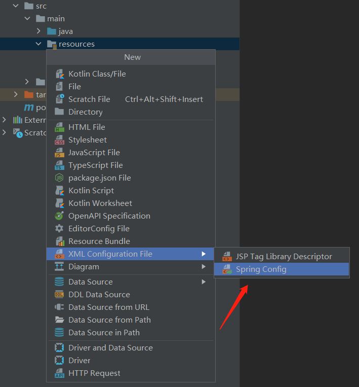

```java
public static void main(String[] args) {
    ApplicationContext applicationContext = new ClassPathXmlApplicationContext("p12-/beans.xml");
    Person i = applicationContext.getBean("I", Person.class);
    System.out.println(i);
}
```

```输出结果
Person{dog=Dog{dogName='小狗狗'}, cat=Cat{catName='小猫咪'}}
```

### 6.2 XML配置自动装配

**autowire**的wire(v.)有"连线、接线"的意思，翻译过来就是"自动装配"。

若使用自动装配，则Spring容器会自动在上下文中寻找并装配符合条件的Bean。

还是先配置“猫”和“狗''两个宠物依赖。

```xml
<bean id="myCat" class="p12ToP13.Cat" p:catName="小猫咪"/>

<bean id="myDog" class="p12ToP13.Dog" p:dogName="小狗狗"/>
```
#### 6.2.1 byName

```xml
<!--     byName自动注入，默认的Bean依赖的id名是类名小写。此时Spring容器找不到id名为"dog"的Bean，所以注入失败-->
<bean id="I" class="p12ToP13.Person" autowire="byName"/>
```

```
Person{dog=null, cat=null}
```

#### 6.2.2 byType

```xml
<!--     byName自动注入，找与依赖类型相同的Bean -->
<bean id="I" class="p12ToP13.Person" autowire="byType"/>
```

```
Person{dog=Dog{dogName='小狗狗'}, cat=Cat{catName='小猫咪'}}
```

### 6.3 基于注解的装配

看下一节的@Autowired注解。

## 七. 基于注解开发Spring

对应官方文档的[1.9 Annotation-based Container Configuration](https://docs.spring.io/spring-framework/docs/current/reference/html/core.html#beans-annotation-config)

### 7.1 注解 vs XML

> ### 1.9. Annotation-based Container Configuration
>
> Are annotations better than XML for configuring Spring?
>
> The introduction of annotation-based configuration raised the question of whether this approach is “better” than XML. The short answer is “it depends.” The long answer is that each approach has its pros and cons, and, usually, it is up to the developer to decide which strategy suits them better. **Due to the way they are defined, annotations provide a lot of context in their declaration, leading to shorter and more concise configuration. However, XML excels at wiring up components without touching their source code or recompiling them.** Some developers prefer having the wiring close to the source while others argue that annotated classes are no longer POJOs and, furthermore, that the configuration becomes decentralized and harder to control.

使用注解配置好还是XML配置好？Spring官方：各有优缺点。

注解配置的优点是能够在短短的声明中包含很多信息，使得代码更加简洁与精细，但缺点是需要改动源码并重新编译。

XML配置虽然内容比较繁杂，但通过这种方式装配Bean不需要接触源代码，更不需要重新编译源码。

狂神：最佳实践：XML配置用来管理Bean，注解配置只负责完成属性（依赖）的注入。

### 7.2 基于注解配置

> 这部分笔记主要是摘抄课本里的，而代码在写JavaEE上机实验的时候敲过，就不再重复写了。

注意，配置了组件扫描\<context:component-scan\>之后，就不需要配置开启注解支持\<context:annotation-config/\>了，因为在spring-context.xsd（Xml Schema Definition）中已经说明：

> <xsd:element name="component-scan">
>    \<xsd:annotation\>
>       \<xsd:documentation\>\<![CDATA\[
>
> ......
>
> Note: **This tag implies the effects of the 'annotation-config' tag**

#### @Component

表示一个组件类，即一个Bean。

可以用在任意一层（DAO/Service/Controller），但为了使类的标注更加清晰，推荐使用下面的几个注解。

#### @Repository

该注解用于将数据库访问层的类（DAO）标记为Bean。

#### @Service

该注解用于将业务逻辑层的类（Service）标记为Bean。

#### @Controller

该注解用于将控制层的类（Controller）标记为Bean。

#### @Autowired

该注解可以对类的成员变量、方法以及构造方法进行标注，完成自动装配。

自动匹配相同**类型**的Bean。

如果匹配名称（Bean的id），则需要配合 **@Qualifier**注解使用。

#### @Resource

JDK自带注解，作用与Spring的@Autowired注解类型。

不同之处在于，@Resource是优先按照**名称**来装配Bean的，只有当找不到匹配名称的Bean时，才会按照类型来装配。

### 7.3 基于纯Java配置

对应官方文档的[1.12 Java-based Container Configuration](https://docs.spring.io/spring-framework/docs/current/reference/html/core.html#beans-java)

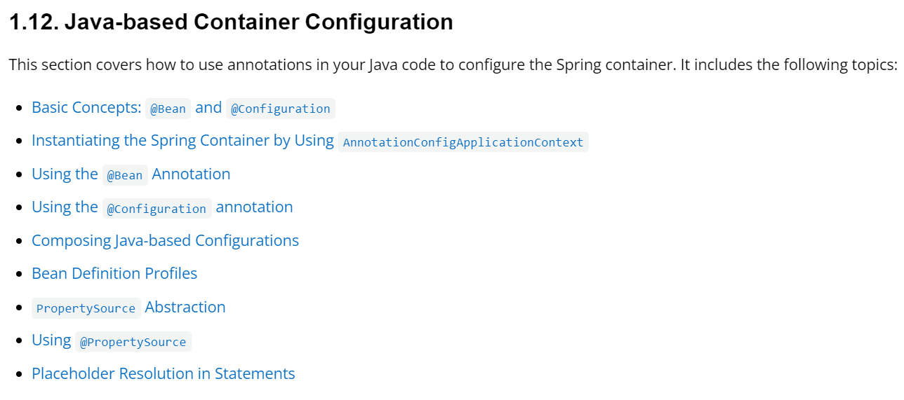

#### 7.3.1 @Configuration和@Bean

> Annotating a class with `@Configuration` indicates that its primary purpose is as a source of bean definitions. Furthermore, `@Configuration` classes let inter-bean dependencies be defined by calling other `@Bean` methods in the same class. The simplest possible `@Configuration` class reads as follows:
>
> Java
>
> ```java
> @Configuration
> public class AppConfig {
> 
>  @Bean
>  public MyService myService() {
>      return new MyServiceImpl();
>  }
> }
> ```
> The preceding `AppConfig` class is equivalent to the following Spring `<beans/>` XML:
>
> ```xml
> <beans>
>     <bean id="myService" class="com.acme.services.MyServiceImpl"/>
> </beans>
> ```

狂神：

* 在Spring Boot中这样的纯Java配置随处可见。
* Spring和MyBatis不一样，Spring推荐用注解，因为更简单，而MyBatis推荐用XML，因为能够配置更复杂的操作。

#### 7.3.2 实践

```java
public class User {
    
    @Value("一个名字")
    String name;
    
    @Override
    public String toString() {
        return "User{" +
                "name='" + name + '\'' +
                '}';
    }
}
```

```java
@Configuration
public class MyConfig {

    @Bean
    public User getUser() {
        return new User();
    }
}
```

```java
public static void main(String[] args) {
    ApplicationContext applicationContext = new AnnotationConfigApplicationContext(MyConfig.class);
    User user = applicationContext.getBean("getUser", User.class);
    System.out.println(user);
}
```

```
User{name='一个名字'}
```

注意：如果不用@Bean注解，通过给配置类加上@ComponentScan("包路径")（相当于在XML里配置\<context:component-scan\>），并给Bean类加上@Component注解，也可以获取到Bean对象。


## 八. Spring AOP

课本第4章 Spring AOP，虽然文字解释很少，大部分靠自己悟，但至少有写上去的东西都是正确的。

可以结合课本+代码演示+详细注释加深理解：[IDEA/JavaEE/src/main/java/textbook/chapter04 at master · Matty-GCU/IDEA · GitHub](https://github.com/Matty-GCU/IDEA/tree/master/JavaEE/src/main/java/textbook/chapter04)

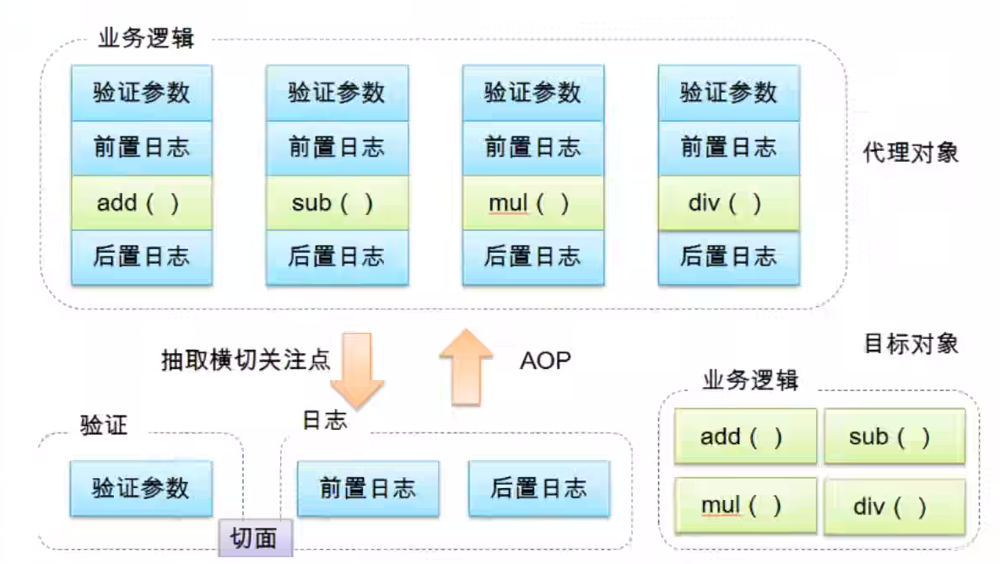

### 8.1 代理模式

狂神将静态代理和动态代理讲了三节课，但是讲得很乱，举例不当，有些地方的代码写得也不合理，这里就不再记笔记了。

### 8.2 AOP实现方式一

在Spring中默认使用JDK动态代理实现AOP编程。

回顾**JDK动态代理**，其本质是创建一个**代理对象**，该对象与**被代理对象**实现同一个接口，所以获取到代理类后可以向上转型为顶层接口，再通过该接口，也就是代理类，来执行相应方法。那代理类具体是怎么帮我们调用的呢？实际上它会把通过反射机制，将方法及其参数以及被代理类的引用都传给它绑定的**InvocationHandler**的**invoke**方法，在这个“（方法）调用处理器”的invoke方法内部做自定义的操作，比如在调用被代理方法的周围，加入一些前置通知啊后置通知啊等等，到这里就属于**面向切面编程**的范畴了。

而Spring实现AOP的底层原理即是如此。我们只需要在配置文件中配置好切入点，指明要增强哪个包下的哪个类的哪些或哪个方法，然后再配置要**织入**哪些**通知**对象就可以了。至于具体是什么通知，前置？后置？后置返回？...就可以通过使切面类实现不同接口（看示例），并重写相应方法来实现了。

```xml
<!-- https://mvnrepository.com/artifact/org.aspectj/aspectjweaver -->
<dependency>
    <groupId>org.aspectj</groupId>
    <artifactId>aspectjweaver</artifactId>
    <version>1.9.8</version>
</dependency>
```

```java
public interface ServiceP20 {
    void insert();
    void delete();
    void update();
    void select();
}
```

```java
public class ServiceP20Impl implements ServiceP20 {
    @Override
    public void insert() {
        System.out.println("增加一条记录！");
    }
    
    @Override
    public void delete() {
        System.out.println("删除一条记录！");
    }
    
    @Override
    public void update() {
        System.out.println("更新一条记录！");
    }
    
    @Override
    public void select() {
        System.out.println("查找记录！");
    }
}
```

```java
import org.springframework.aop.AfterReturningAdvice;
import org.springframework.aop.MethodBeforeAdvice;

import java.lang.reflect.Method;

/**
 * 注意！看实现了哪些接口！
 */
public class LogAspect implements MethodBeforeAdvice, AfterReturningAdvice {
    /**
     * Callback before a given method is invoked.
     * @param method the method being invoked
     * @param args the arguments to the method
     * @param target the target of the method invocation. May be {@code null}.
     * @throws Throwable if this object wishes to abort the call.
     * Any exception thrown will be returned to the caller if it's
     * allowed by the method signature. Otherwise the exception
     * will be wrapped as a runtime exception.
     */
    @Override
    public void before(Method method, Object[] args, Object target) throws Throwable {
        System.out.println("前置增强");
        System.out.println("被代理对象" + target.getClass().getSimpleName() + "即将调用" + method.getName() + "方法，参数是" + args);
    }
    
    /**
     * Callback after a given method successfully returned.
     * @param returnValue the value returned by the method, if any
     * @param method the method being invoked
     * @param args the arguments to the method
     * @param target the target of the method invocation. May be {@code null}.
     * @throws Throwable if this object wishes to abort the call.
     * Any exception thrown will be returned to the caller if it's
     * allowed by the method signature. Otherwise the exception
     * will be wrapped as a runtime exception.
     */
    @Override
    public void afterReturning(Object returnValue, Method method, Object[] args, Object target) throws Throwable {
        System.out.println("被代理对象" + target.getClass().getSimpleName() + "已经调用过" + method.getName() + "方法，参数是" + args + "，返回值是" + returnValue);
        System.out.println("后置增强");
    }
}
```

```xml
<?xml version="1.0" encoding="UTF-8"?>
<beans xmlns="http://www.springframework.org/schema/beans"
       xmlns:xsi="http://www.w3.org/2001/XMLSchema-instance" xmlns:aop="http://www.springframework.org/schema/aop"
       xsi:schemaLocation="http://www.springframework.org/schema/beans http://www.springframework.org/schema/beans/spring-beans.xsd http://www.springframework.org/schema/aop https://www.springframework.org/schema/aop/spring-aop.xsd">

    <!-- 注册Bean -->
    <bean id="myService" class="p20.ServiceP20Impl"/>
    <bean id="myLogAspect" class="p20.LogAspect"/>

    <!-- 方法一：使用Spring原生API -->
    <aop:config>
        <aop:pointcut id="myPointcut" expression="execution(* p20.ServiceP20Impl.*(..))"/>
        <aop:advisor advice-ref="myLogAspect" pointcut-ref="myPointcut"/>
    </aop:config>
</beans>
```

```java
import org.springframework.context.ApplicationContext;
import org.springframework.context.support.ClassPathXmlApplicationContext;

public class TestP20 {
    public static void main(String[] args) {
        ApplicationContext applicationContext = new ClassPathXmlApplicationContext("p20/applicationContext.xml");
        ServiceP20 service = applicationContext.getBean("myService", ServiceP20.class);
        service.delete();
        service.insert();
        service.select();
        service.update();
    }
}
```

```
前置增强
被代理对象ServiceP20Impl即将调用delete方法，参数是[Ljava.lang.Object;@43599640
删除一条记录！
被代理对象ServiceP20Impl已经调用过delete方法，参数是[Ljava.lang.Object;@43599640，返回值是null
后置增强
前置增强
被代理对象ServiceP20Impl即将调用insert方法，参数是[Ljava.lang.Object;@1187c9e8
增加一条记录！
被代理对象ServiceP20Impl已经调用过insert方法，参数是[Ljava.lang.Object;@1187c9e8，返回值是null
后置增强
前置增强
被代理对象ServiceP20Impl即将调用select方法，参数是[Ljava.lang.Object;@127a7a2e
查找记录！
被代理对象ServiceP20Impl已经调用过select方法，参数是[Ljava.lang.Object;@127a7a2e，返回值是null
后置增强
前置增强
被代理对象ServiceP20Impl即将调用update方法，参数是[Ljava.lang.Object;@14008db3
更新一条记录！
被代理对象ServiceP20Impl已经调用过update方法，参数是[Ljava.lang.Object;@14008db3，返回值是null
后置增强
```

### 8.3 AOP实现方式二

```java
/**
 * 简单纯粹的切面类
 */
public class MyAspect {
    public void before() {
        System.out.println("简单纯粹的前置通知");
    }
    public void after() {
        System.out.println("简单纯粹的后置通知");
    }
}
```

```xml
<?xml version="1.0" encoding="UTF-8"?>
<beans xmlns="http://www.springframework.org/schema/beans"
       xmlns:xsi="http://www.w3.org/2001/XMLSchema-instance" xmlns:aop="http://www.springframework.org/schema/aop"
       xsi:schemaLocation="http://www.springframework.org/schema/beans http://www.springframework.org/schema/beans/spring-beans.xsd http://www.springframework.org/schema/aop https://www.springframework.org/schema/aop/spring-aop.xsd">

    <!-- 注册Bean -->
    <bean id="myService" class="p20.ServiceP20Impl"/>
<!--    <bean id="myLogAspect" class="p20.LogAspect"/>-->

    <!-- 方法一：使用Spring原生API -->
<!--    <aop:config>-->
<!--        <aop:pointcut id="myPointcut" expression="execution(* p20.ServiceP20Impl.*(..))"/>-->
<!--        <aop:advisor advice-ref="myLogAspect" pointcut-ref="myPointcut"/>-->
<!--    </aop:config>-->

    <!-- 方法二：使用自定义切面类，不过功能没有上一种强大 -->
    <bean id="myAspect" class="p20.MyAspect"/>

    <aop:config>
        <!-- 注意使用了什么标签 -->
        <aop:aspect ref="myAspect">
            <aop:pointcut id="myPointcut" expression="execution(* p20.ServiceP20Impl.*(..))"/>
            <aop:before method="before" pointcut-ref="myPointcut"/>
            <aop:after method="after" pointcut-ref="myPointcut"/>
        </aop:aspect>
    </aop:config>

</beans>
```

```
简单纯粹的前置通知
删除一条记录！
简单纯粹的后置通知
简单纯粹的前置通知
增加一条记录！
简单纯粹的后置通知
简单纯粹的前置通知
查找记录！
简单纯粹的后置通知
简单纯粹的前置通知
更新一条记录！
简单纯粹的后置通知
```

### 8.4 使用注解实现AOP

```java
import org.aspectj.lang.ProceedingJoinPoint;
import org.aspectj.lang.Signature;
import org.aspectj.lang.annotation.After;
import org.aspectj.lang.annotation.Around;
import org.aspectj.lang.annotation.Aspect;
import org.aspectj.lang.annotation.Before;

@Aspect
public class AnnotationAspect {
    
    @Before("execution(* p20ToP22.ServiceP20Impl.*(..))")
    public void before() {
        System.out.println("前置增强");
    }
    
    @After("execution(* p20ToP22.ServiceP20Impl.*(..))")
    public void after() {
        System.out.println("后置增强");
    }
    
    @Around("execution(* p20ToP22.ServiceP20Impl.*(..))")
    public void around(ProceedingJoinPoint joinPoint) {
        Signature signature = joinPoint.getSignature();
        System.out.println("signature: " + signature);
        System.out.println("环绕前");
        try {
            joinPoint.proceed();
        } catch (Throwable throwable) {
            throwable.printStackTrace();
        }
        System.out.println("环绕后");
    }
}
```

```xml
<?xml version="1.0" encoding="UTF-8"?>
<beans xmlns="http://www.springframework.org/schema/beans"
       xmlns:xsi="http://www.w3.org/2001/XMLSchema-instance" xmlns:aop="http://www.springframework.org/schema/aop"
       xsi:schemaLocation="http://www.springframework.org/schema/beans http://www.springframework.org/schema/beans/spring-beans.xsd http://www.springframework.org/schema/aop https://www.springframework.org/schema/aop/spring-aop.xsd">

    <!-- 注册Bean -->
    <bean id="myService" class="p20ToP22.ServiceP20Impl"/>
    
    <!-- ...... -->

    <!-- 方法二：使用自定义切面类，不过功能没有上一种强大 -->
<!--    <bean id="myAspect" class="p20ToP22.MyAspect"/>-->
<!--    <aop:config>-->
<!--        &lt;!&ndash; 注意看使用了什么标签 &ndash;&gt;-->
<!--        <aop:aspect ref="myAspect">-->
<!--            <aop:pointcut id="myPointcut" expression="execution(* p20ToP22.ServiceP20Impl.*(..))"/>-->
<!--            <aop:before method="before" pointcut-ref="myPointcut"/>-->
<!--            <aop:after method="after" pointcut-ref="myPointcut"/>-->
<!--        </aop:aspect>-->
<!--    </aop:config>-->

    <!-- 方法三：相当于方法二的注解版 -->
    <bean id="myAnnotationAspect" class="p20ToP22.AnnotationAspect"/>
    <aop:aspectj-autoproxy/>
</beans>
```

## 九. MyBatis与Spring整合

### 9.2. MyBatis-Spring

注意：是MyBatis整合Spring，不是Spring整合MyBatis。

其实**MyBatis系列的官方文档**除了有[MyBatis3](https://mybatis.org/mybatis-3/zh/index.html)之外，其实还有

> * [mybatis-spring](https://mybatis.org/spring/zh/index.html)（官方，有中文版）
> * [mybatis-spring-boot](https://mybatis.org/spring-boot-starter/)（官方，英文版）

### 9.2 上手

代码整体结构如下图：

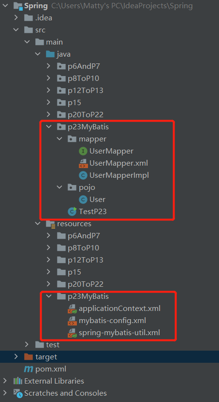

另外请注意，这里我们用到的[数据库和数据表是学MyBatis时建的](https://wuhang.xyz/c460cf59.html#2-1-准备数据库)。

#### 9.2.1 导入依赖

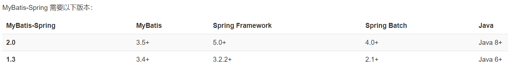

```xml
<dependencies>
    <!-- springframework的一个比较顶层的模块 -->
    <!-- https://mvnrepository.com/artifact/org.springframework/spring-webmvc -->
    <dependency>
        <groupId>org.springframework</groupId>
        <artifactId>spring-webmvc</artifactId>
        <version>5.3.15</version>
    </dependency>
    <!-- Spring AOP -->
    <!-- https://mvnrepository.com/artifact/org.aspectj/aspectjweaver -->
    <dependency>
        <groupId>org.aspectj</groupId>
        <artifactId>aspectjweaver</artifactId>
        <version>1.9.8</version>
    </dependency>
    <!-- spring操作数据库的时候需要用到org.springframework.jdbc.datasource.DriverManagerDataSource -->
    <!-- https://mvnrepository.com/artifact/org.springframework/spring-jdbc -->
    <dependency>
        <groupId>org.springframework</groupId>
        <artifactId>spring-jdbc</artifactId>
        <version>5.3.15</version>
    </dependency>
    <!-- MyBatis -->
    <dependency>
        <groupId>org.mybatis</groupId>
        <artifactId>mybatis</artifactId>
        <version>3.5.6</version>
    </dependency>
    <!-- MySQL -->
    <dependency>
        <groupId>mysql</groupId>
        <artifactId>mysql-connector-java</artifactId>
        <version>8.0.26</version>
    </dependency>
    <!-- 【MyBatis与Spring整合】 -->
    <dependency>
        <groupId>org.mybatis</groupId>
        <artifactId>mybatis-spring</artifactId>
        <version>2.0.7</version>
    </dependency>
</dependencies>
```

#### 9.2.2 编写实体类

```java
package p23MyBatis.pojo;

public class User {
    int id;
    String name;
    String pwd;
    
    @Override
    public String toString() {
        return "User{" +
                "id=" + id +
                ", name='" + name + '\'' +
                ", pwd='" + pwd + '\'' +
                '}';
    }
}
```
#### 9.2.3 编写映射器和映射文件

```java
package p23MyBatis.mapper;

import p23MyBatis.pojo.User;
import java.util.List;

public interface UserMapper {
    
    List<User> getAllUsers();
    
}
```
```xml
<?xml version="1.0" encoding="UTF-8" ?>
<!DOCTYPE mapper
        PUBLIC "-//mybatis.org//DTD Mapper 3.0//EN"
        "http://mybatis.org/dtd/mybatis-3-mapper.dtd">
<mapper namespace="p23MyBatis.mapper.UserMapper">
    <select id="getAllUsers" resultType="p23MyBatis.pojo.User">
        select * from mybatis.user;
    </select>
</mapper>
```

#### 9.2.4 编写MyBatis配置文件

事实上，这个配置文件可以不存在！（实测）

但是为了配置一些基础配置，比如类型别名啊、日志实现什么的，我们还是保留它。

```xml
<?xml version="1.0" encoding="UTF-8" ?>
<!DOCTYPE configuration
        PUBLIC "-//mybatis.org//DTD Config 3.0//EN"
        "http://mybatis.org/dtd/mybatis-3-config.dtd">
<configuration>
    
    <settings>
        <setting name="logImpl" value="STDOUT_LOGGING"/>
    </settings>
    
    <typeAliases>
        <package name="p23MyBatis.pojo"/>
    </typeAliases>
    
</configuration>
```

到此为止，一切都还是初学MyBatis时熟悉的模样，但接下来才是整合的关键。

---

#### 9.2.5 编写Spring配置文件

还记得曾经的[MyBatisUtil工具类](https://wuhang.xyz/c460cf59.html#2-6-编写工具类)吗？在纯MyBatis编程中，我们需要通过它来从XML中构建 SqlSessionFactory，再从SqlSessionFactory中获取SqlSession。

现在我们可以通过Spring容器，以零代码的方式来完成“获取SqlSession”的整个过程。从此，在Spring的任何需要用到SqlSession的地方，都只要注入一下**SqlSessionTemplate**依赖即可。

##### 9.2.5.1 spring-mybatis-util.xml

```xml
<?xml version="1.0" encoding="UTF-8"?>
<beans xmlns="http://www.springframework.org/schema/beans"
       xmlns:xsi="http://www.w3.org/2001/XMLSchema-instance"
       xsi:schemaLocation="http://www.springframework.org/schema/beans http://www.springframework.org/schema/beans/spring-beans.xsd">

    <!-- 配置数据源，代替原来在MyBatis中配置数据源-->
    <bean id="mybatisDataSource" class="org.springframework.jdbc.datasource.DriverManagerDataSource">
        <property name="driverClassName" value="com.mysql.cj.jdbc.Driver"/>
        <property name="url" value="jdbc:mysql://localhost:3306"/>
        <property name="username" value="root"/>
        <property name="password" value="123456"/>
    </bean>

    <!-- 配置SQLSessionFactory模板，代替原来在MyBatis中通过SQLSessionFactoryBuilder方式获取SQLSessionFactory -->
    <bean id="sqlSessionFactory" class="org.mybatis.spring.SqlSessionFactoryBean">
        <property name="dataSource" ref="mybatisDataSource"/>
        <!-- 可以绑定MyBatis配置文件，也可以不绑定。 -->
        <property name="configLocation" value="classpath:p23MyBatis/mybatis-config.xml"/>
        <!-- 可以在这注册Mapper，也可以在MyBatis配置文件中注册。但是不能重复注册！ -->
        <!-- 注意这里注册的Mapper“映射器”其实不是Mapper.xml而是Mapper.class -->
        <property name="mapperLocations" value="classpath:p23MyBatis/mapper/UserMapper.xml"/>
    </bean>

    <!-- 配置SqlSessionTemplate，代替原来在MyBatis中通过SqlSessionFactory获取SqlSession -->
    <bean id="sqlSessionTemplate" class="org.mybatis.spring.SqlSessionTemplate">
        <!-- 之所以使用构造器方式注入，是因为SqlSessionTemplate中没有Setter方法（可以直接点进去看源码，验证一下） -->
        <constructor-arg index="0" ref="sqlSessionFactory"/>
    </bean>
</beans> 
```

**关于DriverManagerDataSource**

* 数据源可以是任意的。
* 这里我们选择Spring JDBC的DriverManagerDataSource，无连接池功能；你也可以选择Spring JDBC或其他厂商的支持连接池功能的数据源。

**关于SqlSessionFactoryBean**

https://mybatis.org/spring/zh/factorybean.html

> * 需要注意的是 `SqlSessionFactoryBean` 实现了 Spring 的 `FactoryBean` 接口（参见 Spring 官方文档 3.8 节 [通过工厂 bean 自定义实例化逻辑](https://docs.spring.io/spring/docs/current/spring-framework-reference/core.html#beans-factory-extension-factorybean) ）。 这意味着由 Spring 最终创建的 bean **并不是** `SqlSessionFactoryBean` 本身，而是工厂类（`SqlSessionFactoryBean`）的 getObject() 方法的返回结果。这种情况下，Spring 将会在应用启动时为你创建 `SqlSessionFactory`，并使用 `sqlSessionFactory` 这个名字存储起来。
>
> * `SqlSessionFactory` 有一个唯一的必要属性：用于 JDBC 的 `DataSource`。这可以是任意的 `DataSource` 对象，它的配置方法和其它 Spring 数据库连接是一样的。
>
> * `SqlSessionFactory` 有一个唯一的必要属性：用于 JDBC 的 `DataSource`。这可以是任意的 `DataSource` 对象，它的配置方法和其它 Spring 数据库连接是一样的。
>
> * 一个常用的属性是 `configLocation`，它用来指定 MyBatis 的 XML 配置文件路径。它在需要修改 MyBatis 的基础配置非常有用。通常，基础配置指的是 `<settings>` 或 `<typeAliases>` 元素。
>
>   <u>需要注意的是，这个配置文件**并不需要**是一个完整的 MyBatis 配置。确切地说，任何环境配置（`<environments>`），数据源（`<DataSource>`）和 MyBatis 的事务管理器（`<transactionManager>`）都会被**忽略**。</u> `SqlSessionFactoryBean` 会创建它自有的 MyBatis 环境配置（`Environment`），并按要求设置自定义环境的值。

**关于SqlSessionTemplate**
https://mybatis.org/spring/zh/sqlsession.html

> * 在 MyBatis 中，你可以使用 `SqlSessionFactory` 来创建 `SqlSession`。 一旦你获得一个 session 之后，你可以使用它来执行映射了的语句，提交或回滚连接，最后，当不再需要它的时候，你可以关闭 session。
>
>   使用 MyBatis-Spring 之后，你不再需要直接使用 `SqlSessionFactory` 了，因为你的 bean 可以被注入一个线程安全的 `SqlSession`，它能基于 Spring 的事务配置来自动提交、回滚、关闭 session。
>
> * `SqlSessionTemplate` 是 MyBatis-Spring 的核心。作为 `SqlSession` 的一个实现，这意味着可以使用它无缝代替你代码中已经在使用的 `SqlSession`。 `SqlSessionTemplate` 是线程安全的，可以被多个 DAO 或映射器所共享使用。
>
> * 当调用 SQL 方法时（包括由 `getMapper()` 方法返回的映射器中的方法），`SqlSessionTemplate` 将会保证使用的 `SqlSession` 与当前 Spring 的事务相关。 此外，它管理 session 的生命周期，包含必要的关闭、提交或回滚操作。另外，它也负责将 MyBatis 的异常翻译成 Spring 中的 `DataAccessExceptions`。
>
> * 由于模板可以参与到 Spring 的事务管理中，并且由于其是线程安全的，可以供多个映射器类使用，你应该**总是**用 `SqlSessionTemplate` 来替换 MyBatis 默认的 `DefaultSqlSession` 实现。在同一应用程序中的不同类之间混杂使用可能会引起数据一致性的问题。
>
> * 可以使用 `SqlSessionFactory` 作为构造方法的参数来创建 `SqlSessionTemplate` 对象。

##### 9.2..5.2 applicationContext.xml

```xml
<?xml version="1.0" encoding="UTF-8"?>
<beans xmlns="http://www.springframework.org/schema/beans"
       xmlns:xsi="http://www.w3.org/2001/XMLSchema-instance"
       xsi:schemaLocation="http://www.springframework.org/schema/beans http://www.springframework.org/schema/beans/spring-beans.xsd">

    <!-- 引入通用的适用于MyBatis整合的配置 -->
    <import resource="spring-mybatis-util.xml"/>

    <!-- 将SqlSessionFactory注入到UserMapperImpl中 -->
    <bean id="userMapperImpl" class="p23MyBatis.mapper.UserMapperImpl">
        <!-- 注意：Setter方式注入，需要有Setter方法 -->
        <property name="sqlSessionTemplate" ref="sqlSessionTemplate"/>
    </bean>
</beans>
```

#### 9.2.6 编写映射器接口的实现类

其实这个接口实现类只是帮我们多做了一点点事情，本质上其实就是`sqlSessionTemplate.getMapper`后帮我们调用对应方法，但是有了它，在Spring的编程中，我们就可以完完全全地**忽略MyBatis的存在**——这才是两者整合之后我们想要达到的效果。

```java
package p23MyBatis.mapper;

import org.mybatis.spring.SqlSessionTemplate;
import p23MyBatis.pojo.User;

import java.util.List;

public class UserMapperImpl implements UserMapper {
    
    SqlSessionTemplate sqlSessionTemplate;
    
    public void setSqlSessionTemplate(SqlSessionTemplate sqlSessionTemplate) {
        this.sqlSessionTemplate = sqlSessionTemplate;
    }
    
    @Override
    public List<User> getAllUsers() {
        return sqlSessionTemplate.getMapper(UserMapper.class).getAllUsers();
    }
}
```

#### 9.2.7 测试

```java
package p23MyBatis;

import org.springframework.context.ApplicationContext;
import org.springframework.context.support.ClassPathXmlApplicationContext;
import p23MyBatis.mapper.UserMapper;
import p23MyBatis.pojo.User;

import java.util.List;

public class TestP23 {
    public static void main(String[] args) {
        ApplicationContext applicationContext = new ClassPathXmlApplicationContext("p23MyBatis/applicationContext.xml");
        // 实现方式一
        UserMapper userMapper = applicationContext.getBean("userMapperImpl", UserMapper.class);
        List<User> users = userMapper.getAllUsers();
        for (User user : users) {
            System.out.println(user);
        }
    }
}
```

```
...
日志输出部分就不放了
...
User{id=1, name='name1', pwd='pwd111'}
User{id=2, name='name2', pwd='pwd222'}
User{id=3, name='name3', pwd='pwd333'}
User{id=4, name='name4', pwd='pwd444'}
User{id=6, name='name666', pwd='pwd666'}
User{id=7, name='name777', pwd='pwd777'}
User{id=8, name='name8', pwd='pwd8'}
```

#### 9.2.8 另一种实现方式

https://mybatis.org/spring/zh/sqlsession.html#SqlSessionDaoSupport

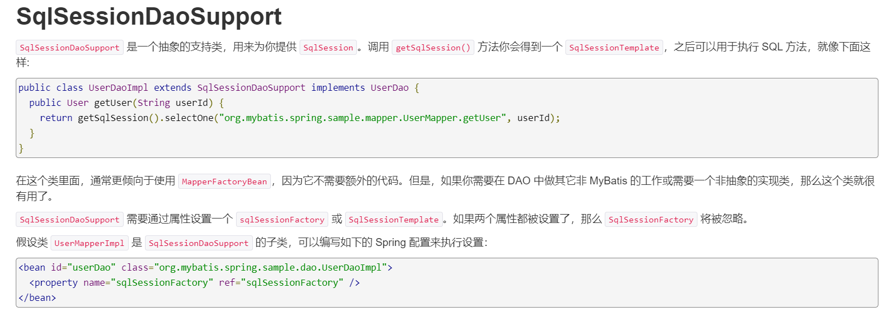

```java
package p23MyBatis.mapper;

import org.mybatis.spring.support.SqlSessionDaoSupport;
import p23MyBatis.pojo.User;

import java.util.List;

public class UserMapperImpl2 extends SqlSessionDaoSupport implements UserMapper {
    @Override
    public List<User> getAllUsers() {
        return getSqlSession().getMapper(UserMapper.class).getAllUsers();
    }
}
```

```xml
<bean id="userMapperImpl2" class="p23MyBatis.mapper.UserMapperImpl2">
    <property name="sqlSessionFactory" ref="sqlSessionFactory"/>
</bean>
```

测试方式与测试结果与9.2.7完全一致，只是把`getBean("userMapperImpl", UserMapper.class)`改成了`getBean("userMapperImpl2", UserMapper.class)`。

## 十. 事务管理

### 10.1 事务

10.1的内容全文转载自：[数据库基础（一）事务的ACID - 知乎](https://zhuanlan.zhihu.com/p/27789602)，写得非常通俗易懂，给作者点赞。

#### 10.1.1 事务是什么？

> 在数据库系统里，<u>事务是代表一个或者一系列操作的最小逻辑单元，所有在这个逻辑单元内的操作要么全部成功，要么就全部失败，不存在任何中间状态</u>，一旦事务失败那么所有的更改都会被撤消，一旦事务成功所有的操作结果都会被保存。

#### 10.1.2 为什么要有事务？

> 我们可以尝试从它解决问题的出发点来了解它，<u>事务机制存在的目的就是无论我们的操作过程中是成功、失败、异常、或是受到干扰的情况下，事务都能保证我们数据最终的一致性</u>。
>
> 为了让大家重视和理解事务的作用，所以我们必须看一个和钱有关的例子：
>
> **案例：转账**
>
> A账户余额有1000元，B账户余额0元，在这个基础上A向B转账400元，流程如下：
>
> 1、查询A账户余额，看金额是>=400元。
>
> 2、满足条件则先从A账户扣款400元（当前A余额=600、当前余=0）。
>
> 3、然后再向B账户增加400元（当前A余额=600、当前B余额=400）。
>
> ### **没有事务支持的情况下会是什么样？**
>
> 如果上面每个操作都是独立的，那么任意一个操作的失败都不会影响下一步操作，这样就可能会出现下面几个场景：
>
> **情况一：**在执行完第2步后，执行第3步系统发生异常失败了，那么最后的结果A余额=600，B账户余额=0；
>
> **情况二**：在执行第2步失败了，然后继续执行第3步， 那么最后的结果A余额=1000，B余额=400；
>
> <u>很明显这样直接会导致严重的问题，因为这样的情况下系统会凭空减少或多出钱出来，所以我们需要一套事务机制来容许在异常情况下，能让数据恢复到最初的样子。</u>
>
> ### **有事务支持的情况会是什么样？**
>
> 其实在这个操作中，转账就是本次一系列操作的最小逻辑单元，只有3个操作都成功了才算转账成功，任何一个步骤失败都算整个转账操作失败，只要其中任意一个步骤执行失败都不会再往下执行，并对已经执行的数据变更进行恢复。
>
> **转账操作开始**
>
> 1、查询A账户余额，看金额是>=400元 （失败则整个转账失败）。
>
> 2、满足条件则先从A账户扣款400元（当前A余额=600、当前余=0）（失败则整个转账失败）。
>
> 3、然后再向B账户增加400元（当前A余额=600、当前B余额=400）（失败则整个转账失败,同时把上一步的扣 款400返还给A账户）。
>
> **转账操作结束**
>
> <u>这样在事务的机制下，不管转账成功还是失败系统数据最终都是一致的，钱才不会出现凭空变多或者减少，这也是事务存在的意义。</u>

#### 10.1.3 事务的四大特性（ACID）

> 要实现事务的最终目的，需要几种机制组合才能实现，这几种机制就是事务的几个特性，分别原子性、隔离性、一致性、持久性。 用一句话总结来总结这几个特性之间的关系，那就是<u>“一致性是事务的最终目的，而原子性、隔离性、持久性其实都是为了实现一致性的手段”</u>。
>
> ## **1、原子性（Atomicity）**
>
> 概念：<u>一个事务必须是一系列操作的最小单元，这系列操作的过程中，要么整个执行，要么整个回滚，不存在只执行了其中某一个或者某几个步骤</u>。
>
> 对应到上面的转账操作中，原子性就代表（检查余额、转账、到账）三个步骤就是一个整体，少了任何一个都不能称为一次转账，整个过程中检查余额、转账、到账要么整体都执行，要么一个失败就整体失败，绝对不会出现某一个执行成功其它的都执行失败，或者某一个执行失败其它的操作执行成功的情况。
>
> ## **2、隔离性（Isolation）**
>
> 概念：<u>隔离性是说两个事务的执行都是独立隔离开来的，事务之前不会相互影响，多个事务操作一个对象时会以串行等待的方式保证事务相互之间是隔离的</u>：
>
> 小明和小芳各自有一本作业本，如果他们同时去写作业，这时他们都可以在各自作业本上写作业是相互不影响的。但是如果他们两个人只有一本作业本，但是他们都想去写作业怎么办，那么就这个时候就只能等一个人先写完作业后，另外一个人才能写，要不然两个人同时在同一个作业本上写作业，那么肯定会乱套。所以这种两个事物操作同一个对象必须隔离开来不能相互影响的特性称为事务的隔离性。
>
> ## **3、一致性（Consistency）**
>
> 概念：<u>事务要保证数据库整体数据的完整性和业务的数据的一致性，事务成功提交整体数据修改，事务错误则回滚到数据回到原来的状态</u>；
>
> 如上面转账的案例，如果事务提交成功则A账户减金额，B账户则加对应的金额，数据库总体金额不变只是载体变了。如果事务出错则整体回滚，无论到了上面的哪个步骤A和B的数据都会回到最事务开启前的状态保证数据的始终一致;
>
> ## **4、D(Durability）持久性：**
>
> 概念：<u>持久性是指一旦事务成功提交后，只要修改的数据都会进行持久化，不会因为异常、宕机而造成数据错误或丢失。</u>

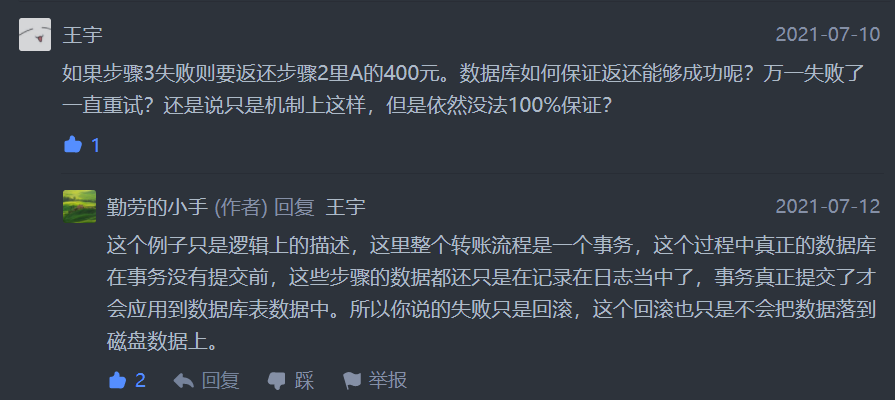

### 10.2 声明式事务管理

声明式事务管理也就是官方所说的“**交由容器管理事务**”。

> 官方：
>
> <u>一个使用 MyBatis-Spring 的其中一个主要原因是它允许 MyBatis 参与到 Spring 的事务管理中。</u>而不是给 MyBatis 创建一个新的专用事务管理器，MyBatis-Spring 借助了 Spring 中的 `DataSourceTransactionManager` 来实现事务管理。

#### 10.2.1 准备工作

对9.2的Java代码进行小修改，以便测试事务管理。

* UserMapper接口

```java
/**
 * 增加一个方法，用于测试声明式事务
 */
int addUser(@Param("id") int id, @Param("name") String name, @Param("pwd") String pwd);
```

* UserMapperImpl实现类

```java
/**
 * 增加一个方法，用于测试声明式事务
 */
@Override
public int addUser(int id, String name, String pwd) {
    //故意多写一行，此时必然出错，因为重复插入相同主键的记录
    //注意，我们想要达到的效果是：如果第一次插入成功，第二次插入失败，那么数据库最终并不会插入新记录，数据库的状态和方法执行前的状态保持“一致”。
    sqlSessionTemplate.getMapper(UserMapper.class).addUser(id, name, pwd);
    return sqlSessionTemplate.getMapper(UserMapper.class).addUser(id, name, pwd);
}
```

此时user表的所有数据如图：

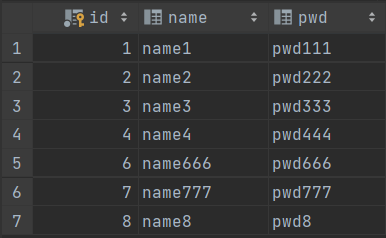

#### 10.2.2 无事务支持的测试结果

```java
public static void main(String[] args) {
    ApplicationContext applicationContext = new ClassPathXmlApplicationContext("p23MyBatis/applicationContext.xml");
    UserMapper userMapper = applicationContext.getBean("userMapperImpl", UserMapper.class);
    //事务测试
    userMapper.addUser(9, "name9", "pwd9");
}
```

报错，这是肯定的，Duplicate entry '9' for key 'user.PRIMARY'

但是！user表中成功新增了一条记录！这个结果是我们不想看到的。

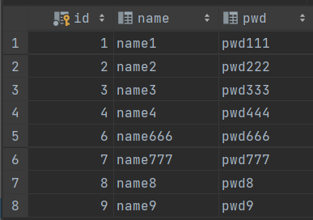

#### 10.2.3 关键工作

这里我们只演示**声明式事务管理**（即官方文档所说的“**交由容器管理事务**”），可以在不修改原有代码的前提上增加事务功能。

同样，在9.2的Spring配置文件的基础上，给它增加一些配置。

* applicationContext.xml

```xml
<!-- 结合Spring AOP实现实现事务管理 -->
<!-- xmlns:aop="http://www.springframework.org/schema/aop" -->
<!-- http://www.springframework.org/schema/aop https://www.springframework.org/schema/aop/spring-aop.xsd -->
<aop:config>
    <!-- 配置切入点 -->
    <aop:pointcut id="myPointcut" expression="execution(* p23MyBatis.mapper.UserMapperImpl.addUser(int, String, String))"/>
    <!-- 配置织入到切入点的通知 -->
    <aop:advisor advice-ref="myAdvice" pointcut-ref="myPointcut"/>
</aop:config>

<!-- 配置通知 -->
<!-- xmlns:tx="http://www.springframework.org/schema/tx" -->
<!-- http://www.springframework.org/schema/tx http://www.springframework.org/schema/tx/spring-tx.xsd" -->
<tx:advice id="myAdvice" transaction-manager="transactionManager">
    <!-- 注意：这里不是用来配置哪些方法要被拦截的（这个在aop:pointcut中已经配置好了），而是针对确定要被拦截的方法，配置一些具体的操作。 -->
    <tx:attributes>
        <!-- 此处的propagation（传播）属性配置的是事务的传播特性，当然还可以配置其他属性，比如事务的隔离级别、是否只读和超时时间等等。 -->
        <!-- 当然，由于addUser(..)方法里实际上并没有调用其他事务方法，在这种特定情况下，设置事务传播特性并无实际意义。 -->
        <tx:method name="addUser" propagation="REQUIRED"/>
        <!-- 其他有效写法 -->
        <!--            <tx:method name="*"/>-->
        <!--            <tx:method name="add*"/>-->
        <!--            <tx:method name="*Use"/>-->
        <!--            <tx:method name="*addUser"/>-->
        <!--            <tx:method name="addUser*"/>-->
        <!--            <tx:method name="*addUser*"/>-->
        <!-- 无效写法 -->
        <!--            <tx:method name="add"/>-->
        <!--            <tx:method name="addU"/>-->
        <!--            <tx:method name="insert"/>-->
    </tx:attributes>
</tx:advice>
```

#### 10.2.4 关于事务的传播特性

直接转载一篇好文：[spring事务的传播特性_loadhai的博客-CSDN博客]((https://blog.csdn.net/loadhai/article/details/17800537))

P.S.最难能可贵的是它诚实地标注了“转载”而不是“原创”。

> Spring 事务一个被讹传很广说法是：一个事务方法不应该调用另一个事务方法，否则将产生两个事务。结果造成开发人员在设计事务方法时束手束脚，生怕一不小心就踩到地雷。
>
> 其实这种是不认识 Spring 事务传播机制而造成的误解，Spring 对事务控制的支持统一在 TransactionDefinition 类中描述，该类有以下几个重要的接口方法：
>
> - int getPropagationBehavior()：事务的传播行为
> - int getIsolationLevel()：事务的隔离级别
> - int getTimeout()：事务的过期时间
> - boolean isReadOnly()：事务的读写特性。
>
> 很明显，除了事务的传播行为外，事务的其它特性 Spring 是借助底层资源的功能来完成的，Spring 无非只充当个代理的角色。但是事务的传播行为却是 Spring 凭借自身的框架提供的功能，是 Spring 提供给开发者最珍贵的礼物，讹传的说法玷污了 Spring 事务框架最美丽的光环。
>
> <u>***所谓事务传播行为就是多个事务方法相互调用时，事务如何在这些方法间传播。***</u>Spring 支持 7 种事务传播行为：
>
> - PROPAGATION_REQUIRED 如果当前没有事务，就新建一个事务，如果已经存在一个事务中，加入到这个事务中。这是最常见的选择。
> - PROPAGATION_SUPPORTS 支持当前事务，如果当前没有事务，就以非事务方式执行。
> - PROPAGATION_MANDATORY 使用当前的事务，如果当前没有事务，就抛出异常。
> - PROPAGATION_REQUIRES_NEW 新建事务，如果当前存在事务，把当前事务挂起。
> - PROPAGATION_NOT_SUPPORTED 以非事务方式执行操作，如果当前存在事务，就把当前事务挂起。
> - PROPAGATION_NEVER 以非事务方式执行，如果当前存在事务，则抛出异常。
> - PROPAGATION_NESTED 如果当前存在事务，则在嵌套事务内执行。如果当前没有事务，则执行与 PROPAGATION_REQUIRED 类似的操作。
>
> <u>Spring 默认的事务传播行为是 PROPAGATION_REQUIRED，它适合于绝大多数的情况。</u>假设 ServiveX#methodX() 都工作在事务环境下（即都被 Spring 事务增强了），假设程序中存在如下的调用链：Service1#method1()->Service2#method2()->Service3#method3()，那么这 3 个服务类的 3 个方法通过 Spring 的事务传播机制都工作在同一个事务中。

#### 10.2.5 有事务支持的测试结果

与10.2.2同样的测试代码。同样的报错结果，Duplicate entry '9' for key 'user.PRIMARY'。

但是！数据库并没有新增任何记录！

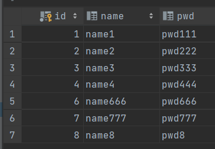

#### 10.2.6 事务管理小结

* Spring容器帮我们拦截了addUser(..)方法，并织入由事务管理器实现的通知；

* 执行该方法时，由于当前没有事务，就新建了一个事务，并将该方法加入到这个事务中；

* 在对数据库的操作过程中，由于发生了错误，根据事务的ACID特性，Spring容器自动帮我们完成了事务回滚。
* 通知的织入（Spring AOP）无需修改原有代码，也并不影响原来代码的运行，所以addUser(..)方法照样报错。

> 官方：
>
> 一旦配置好了 Spring 的事务管理器，你就可以在 Spring 中按你平时的方式来配置事务。并且支持 `@Transactional` 注解和 AOP 风格的配置。在事务处理期间，一个单独的 `SqlSession` 对象将会被创建和使用。<u>当事务完成时，这个 session 会以合适的方式提交或回滚。</u>
>
> <u>事务配置好了以后，MyBatis-Spring 将会透明地管理事务。这样在你的 DAO 类中就不需要额外的代码了。</u>

2022.04.04