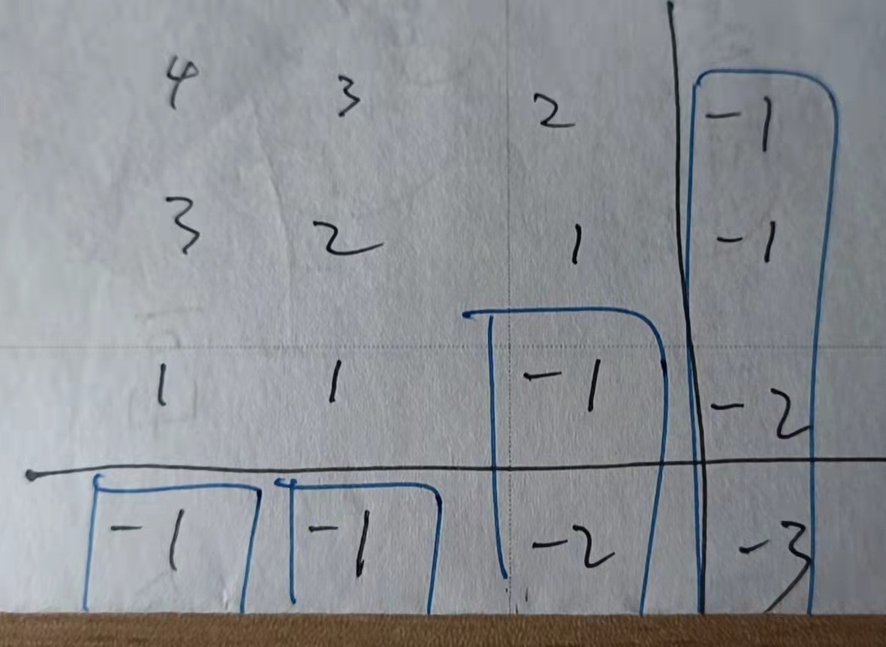

# 二分查找-第一轮 刷题笔记

## 前言

关于二分查找，704题的题解区有一篇文章分析得很到位。原文：[二分查找细节详解，顺便赋诗一首 - 二分查找 - 力扣（LeetCode）](https://leetcode-cn.com/problems/binary-search/solution/er-fen-cha-zhao-xiang-jie-by-labuladong/)

> 二分查找并不简单，Knuth 大佬（发明 KMP 算法的那位）都说二分查找：思路很简单，细节是魔鬼。很多人喜欢拿整型溢出的 bug 说事儿，但是二分查找真正的坑根本就不是那个细节问题，而是在于到底要给 mid 加一还是减一，while 里到底用 <= 还是 <。
>
> 你要是没有正确理解这些细节，写二分肯定就是玄学编程，有没有 bug 只能靠菩萨保佑。

这段评价真是一阵见血。

我觉得，大家都懂得二分思想，但是**只有能够独立写出无bug、一次性AC的二分算法，才算是把二分学明白了**。如果只是靠看评论、看题解、看提交不通过的报错，最终跌跌撞撞把一道题做出来了，那么这不是我想要达到的水平。

## 背景

#### [704. 二分查找](https://leetcode-cn.com/problems/binary-search/)

给定一个 n 个元素有序的（升序）整型数组 nums 和一个目标值 target  ，写一个函数搜索 nums 中的 target，如果目标值存在返回下标，否则返回 -1。

> **示例 1:**
>
> ```
> 输入: nums = [-1,0,3,5,9,12], target = 9
> 输出: 4
> 解释: 9 出现在 nums 中并且下标为 4
> ```
>
> **提示：**
>
> 1. 你可以假设 `nums` 中的所有元素是不重复的。
> 2. `n` 将在 `[1, 10000]`之间。
> 3. `nums` 的每个元素都将在 `[-9999, 9999]`之间。

这题其实我在2021.11.06做过一次，不过当时没有记录，也没有写笔记。这次重做一遍就当复习吧，顺便补一下笔记。

**看到有序数组+无重复元素。就要想到用二分查找了**，因为这是二分查找最经典的应用场景。

不过我第一次做的时候甚至还写不出来一个能用的二分，只好直接套模板，就是下面的模板1。

2022.01.29

## LeetBook 二分查找模板1

#### 模板1

```java
int binarySearch(int[] nums, int target){
  if(nums == null || nums.length == 0) {
      return -1;
  }
  int left = 0;
  int right = nums.length - 1;
  while(left <= right){
    //避免(left + right)溢出
    int mid = left + (right - left) / 2;
    if(nums[mid] == target){
        return mid;
    }
    else if(nums[mid] < target) {
        left = mid + 1;
    }
    //相当于else if(nums[mid] > target)
    else {
        right = mid - 1;
    }
  }
  //退出循环时，left > right
  return -1;
}
```

#### [69. Sqrt(x)](https://leetcode-cn.com/problems/sqrtx/)

给你一个非负整数 `x` ，计算并返回 `x` 的 算术平方根 。

由于返回类型是整数，结果只保留 整数部分 ，小数部分将被 舍去 。

**注意：**不允许使用任何内置指数函数和算符，例如 `pow(x, 0.5)` 或者 `x ** 0.5` 。

> **示例 1：**
>
> ```
> 输入：x = 4
> 输出：2
> ```
>
> **示例 2：**
>
> ```
> 输入：x = 8
> 输出：2
> 解释：8 的算术平方根是 2.82842..., 由于返回类型是整数，小数部分将被舍去。
> ```
>
> **提示：**
>
> - `0 <= x <= 2^31 - 1`

最终我还是参考了评论区，才能AC这道题。

因为我自己写的时候没能解决mid * mid溢出这个问题，事实上由于mid最大可以取Integer.MAX_VALUE / 2（当left=0, right=Integer.MAX_VALUE），这就意味着mid * mid的值一旦溢出，那将毫无规律可言。可能是正数，可能是负数，可能很大，可能很小。*（第一次提交：解答错误）*

评论区大佬的思路是，不要判断mid * mid == x，而是判断x / mid == mid，马上解决问题。

然后问题又来了，当x取1或者0时，mid会等于0，x除以0直接报错。*（第二次提交：执行错误）*

只要在程序前面写了个针对0和1的特殊处理，虽然很丑，但终于能通过了。*（第三次提交：通过）*

**这样其实是不够的，我还是需要借助评论区/题解区大佬+提交不通过返回的信息才能做出这道题……但是没关系，开始阶段，先把题做出来就好，等二分查找的题做了一定量之后，再来总结分析，先量变，再质变。**

2022.01.29


#### [374. 猜数字大小 - 独立](https://leetcode-cn.com/problems/guess-number-higher-or-lower/)

猜数字游戏的规则如下：

- 每轮游戏，我都会从 **1** 到 ***n*** 随机选择一个数字。 请你猜选出的是哪个数字。
- 如果你猜错了，我会告诉你，你猜测的数字比我选出的数字是大了还是小了。

你可以通过调用一个预先定义好的接口 `int guess(int num)` 来获取猜测结果，返回值一共有 3 种可能的情况（`-1`，`1` 或 `0`）：

- -1：我选出的数字比你猜的数字小 `pick < num`
- 1：我选出的数字比你猜的数字大 `pick > num`
- 0：我选出的数字和你猜的数字一样。恭喜！你猜对了！`pick == num`

返回我选出的数字。

> **示例 1：**
>
> ```
> 输入：n = 10, pick = 6
> 输出：6
> ```
>
> **提示：**
>
> - `1 <= n <= 231 - 1`
> - `1 <= pick <= n`

直接套模板1即可，而且这题在while中必然能找到答案，根本走不到退出while循环那一步。

这是二分专题里第一道我能独立做出来的题。。。

2022.02.03

#### [33. 搜索旋转排序数组 - 中等](https://leetcode-cn.com/problems/search-in-rotated-sorted-array/)

整数数组 `nums` 按升序排列，数组中的值 **互不相同** 。

在传递给函数之前，`nums` 在预先未知的某个下标 `k`（`0 <= k < nums.length`）上进行了 **旋转**，使数组变为 `[nums[k], nums[k+1], ..., nums[n-1], nums[0], nums[1], ..., nums[k-1]]`（下标 **从 0 开始** 计数）。例如， `[0,1,2,4,5,6,7]` 在下标 `3` 处经旋转后可能变为 `[4,5,6,7,0,1,2]` 。

给你 **旋转后** 的数组 `nums` 和一个整数 `target` ，如果 `nums` 中存在这个目标值 `target` ，则返回它的下标，否则返回 `-1` 。

> **示例 1：**
>
> ```
> 输入：nums = [4,5,6,7,0,1,2], target = 0
> 输出：4
> ```
>
> **提示：**
>
> - `1 <= nums.length <= 5000`
> - `-10^4 <= nums[i] <= 10^4`
> - `nums` 中的每个值都 **独一无二**
> - 题目数据保证 `nums` 在预先未知的某个下标上进行了旋转
> - `-10^4 <= target <= 10^4`
>
> **进阶：**你可以设计一个时间复杂度为 `O(log n)` 的解决方案吗？

暴力解法就是直接遍历，时间O(N)，但我们的目标（面试官的要求）是O(logN)的时间复杂度。

这题我直接不会。。。还是看了官方题解。

解题思想：二分查找，只能对排序数组做，这题整个数组是部分有序，那就用二分切割成两个区间，其中一个区间肯定是单调递增的（为什么？因为转折点要么在左边区间，要么在右边区间），这样我们就可以针对那个单调递增的区间做处理。如果要找的值不在单调递增区间内，那么下一轮就对【部分有序】的区间进行切割。

说得容易，但是小细节实在是太多了……我看了题解，然后自己去写，提交了4次才过……

2022.02.03

## LeetBook 二分查找模板2

#### 模板2

模板2是二分查找的高级模板。它用于查找需要访问数组中当前索引及其直接右邻居索引的元素或条件。

```java
int binarySearch(int[] nums, int target){
    if(nums == null || nums.length == 0) {
        return -1;   
    }

    int left = 0;
    int right = nums.length;
    while(left < right){
        // Prevent (left + right) overflow
        int mid = left + (right - left) / 2;
        if(nums[mid] == target){
            return mid;
        }
        else if(nums[mid] < target) {
            left = mid + 1;
        }
        else {
            right = mid;
        }
    }

  // Post-processing:
  // End Condition: left == right
  if(left != nums.length && nums[left] == target) {
      return left;
  }
  return -1;
}
```

#### [278. 第一个错误的版本](https://leetcode-cn.com/problems/first-bad-version/)

你是产品经理，目前正在带领一个团队开发新的产品。不幸的是，你的产品的最新版本没有通过质量检测。由于每个版本都是基于之前的版本开发的，所以错误的版本之后的所有版本都是错的。

假设你有 `n` 个版本 `[1, 2, ..., n]`，你想找出导致之后所有版本出错的第一个错误的版本。

你可以通过调用 `bool isBadVersion(version)` 接口来判断版本号 `version` 是否在单元测试中出错。实现一个函数来查找第一个错误的版本。你应该尽量减少对调用 API 的次数。

>  
>
> **示例 1：**
>
> ```
> 输入：n = 5, bad = 4
> 输出：4
> 解释：
> 调用 isBadVersion(3) -> false 
> 调用 isBadVersion(5) -> true 
> 调用 isBadVersion(4) -> true
> 所以，4 是第一个错误的版本。
> ```
>
> **提示：**
>
> - `1 <= bad <= n <= 231 - 1`

由低效到高效开始说吧。

1. 暴力解：时间复杂度O(N)，在在一个n非常大的用例上直接超时。
2. 二分模板一：时间复杂度O(logN)，但是要15ms  22%
3. 二分模板二：时间复杂度O(logN)，但是11ms  99%

这题也是看题解才做出来的。能AC，但是我还是没有掌握“从无到有”想出解法的思路，没有掌握精髓。

2022.02.03


#### [162. 寻找峰值 - 中等](https://leetcode-cn.com/problems/find-peak-element/)

峰值元素是指其值严格大于左右相邻值的元素。

给你一个整数数组 `nums`，找到峰值元素并返回其索引。数组可能包含多个峰值，在这种情况下，返回 **任何一个峰值** 所在位置即可。

你可以假设 `nums[-1] = nums[n] = -∞` 。

**你必须实现时间复杂度为 `O(log n)` 的算法来解决此问题。**

> **示例 1：**
>
> ```
> 输入：nums = [1,2,3,1]
> 输出：2
> 解释：3 是峰值元素，你的函数应该返回其索引 2。
> ```
>
> **示例 2：**
>
> ```
> 输入：nums = [1,2,1,3,5,6,4]
> 输出：1 或 5 
> 解释：你的函数可以返回索引 1，其峰值元素为 2；
>      或者返回索引 5， 其峰值元素为 6。
> ```
>
> **提示：**
>
> - `1 <= nums.length <= 1000`
> - `-2^31 <= nums[i] <= 2^31 - 1`
> - 对于所有有效的 `i` 都有 `nums[i] != nums[i + 1]`——无重复元素

暴力解就不提了，面试官不会满意的。

要用二分。

```java
class Solution {
    public int findPeakElement(int[] nums) {
        int left = 0;
        int right = nums.length - 1;
        while (left < right) {
            int mid = left + (right - left) / 2;
            if (nums[mid] < nums[mid + 1]) {
                left = mid + 1;
            }
            else {  //else if(nums[mid] > nums[mid + 1])
                right = mid;
            }
        }
        return left;    //return right;
    }
}
```

可以称之为“爬坡法”，核心思想是：一直往高处走，一定能走到峰顶。

先确定一个点mid，

* 如果是mid < mid + 1，那么mid往右到mid + 1是上坡，[mid + 1, right]区间内一定有峰顶，大不了走到右边界；
* 如果是mid > mid + 1，那么mid往右到mid + 1是下坡（往左走就相当于上坡），[left, mid]区间内一定峰顶，大不了走到左边界。
* 当[left, right]区间内只有一个数，即left == right时退出循环并返回left

解法我懂了，但自己写出来还是不行，玄学。。

精品题解&完整证明：[【宫水三叶の相信科学系列】关于能够「二分」的两点证明 - 寻找峰值 - 力扣（LeetCode）](https://leetcode-cn.com/problems/find-peak-element/solution/gong-shui-san-xie-noxiang-xin-ke-xue-xi-qva7v/)

2022.02.04

#### [153. 寻找旋转排序数组中的最小值 - 中等](https://leetcode-cn.com/problems/find-minimum-in-rotated-sorted-array/)

已知一个长度为 `n` 的数组，预先按照升序排列，经由 `1` 到 `n` 次 **旋转** 后，得到输入数组。例如，原数组 `nums = [0,1,2,4,5,6,7]` 在变化后可能得到：

- 若旋转 `4` 次，则可以得到 `[4,5,6,7,0,1,2]`
- 若旋转 `7` 次，则可以得到 `[0,1,2,4,5,6,7]`

注意，数组 `[a[0], a[1], a[2], ..., a[n-1]]` **旋转一次** 的结果为数组 `[a[n-1], a[0], a[1], a[2], ..., a[n-2]]` 。

给你一个元素值 **互不相同** 的数组 `nums` ，它原来是一个升序排列的数组，并按上述情形进行了多次旋转。请你找出并返回数组中的 **最小元素** 。

> **示例 1：**
>
> ```
> 输入：nums = [3,4,5,1,2]
> 输出：1
> 解释：原数组为 [1,2,3,4,5] ，旋转 3 次得到输入数组。
> ```
>
> **提示：**
>
> - `n == nums.length`
> - `1 <= n <= 5000`
> - `-5000 <= nums[i] <= 5000`
> - `nums` 中的所有整数 **互不相同**
> - `nums` 原来是一个升序排序的数组，并进行了 `1` 至 `n` 次旋转

我TM写了两个多小时，提交了四次，都没法用二分提交通过。。

细节是魔鬼。。。

2022.02.04


## ------------------

不做LeetBook的题了，都是中等题，但是我连二分最基础的用法都没有完全悟透，LeetBook剩下的内容不适合我。

还是做二分专题的简单题吧。

---

## LC 二分查找 - 简单

#### [367. 有效的完全平方数](https://leetcode-cn.com/problems/valid-perfect-square/)

给定一个 正整数 num ，编写一个函数，如果 num 是一个完全平方数，则返回 true ，否则返回 false 。

进阶：不要 使用任何内置的库函数，如  sqrt 。

> 示例 1：
>
> 输入：num = 16
> 输出：true
> 示例 2：
>
> 输入：num = 14
> 输出：false
>
>
> 提示：
>
> 1 <= num <= 2^31 - 1

**方法一：调用库函数**

**方法二：暴力遍历，时间复杂度O(N)**

**方法三：二分查找，时间复杂度为O(logN)**

<u>第一次思路清晰地靠自己写出了二分查找AC！这次不是玄学编程了！</u>

主要是看了这篇文章被点通了：[代码随想录 - 704.二分查找](https://programmercarl.com/0704.%E4%BA%8C%E5%88%86%E6%9F%A5%E6%89%BE.html#￦ﾀﾝ￨ﾷﾯ)

> ## 思路
>
> **这道题目的前提是数组为有序数组**，同时题目还强调**数组中无重复元素**，因为一旦有重复元素，使用二分查找法返回的元素下标可能不是唯一的，这些都是使用二分法的前提条件，当大家看到题目描述满足如上条件的时候，可要想一想是不是可以用二分法了。
>
> 二分查找涉及的很多的边界条件，逻辑比较简单，但就是写不好。例如到底是 `while(left < right)` 还是 `while(left <= right)`，到底是`right = middle`呢，还是要`right = middle - 1`呢？
>
> 大家写二分法经常写乱，主要是因为**对区间的定义没有想清楚，区间的定义就是不变量**。要在二分查找的过程中，保持不变量，就是在while寻找中每一次边界的处理都要坚持根据区间的定义来操作，这就是**循环不变量**规则。
>
> 写二分法，区间的定义一般为两种，左闭右闭即[left, right]，或者左闭右开即[left, right)。

我TM直接悟了。

这题我选用[left, right]，定义为num的整数平方根（如果存在的话）的取值范围，那么循环条件自然是left <= right，如果退出循环，说明区间（取值范围）为空，说明找不到，返回false。

> 其实退出循环时，right的值刚好就是num的真正的平方根向下取整后的值，即Math.sqrt(num)。至于为什么？请看下一题的分析，举一反三。

然后为了避免mid * mid的溢出问题，可以用一个long型局部变量存mid * mid，也可以直接用num / mid的值与mid比较，不过后一种还要考虑5/2=2和4/2=2的问题，得再反过来试试mid * mid是否等于num，等于才能返回true，否则就得返回false。

上代码！（纪念我第一次写二分写得这么有底气）

```java
class Solution {
    public boolean isPerfectSquare(int num) {
        int left = 1, right = num;
        //可取的正整数平方根位于[left, right]范围内，闭区间
        while(left <= right) {
            int mid = left + (right - left) / 2;
            //mid * mid < num，mid太小
            if(num / mid > mid) {
                left = mid + 1;
            }
            //mid * mid > num，mid太大
            else if(num / mid < mid) {
                right = mid - 1;
            }
            else {
                //num / mid == mid有两种情况，一个是刚好找到4/2=2，一个是刚好找不到5/2=2。
                //mid * mid不会超过num，不用担心溢出问题
                if(mid * mid == num) {
                    return true;
                }
                break;
            }
        }
        return false;
    }
}
```

**方法四：牛顿迭代，时间复杂度为O(logN)**

这个我暂时还没学，比较复杂。

2022.02.05

#### 心得1：取值区间的设置

取值区间就是解的取值范围（区间），你可以设置为[left, right]闭区间，或[left, right)半开半闭区间等等。

**1-1 循环条件的选择**

循环条件是选择left < right还是left <= right还是left -1 < right？这取决于取值区间的设置。

只要明确了取值区间的设置，比如定义为[left, right]，闭区间，那么就肯定选择left <= right。

**1-2 怎么进行收缩操作**

如果已经知道mid不是解，且mid太大或太小，left或right怎么收缩？这取决于取值区间的设置。

只要使收缩后的left和right仍然满足取值区间的设置就好了。比如取值区间定义为[left,right)，那么排除mid后，right就可以收缩到mid；如果定义为[left,right)，那么排除mid后，right就应该收缩到mid-1。

进行收缩操作时，必须保证解仍然处于收缩后的取值区间之内，或者说收缩后的取值区间内必定有解，而不会错过解。

2022.02.05

#### [441. 排列硬币](https://leetcode-cn.com/problems/arranging-coins/)

你总共有 n 枚硬币，并计划将它们按阶梯状排列。对于一个由 k 行组成的阶梯，其第 i 行必须正好有 i 枚硬币。阶梯的最后一行 可能 是不完整的。

给你一个数字 n ，计算并返回可形成 完整阶梯行 的总行数。

> **示例 1：**
>
> 
>
> ```
> 输入：n = 5
> 输出：2
> 解释：因为第三行不完整，所以返回 2 。
> ```
> **提示：**
>
> - `1 <= n <= 2^31 - 1`

芜湖！第二道我自己思路清晰写出来的二分！中等题我唯唯诺诺，简单题我重拳出击。

假设有效阶梯行数（即可形成完整阶梯行的总行数）为k，硬币总数为n，那么这题可以根据等差数列前n项和的公式算出k与n的关系——如果k刚好，即不存在不完整阶梯行的话，<u>(1 + k) / 2 * k = n</u>。

设定k的取值区间是[left, right]，那么肯定用left <= right。

把mid当作k试一下是不是刚好满足这条公式，如果满足就直接返回；如果不满足，并且得出的值比硬币数n还大，说明太多行了，那就缩一下右边界；反之亦然。

当然，如果k刚好，那么一定能在循环中找到，非常容易理解；

如果k不刚好，也就是说存在不完整阶梯行，那么等到取值区间已经被缩减剩2个数的时候，因为左边界会觉得自己太小（或者右边界觉得自己太大），然后往右（往左）移，导致不满足left<=right，即right+1=left，退出循环。此时right就是我们要找的k。

上代码！（中等题我唯唯诺诺，简单题我重拳出击）

```java
class Solution {
    public int arrangeCoins(int n) {
        //根据等差数列前n项和公式：(A1 + An) / 2 * n = Sn
        //可得：(1 + k) / 2 * k = n，此处k为有效阶梯行，n为硬币总数
        int left = 1, right = n;
        //k解的取值范围：[left, right]
        while(left <= right) {
            int mid = left + (right - left) / 2;
            if((long)(1 + mid) * mid / 2 == n) {
                return mid;
            }
            else if((long)(1 + mid) * mid / 2 > n) {
                right = mid - 1;
            }
            else {
                left = mid + 1;
            }
        }
        //本题必定有解，因此退出循环只有一种情况，就是存在不完整阶梯行，
        //此时要么是left认为自己应该稍大于k，因此走到k+1；要么是right认为自己应该稍小于k+1，因此走到k。
        //即right = k, left = k + 1，right即为解。
        return right;
    }
}
```

2022.02.05

#### [744. 寻找比目标字母大的最小字母](https://leetcode-cn.com/problems/find-smallest-letter-greater-than-target/)

给你一个排序后的字符列表 letters ，列表中只包含小写英文字母。另给出一个目标字母 target，请你寻找在这一有序列表里比目标字母大的最小字母。

在比较时，字母是依序循环出现的。举个例子：

如果目标字母 target = 'z' 并且字符列表为 letters = ['a', 'b']，则答案返回 'a'

> 示例：
>
> 输入:
> letters = ["c", "f", "j"]
> target = "a"
> 输出: "c"
>
> 输入:
> letters = ["c", "f", "j"]
> target = "c"
> 输出: "f"
>
> 输入:
> letters = ["c", "f", "j"]
> target = "d"
> 输出: "f"
>
> 输入:
> letters = ["c", "f", "j"]
> target = "g"
> 输出: "j"
>
> 输入:
> letters = ["c", "f", "j"]
> target = "j"
> 输出: "c"
>
> 输入:
> letters = ["c", "f", "j"]
> target = "k"
> 输出: "c"
>
>
> 提示：
>
> letters长度范围在[2, 10000]区间内。
> letters 仅由小写字母组成，最少包含两个不同的字母。
> 目标字母target 是一个小写字母。

二分简单题再下一城！这次举一反三，总结出三个心得！

思路如下：

取值区间设置为[left, right]，则循环条件选择left<=right。

这题要找到“比target大的最小字母”，那么核心if的条件是什么？比target大 && 最小字母，所以在判断letters[mid]是否满足时肯定还要比较letters[mid-1]。为了避免mid-1越界，应该先把第0个元素特殊处理，顺便把题目条件特别指出的另一种特殊情况处理掉（即target >= letters[length - 1]）。所以left可以从1开始，因为0已经被处理过了，这样mid-1就不可能越界；而right初始值依旧为length-1。

在程序一开始完成特殊处理后，我们可以就确定，[left, right]内必定有解。又由于这道题不可能出现“幽灵解”，所以必定能够在while循环内找到解，不可能退出循环。所以循环外的最后的return可以随便写。

初始值、循环条件、核心if的条件、循环后处理都搞定了，那么循环内的if-else逻辑怎么说？

如果[mid]不是解，即不满足第一个if，那只有两种可能

* 要么mid太小，导致[mid] <= target，那就收缩左区间；
* 要么mid太大，导致[mid - 1] > target，那就收缩右区间。

就这么简单！

```java
class Solution {
    public char nextGreatestLetter(char[] letters, char target) {
        //排除target比所有letter都小，或者所有letter都不比target大的情况
        if(letters[0] > target || letters[letters.length - 1] <= target) {
            return letters[0];
        }
        //已经排除“比target大的最小字母位于下标0”的情况，故取值区间从1开始，这样就可以避免[mid-1]越界。
        int left = 1, right = letters.length - 1;

        while(left <= right) {
            int mid = left + (right - left) / 2;
            //比target大 && 的最小字母
            if(letters[mid] > target && letters[mid - 1] <= target) {
                return letters[mid];
            }
            //不满足上一个if，要么是因为比target小或相等
            else if(letters[mid] <= target) {
                left = mid + 1;
            }
            //要么是因为[mid-1]同样比target大
            else {      //letters[mid - 1] > target
                right = mid - 1;
            }
        }
        //一开始就排除了无解的情况，所以循环内必定能找到解，不可能退出循环
        return '\0';
    }
}
```

2022.02.05

#### 心得2：幽灵解

**幽灵解**是指实际上**并不存在于现有数组中**的精确解。比如找平方根时，2的精确解是1.44......，**最终解**是1。

在二分查找中，如果一道题目可能出现幽灵解，就意味着程序不一定能够在取值区间内找到解，换句话说，不一定能够在while循环内找到解。因为程序只能根据数组中现有的元素去判断是否为解，而幽灵解并不存在于现有数组中，自然找不到。

但是找不到不代表无法正确地收缩取值区间，如果在某个测试用例中出现了幽灵解，则程序的左右边界必定会收缩成这样的情况“left跑到right的右一位”，因为幽灵解是抓不到的——它是个幽灵。

因此，**如果一道题目可能出现幽灵解，那就必须考虑退出循环后的返回值**；否则不需要考虑，随便返回什么都行，反正程序走不到那一步。

2022.02.05

#### 心得3：核心if的条件

我们已经知道，

* while循环的条件，要看取值区间的设置（心得1-1）；
* while循环内如何收缩，同样要看取值区间（心得1-2）；
* while循环退出后的操作，要看是否可能出现幽灵解（心得2）

但是，在考虑如何收缩之前，我们不禁要问：while循环内的if-else条件怎么写？

**首先要确定“mid为解的判断条件”，即核心if的条件**（while循环内的第一个if），确定核心if的条件之后，剩下的逻辑结构就呼之欲出了。

**然后想一想，如果mid进不了核心if，会有几种情况？这几种情况其实就意味着不同的收缩方向，即不同的else if、else的条件，而 else if、else内则是对应方向的收缩操作。**我们在进行收缩操作（进入else内）之前，当然要先确定收缩方向（进入else的条件）——要么是收缩right边界，要么是收缩left边界，至于具体的收缩操作这里就不展开了。

举个例子，比如你确定了核心if的条件是nums[mid] == target，mid满足就说明它是解，不满足就说明要进行收缩。那么如果此时mid不满足核心if的条件【==】，会有几种情况呢？情况1，【<】，那就应该收缩left；情况2，【>】，那就应该收缩right。这样我们就确定了收缩方向。

2022.02.05

---

以上3道简单题和3个心得，都是我在5号这天完成的。

虽然都是简单题，但却是我第一次摆脱了二分查找的”玄学编程“，整个做题过程中的思考逻辑都比较清晰。

Keep moving. 时间会告诉你答案。

---


#### [852. 山脉数组的峰顶索引](https://leetcode-cn.com/problems/peak-index-in-a-mountain-array/)

符合下列属性的数组 arr 称为 山脉数组 ：
arr.length >= 3
存在 i（0 < i < arr.length - 1）使得：
arr[0] < arr[1] < ... arr[i-1] < arr[i]
arr[i] > arr[i+1] > ... > arr[arr.length - 1]
给你由整数组成的山脉数组 arr ，返回任何满足 arr[0] < arr[1] < ... arr[i - 1] < arr[i] > arr[i + 1] > ... > arr[arr.length - 1] 的下标 i 。

> 示例 1：
>
> 输入：arr = [0,1,0]
> 输出：1
> 示例 2：
>
> 输入：arr = [0,2,1,0]
> 输出：1
>
>
> 提示：
>
> 3 <= arr.length <= 10^4
> 0 <= arr[i] <= 10^6
> 题目数据保证 arr 是一个山脉数组
>
>
> 进阶：很容易想到时间复杂度 O(n) 的解决方案，你可以设计一个 O(log(n)) 的解决方案吗？
>

由题目设定可知：

* arr必定是山脉数组，山脉数组必定有峰顶，峰顶必定唯一；
* 峰顶的左边区间都是单调递增的，右边区间都是单调递减的；
* 数组中相邻元素必定不相等；
* arr数组元素大于等于3，且下标0和下标arr.length-1必定不是峰顶。

如何确定某点是峰顶？最原始的办法是按照定义来看，该点比左右邻居都高。但实际上，由于山脉数组有且只有一个峰顶，故只需要判断该点是否比右邻居高即可。

**方法一：暴力解，时间O(N)**

去头去尾，从下标1遍历到下标length-2，第一次遇到[i] > [i+1]就返回i，相当于“寻找比右邻居高的最小元素”。

——不过这是优化后的，一开始我还傻傻地比较左右邻居，效率低了一倍。

**方法二：二分，时间O(logN)**

有了前面总结出来的心得，拿到题不到15分钟我就用暴力法和二分法都A了一次！

就是确定取值区间为[left, right]，然后left从1开始，right从length-2开始，去头去尾嘛。在循环内，确定核心if的条件的比较左右邻居，满足就返回，不满足的两种情况就是两种收缩方向，非常简单。题目必定有解，又没有幽灵解，所以肯定能在循环内解决。

```java
class Solution {
    public int peakIndexInMountainArray(int[] arr) {
        //去头去尾
        int left = 1, right = arr.length - 2;
        while(left <= right) {
            int mid = left + (right - left) / 2;
            //核心if
            if(arr[mid - 1] < arr[mid] && arr[mid] > arr[mid + 1]) {
                return mid;
            }
            //不满足核心if的条件的第一种情况
            else if(arr[mid - 1] > arr[mid]) {
                right = mid - 1;
            }
            //不满足核心if的条件的另一种情况
            else {  //arr[mid] < arr[mid + 1]
                left = mid + 1;
            }
        }
        //根据题目设定，取值区间必定有解，并且必定不存在幽灵解，所以不可能退出循环。
        return -1;
    }
}
```

但是，这只是套模板的，却不是最高效的，因为我没有充分利用题目条件。其实可以再优化，只需要判断是否比右邻居大就好了

* 比右邻居大就收缩right，但有可能mid就是峰顶，所以收缩至mid，保证不会错过；
* 比右邻居小就收缩left，mid必定不是峰顶，并且mid必定处于峰顶左边，故收缩至mid+1；

<u>取值区间仍然是[left, right]，循环条件left <= right。</u>

这样收缩可能会出现一个死循环，那就是left和right相等的时候，取值区间内只有一个数，它就是解（本题有且仅有一个解），此时left=mid=right，right不断收缩到原地。我们本来可以加一个if(left==right) return left;，不过<u>更优雅的写法是把循环条件改成left<right</u>，刚好可以实现同样的效果，left==right时就退出循环，返回left。

```java
class Solution {
    public int peakIndexInMountainArray(int[] arr) {
        //去头去尾
        int left = 1, right = arr.length - 2;
        //把<=改成<相当于加一个if(left==right) return left;
        //因为本题必定有解并且有唯一解，若取值区间[left,right]只剩下一个数，那它必定是解。
        while(left < right) {
            int mid = left + (right - left) / 2;
            if(arr[mid] > arr[mid + 1]) {
                right = mid;
            }
            //else if(arr[mid] < arr[mid + 1]) {
            else {
                left = mid + 1;
            }
        }
        return left;
    }
}
```

2022.02.06

#### [888. 公平的糖果交换](https://leetcode-cn.com/problems/fair-candy-swap/)

爱丽丝和鲍勃拥有不同总数量的糖果。给你两个数组 `aliceSizes` 和 `bobSizes` ，`aliceSizes[i]` 是爱丽丝拥有的第 `i` 盒糖果中的糖果数量，`bobSizes[j]` 是鲍勃拥有的第 `j` 盒糖果中的糖果数量。

两人想要互相交换一盒糖果，这样在交换之后，他们就可以拥有相同总数量的糖果。一个人拥有的糖果总数量是他们每盒糖果数量的总和。

返回一个整数数组 `answer`，其中 `answer[0]` 是爱丽丝必须交换的糖果盒中的糖果的数目，`answer[1]` 是鲍勃必须交换的糖果盒中的糖果的数目。如果存在多个答案，你可以返回其中 **任何一个** 。题目测试用例保证存在与输入对应的答案。

> 示例 1：
>
> 输入：aliceSizes = [1,1], bobSizes = [2,2]
> 输出：[1,2]
> 示例 2：
>
> 输入：aliceSizes = [1,2], bobSizes = [2,3]
> 输出：[1,2]
> 示例 3：
>
> 输入：aliceSizes = [2], bobSizes = [1,3]
> 输出：[2,3]
>
>
> 提示：
>
> 1 <= aliceSizes.length, bobSizes.length <= 10^4
> 1 <= aliceSizes[i], bobSizes[j] <= 10^5
> 爱丽丝和鲍勃的糖果总数量不同。
> 题目数据保证对于给定的输入至少存在一个有效答案。

**思路**

题目描述看起来很绕，实际上可以这么理解：有两个数组A（aliceSizes）和B（bobSizes），要找到满足等式 `aSum - a + b == bSum - b + a` 的a（aliceSizes[i]）和b（bobSizes[j]）。

上述等式可以化简为 `b == (bSum - aSum) / 2 + a` ，我们可以称 `(bSum - aSum) / 2 + a` 为target，每个a都有其对应的target。所以这道题的思路就是：**对于A里的每一个a，都要去B里找到能够满足它的b，即值为target的b。**

> **/2** 为什么不会因为向下取整而出bug？万一发生向下取整，导致target比真正要找的b小1怎么办？
>
> 先说结论：不可能发生这种情况。target一定是准确的。
>
> 至于如何证明，等会儿再说。

事实上，直接遍历A是省不了的，但是遍历B这一步，可以直接遍历/二分查找/哈希表，对应不同的时间空间复杂度。

还有，事先统计两个数组的各自的总和也是省不了的，因为没有总和就没法判断这个b是不是a要找的那个b。

另外题目还有两个重要设定：

* 本题必定有解（“对于给定的输入至少存在一个有效答案”）：所以退出循环后的返回语句无意义，程序必定能够在循环内找到解；
* 两个数组都不一定是有序的（题目未提及数组已排序）：所以如果要做二分查找，就要先排序。

**方法一：暴力法	O(N*N)	O(1)**

固定步骤：两次直接遍历，计算aSum和bSum。

直接遍历A，再嵌套直接遍历B，找到等于target的b就返回。

**方法二：二分查找	O(N*logN)	O(1)**

固定步骤：两次直接遍历，计算aSum和bSum。

对B排序，否则没法做二分。

直接遍历A，再嵌套二分查找B，找到等于target的b就返回。

**方法三：哈希表	O(N)	O(N)**

固定步骤：两次直接遍历，计算aSum和bSum。

计算bSum的时候顺便把每个b的值add到一个HashSet中。

直接遍历A，再看看HashSet中是否存在值为target的b，存在就返回。

为什么 /2 向下取整不会出bug？

如果<u>aSum和bSum都是偶数</u>，两者之差为偶数，`(bSum - aSum) / 2` 不可能发生向下取整。

同理，如果<u>aSum和bSum都是奇数</u>，两者之差也为偶数，自然也不可能发生向下取整。

但是，如果<u>aSum和bSum一个是奇数一个是偶数</u>呢？两者之差为奇数，`(bSum - aSum) / 2` 肯定会发生向下取整！这不就出bug了吗？然而像这样的情况是不可能出现的。

我们可以把等式 `aSum - a + b == bSum - b + a` 化为 `aSum + (b - a) == bSum - (b - a)` ，而`b - a` 的值要么是偶数要么是奇数，没毛病吧？重点来了，在aSum和bSum一个是奇数一个是偶数的情况下，`aSum + (b - a)` 是不可能与 `bSum - (b - a)` 相等的。

* aSum偶，bSum奇，b - a偶——aSum + (b - a)偶，bSum - (b - a)奇，奇偶数必定不相等
* aSum奇，bSum偶，b - a偶——aSum + (b - a)奇，bSum - (b - a)偶，奇偶数必定不相等
* aSum偶，bSum奇，b - a奇——aSum + (b - a)奇，bSum - (b - a)偶，奇偶数必定不相等
* aSum奇，bSum偶，b - a奇——aSum + (b - a)偶，bSum - (b - a)奇，奇偶数必定不相等

这就意味着，在aSum和bSum一个是奇数一个是偶数的情况下，不存在满足交换条件的a、b，换句话说就是无解。而“题目数据保证对于给定的输入至少存在一个有效答案”，故不可能出现这样的测试用例，所以向下取整的bug不可能出现。

> 我是怎么想到这个证明的？其实我一开始只是先觉得这个地方可能会向下取整，引发bug。但是这样写，提交又能通过，我就想是不是这道题缺少一个能够引发这个bug的测试用例，于是我就想自己写一个反例，要是写得出来，就说明题目给的测试用例不完整。
>
> 我先写了一个正常的肯定不会出bug的测试用例，比如[4,5],[1,2]，然后试图把它微调成我认为可能出bug的样子，比如[4,6],[1,2]，却发现这是无解的——而题目设定为必定有解。
>
> 事实上无论怎么改，我都写不出一个反例，这引发了我的思考。

题解发布：[循序渐进的三种解法 以及 (sumA - sumB) / 2不可能出现向下取整bug的证明 - 公平的糖果交换 - 力扣（LeetCode）](https://leetcode-cn.com/problems/fair-candy-swap/solution/xun-xu-jian-jin-de-san-chong-jie-fa-yi-j-8fv2/)

---

官方题解评论区看到一个大佬也讨论了除以2的问题，并且证明方法比我简洁多了！怒赞！！！

> ......后来自己简单思考得到了证明，sumA - sumB必为偶数。 首先令 (sumA - sumB) = k, 交换数字分别为 x 和 y， 这样最后满足的条件应该是 sumA - x + y == sumB - y + x。 通过化简该式，得到 (sumA - sumB) - 2 * (x - y) == 0 --> k == 2 * (x - y)。 因为x， y都为整数，所以x -y 比为整数，因此得证 k = 2 * (x - y) 必为偶数。至此就可以放心大胆用除法了。

---

2022.02.06


#### [1337. 矩阵中战斗力最弱的 K 行](https://leetcode-cn.com/problems/the-k-weakest-rows-in-a-matrix/)

给你一个大小为 m * n 的矩阵 mat，矩阵由若干军人和平民组成，分别用 1 和 0 表示。

请你返回矩阵中战斗力最弱的 k 行的索引，按从最弱到最强排序。

如果第 i 行的军人数量少于第 j 行，或者两行军人数量相同但 i 小于 j，那么我们认为第 i 行的战斗力比第 j 行弱。

军人 总是 排在一行中的靠前位置，也就是说 1 总是出现在 0 之前。

> 示例 1：
>
> 输入：mat = 
> [[1,1,0,0,0],
>  [1,1,1,1,0],
>  [1,0,0,0,0],
>  [1,1,0,0,0],
>  [1,1,1,1,1]], 
> k = 3
> 输出：[2,0,3]
> 解释：
> 每行中的军人数目：
> 行 0 -> 2 
> 行 1 -> 4 
> 行 2 -> 1 
> 行 3 -> 2 
> 行 4 -> 5 
> 从最弱到最强对这些行排序后得到 [2,0,3,1,4]
>
>
> 提示：
>
> m == mat.length
> n == mat[i].length
> 2 <= n, m <= 100
> 1 <= k <= m
> matrix[i][j] 不是 0 就是 1


这题被标记为简单题，但我感觉确实像是中等题的难度。

**方法一：暴力	2ms  42.4MB  64%  5%  O(N*N)  O(N\*N)**

一开始我自己想写暴力，写了半天都没能通过。最后还是看官方题解评论区的，才写了个暴力算法AC了。

想AC，关键思路就是**二维数组**。因为要存储【行的原序号+行的战斗力】，这时候如果仅仅用两个int轮流用、每轮都更新，是非常容易出错的，这也是我自己写暴力法都没能通过的原因。

然后我还学会了**lambda表达式实现自定义排序**，重新复习了一下`Arrays类的sort(T[] a, Comparator<? super T> c)`方法，非常实用。

上代码：

```java
class Solution {
    public int[] kWeakestRows(int[][] mat, int k) {
        //二级数组长度为2，存储【行的原序号+行的战斗力】
        int[][] count = new int[mat.length][2];
        for(int i = 0; i < count.length; i++) {
            //本来一级数组的下标就是其二级数组的“行的原序号”，但是后面可能会发生排序，一级数组的下标就变了。
            count[i][0] = i;
            for(int j = 0; j < mat[i].length; j++) {
                if(mat[i][j] == 1) {
                    count[i][1]++;
                }
            }
        }
        //sort默认升序。但是，在对一级数组进行排序时，如何比较每一个二维数组的“大小”？
        //我通过lambda表达式实现Comparator接口告诉了它。
        Arrays.sort(count, (o1, o2) -> o1[1] == o2[1] ? o1[0] - o2[0] : o1[1] - o2[1]);
        int[] result = new int[k];
        for(int i = 0; i < result.length; i++) {
            result[i] = count[i][0];
        }
        return result;
    }
}
```

**方法二：方法一的二分优化  1ms  42.5MB  99%  5%  O(N*logN)  O(N\*N)**

具体优化的就是统计的那一部分，不是要统计每行的战斗力吗，方法一是直接遍历，遇到1就++；

方法二优化后是用二分查找，有点像852题的山脉数组，不过这里的情况比山脉数组还简单，要统计的数组只有三种可能结构（2<=length<=100），并且只有1和0两个数字：

* 111000
* 000000
* 111111

那就相当于用**二分查找**找到降序数组中的第一个0，如果这个0的下标是n，那么它前面就跟着n个0。

* 111000——left和right会收缩到下标3，1的个数是3

* 000000——left和right会收缩到下标0，1的个数是0

* 111111——left和right会收缩到下标5，但1的个数是6！这里特殊处理一下即可。

* > 111110——left和right会收缩到下标5，1的个数是5

```java
//相当于用二分找到降序数组中的第一个0
//只有三种情况：都是1，都是0，111变000
int left = 0, right = mat[i].length - 1;
while(left < right) {   //if(left == right) break;
    int mid = left + (right - left) / 2;
    if(mat[i][mid] == 0) {
        right = mid;
    }
    else {  //== 1
        left = mid + 1;
    }
}
count[i][1] = mat[i][mat[i].length - 1] == 1 ? right + 1: right;
```

**方法三：排序优化**

这个暂时不纠结。上面已经学到很多新知识了，排序有点复杂，等以后做相关专题再看。

精品题解：[【宫水三叶】一题双解 :「朴素解法」&「二分 + 优先队列（堆）」 - 矩阵中战斗力最弱的 K 行 - 力扣（LeetCode）](https://leetcode-cn.com/problems/the-k-weakest-rows-in-a-matrix/solution/gong-shui-san-xie-yi-ti-shuang-jie-po-su-7okx/)

2022.02.07


#### [1346. 检查整数及其两倍数是否存在](https://leetcode-cn.com/problems/check-if-n-and-its-double-exist/)

给你一个整数数组 arr，请你检查是否存在两个整数 N 和 M，满足 N 是 M 的两倍（即，N = 2 * M）。

更正式地，检查是否存在两个下标 i 和 j 满足：

i != j
0 <= i, j < arr.length
arr[i] == 2 * arr[j]

> 示例 1：
>
> 输入：arr = [10,2,5,3]
> 输出：true
> 解释：N = 10 是 M = 5 的两倍，即 10 = 2 * 5 。
> 示例 3：
>
> 输入：arr = [3,1,7,11]
> 输出：false
> 解释：在该情况下不存在 N 和 M 满足 N = 2 * M 。
>
>
> 提示：
>
> 2 <= arr.length <= 500
> -10^3 <= arr[i] <= 10^3

1. 暴力法  99%  5%  O(N*N)  O(1)  1ms  41.3MB

   两层for循环去做，很直观。

   ```java
   for(int i = 0; i < arr.length; i++) {
       //这里提前把arr[i] * 2算好，别等进入第二层循环再算，能节省时间。
       int a = arr[i] * 2;
       for(int j = 0; j < arr.length; j++) {
           if(arr[j] == a && j != i) {
               return true;
           }
       }
   }
   return false;
   ```

2. 哈希表  参考评论区  O(N)  O(N)  99%  5%  1ms  41.1MB

   这个解法我早该想到的，这是哈希表的典型应用场景啊。

   * “数组中是否存在满足条件的数？如果是，返回true”——可以用HashSet
   * “数组中是否存在满足条件的数？如果是，返回其下标”——可以用HashMap

   ```java
   HashSet<Integer> hashSet = new HashSet<>();
   for(int i = 0; i < arr.length; i++) {
       int a = arr[i];
       //直接一次遍历完成，能够充分利用已经遇到过的元素。
       //不需要先用一次遍历存所有元素，再来一次遍历匹配元素。
       if(hashSet.contains(a * 2) || (a % 2 == 0 && hashSet.contains(a / 2))) {
           return true;
       }
       else {
           hashSet.add(arr[i]);
       }
   }
   return false;
   ```

3. 二分查找  O(N*logN)  O(1)  3ms  41.2MB

   这道题用二分，时间复杂度是比暴力法好的，但是要先排序，所以实际上是O(2\*(N*logN)的时间复杂度。

   可能是测试用例的数组长度太短了，无法凸显二分的时间复杂度优势。

   ```java
   Arrays.sort(arr);
   for(int i = 0; i < arr.length; i++) {
       int left, right;
       //负数的2倍必是更小的负数，非1正数的2倍必是更大的正数，所以要分if-else两种情况
       //0和1的2倍是其本身，但题目设定“i != j”，可以直接排除，所以要-1或+1
       if(arr[i] < 0) {
           left = 0;
           right = i - 1;
       }
       else {
           left = i + 1;
           right = arr.length - 1;
       }
       while(left <= right) {
           int mid = (left + right) / 2;
           if(arr[mid] == arr[i] * 2) {
               return true;
           }
           else if(arr[mid] > arr[i] * 2) {
               right = mid - 1;
           }
           else {
               left = mid + 1;
           }
       }
   }
   return false;
   ```

2022.02.09


#### [1351. 统计有序矩阵中的负数](https://leetcode-cn.com/problems/count-negative-numbers-in-a-sorted-matrix/)

给你一个 `m * n` 的矩阵 `grid`，矩阵中的元素无论是按行还是按列，都以非递增顺序排列。 

请你统计并返回 `grid` 中 **负数** 的数目。

> 示例 1：
>
> 输入：grid = [[4,3,2,-1],[3,2,1,-1],[1,1,-1,-2],[-1,-1,-2,-3]]
> 输出：8
> 解释：矩阵中共有 8 个负数。
>
> 提示：
>
> m == grid.length
> n == grid[i].length
> 1 <= m, n <= 100
> -100 <= grid[i][j] <= 100
>
> 进阶：你可以设计一个时间复杂度为 O(n + m) 的解决方案吗？

这个矩阵的规律很重要。



最简单的思路就是顺序遍历，遍历每一行的每一列，遇到负数就加1，时间复杂度为严格的O(M*N)——行指针一定会移动M次，列指针一定会移动N次；

然后可以改进一下，遍历每一行，遇到第一个负数，（利用按列以非递增顺序排列的设定）可知该行的剩余列都是负数，所有就加剩余所有负数给个数，跳到下一行，时间复杂度为O(M*N)——行指针一定会移动M次，每轮的列指针在最差的情况下会移动N次，最好的情况下移动0次。

再改进一下，遍历每一行，遇到第一个负数，（利用按行按列都以非递增顺序排列的设定）可知从该行该列开始，剩余行的剩余列都是负数，所以就`count += 该行剩余负数的个数 * 剩余行的行数`，然后下一行遍历时，遍历到当前负数的前一列就可以停了。如果某一行的第一个元素就已经是负数，那么计算完count之后，就相当于把剩下的行都计算好了，不需要再遍历。时间复杂度为O(M*N)——行指针在最差的情况下移动M次，最好的情况下移动0次，每轮的列指针在最差的情况下移动N次，最好的情况下移动0次。

再改进一下，找当前行第一个负数的时候，从后往前找，而起点就是上一行的第一个负数的前一位。时间复杂度O(M+N)——行指针在最差的情况下移动M次，最好的情况下移动0次，每轮的列指针在最差的情况下移动N次，最好的情况下移动0次，但是！所有轮的列指针的移动次数是严格的N次！因为列指针永远在前进，不会倒退。

> p.s.实际上我是先写出后面那种二分的（当时以为时间复杂度是O(M*logN)，达不到要求），然后看官方题解才知道有这种思路。官方题解不是java语言的，所以这个是我自己写的。
>
> 两种解法都是0ms 100%，内存消耗也差不多。不过感觉这种反而更复杂一点，要注意的细节很多。
>
> 主要就是要处理好三种情况：当前行的下标0~n-1内正负数都有/全是负数/全是正数。

```java
class Solution {
    public int countNegatives(int[][] grid) {
        int count = 0;
        //注意m和n永远是length，不是index
        int m = grid.length, n = grid[0].length;
        //注意i和j永远是index，不是length
        for(int i = 0; i < m; i++) {
            boolean allNegative = true;
            for(int j = n - 1; j >= 0; j--) {
                if(grid[i][j] >= 0) {
                    allNegative = false;
                    //not all positive
                    if(j != n - 1) {
                        count += (n - (j + 1)) * (m - i);    
                        n = j + 1;
                    }
                    break;
                }
            }
            if(allNegative) {
                count += n * (m - i);
                break;
            }
        }
        return count;
    }
}
```

这时候再把“找到当前行的第一个负数”这个操作，不要用直接遍历，用二分查找做，就更快了。时间复杂度O(M+logN)——行指针在最差的情况下移动M次，最好的情况下移动0次，每轮的列指针在最差的情况下移动logN次，最好的情况下移动0次，但是！所有轮的列指针的移动次数比N还小。列指针同样永远在前进，不会倒退。我不确定这里的时间复杂度是不是O(M+logN)，但肯定比上一种的O(M+N)快就是了，不过会消耗多一点的空间去存边界指针（虽然复杂度也是O(1)）。

```java
class Solution {
    public int countNegatives(int[][] grid) {
        int count = 0;
        int m = grid.length, n = grid[0].length;
        //遍历每一行，O(N)
        for(int i = 0; i < m; i++) {
            int left = 0, right = n - 1;
            //关键
            if(right < 0) {
                count += (n - left) * (m - i);
                break;
            }
            //该行有负数才要找负数，如果全是正数，那什么都不需要统计。
            //下面的二分查找如果最后left=right=n-1退出，那么无法分辨是不是整行全是正数的情况
            if(grid[i][right] < 0) {    
                //查找该行的第一个负数，O(logN)
                while(left < right) {
                    int mid = (left + right) / 2;
                    if(grid[i][mid] >= 0) {
                        left = mid + 1;
                    }
                    else {
                        right = mid;
                    }
                }
                count += (n - left) * (m - i);
                //关键
                n = left;
            }
        }
        return count;
    }
}
```

2022.02.10