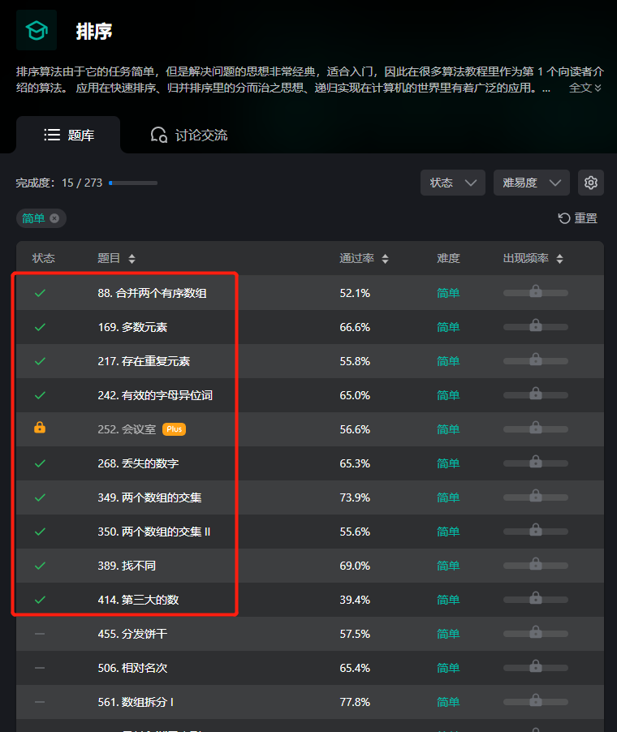

# 排序-第一轮 刷题笔记

#### 回顾

排序第一轮开始之前，做别的标签（估计大多是**数组**标签）已经通过了这么多题：

那就简单回顾一下吧。

其实以下题目虽然都带“排序”标签，大多数都不适合用排序做，因为排序的时间复杂度最低也是O(N*logN)，太低效了。

##### （数组标签）[88. 合并两个有序数组](https://leetcode-cn.com/problems/merge-sorted-array/)

双指针从后向前填即可。

##### （数组标签）[169. 多数元素](https://leetcode-cn.com/problems/majority-element/)

要么排序后直接定位到数组中间（“管中之蛇”），

要么用摩尔投票法（“一超多强的人数优势”）。

> 数组标签的刷题笔记详细记录了这两种高效解法，但不知道为什么没有实现（当时AC用的是时间O(N)空间O(N)的哈希映射，算是暴力法）。
>
> 所以我就做了一下，提交了这两种解法。

##### （数组标签）[217. 存在重复元素](https://leetcode-cn.com/problems/contains-duplicate/)

可以用HashSet一个一个存，存不进去就是出现重复元素。但是哈希表底层的构建真的很慢。

也可以先用一次遍历找到数组中的最大值和最小值，然后在这个范围内构建数组映射，然后再遍历一次数组，出现过就记录一下，如果遇到已经有过记录的元素，说明出现了重复元素。这种方法和前一种的复杂度都相同，但实际速度快多了。

##### （字符串标签）[242. 有效的字母异位词](https://leetcode-cn.com/problems/valid-anagram/)

暴力思路就哈希映射，看到小写字母限制，第一反应用**数组映射**。

> 搞笑的是，字符串第一轮是在数组第一轮后面的，所以做这道题的时候的我早就总结过了数组映射——当时称为“差值表”——的用法，但当时却完全没想到这个思路，还在折腾哈希表，时间消耗十几ms（捂脸）。
>
> 所以这次我也用数组映射提交了一下。

##### (数组标签)[268. 丢失的数字](https://leetcode-cn.com/problems/missing-number/)

区间内的数字总和，减去实际数组里的数字总和，就是丢失的那个数字。前者可以用**等差数列的前n项和公式**算出来，后者用一次直接遍历即可。

> 当时可能懒得用公式，毕竟就算直接在遍历中累加下标也是0ms，或者只是单纯的没想到可以用公式。
>
> 还是补一次提交吧。

##### (数组标签)[349. 两个数组的交集](https://leetcode-cn.com/problems/intersection-of-two-arrays/)

利用0 <= nums1[i], nums2[i] <= 1000的条件，可以用数组映射，记录nums1中哪些值出现过，然后在nums1中遍历，如果nums1中出现过，就加进交集，并把它**标记为未出现**，避免nums2中出现重复元素时往交集里添加重复数字的情况。

> 上一次我也是先想到数组映射，但是我写了很久，都没能解决nums2中也有重复元素的情况，只好改用HashSet，能自动去重。
>
> 这次重新做，重新提交，其中我大概只花了几秒钟就自然而然地解决了这个小问题，也算上“比昨天的自己厉害一点点”吧。

##### (数组标签)[350. 两个数组的交集 II](https://leetcode-cn.com/problems/intersection-of-two-arrays-ii/)

哈哈哈，和上一题没啥区别，就是把数组映射由boolean型改成int型，加进交集后，把“标记为未出现”改成“**标记出现次数减一**”，没错，就这么简单。

> Again……当时折腾了好几种解法，都没能达到0ms，而且当时我肯定是看了很多评论区和题解区的思路的，居然没看到一个执行用时beat 100%的解法？真想自己发个题解。
>
> 补一次提交。

##### (字符串标签)[389. 找不同](https://leetcode-cn.com/problems/find-the-difference/)

要么比对两个字符串的字符的ascii总值，要么用异或，算到最后剩下的就是多出来的那个字符。

> 因为两个字符串的长度只差1，因此两次遍历可以合为一次。
>
> 补一次提交。

##### (数组标签)[414. 第三大的数](https://leetcode-cn.com/problems/third-maximum-number/)

时间O(3N)的解法就是，三次遍历，第一次找最大，第二次找第二大，第三次找第三大，简单粗暴。

时间O(N)的解法是，同时维护三个变量代表前三榜单的数字，一次遍历，在遍历过程中不断更新前三榜单。由于nums[i]的取值范围完全覆盖了int型的取值范围，所以为了能够区分三个变量的初始值（最后需要确认是否存在第三大数字），应该改用long型存储，初始值设置为比Integer.MIN_VALUE更小就可以了。

2022.02.17