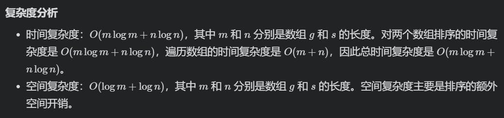
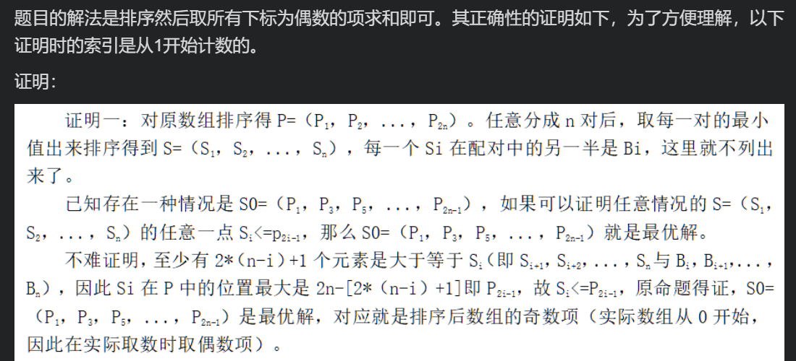

# 排序-第一轮 刷题笔记

#### 回顾  数组*7+字符串\*2

排序第一轮开始之前，做别的标签（估计大多是**数组**标签）已经通过了这么多题：


那就简单回顾一下吧。

其实以下题目虽然都带“排序”标签，大多数都不适合用排序做，因为排序的时间复杂度最低也是O(N*logN)，太低效了。

##### （数组标签）[88. 合并两个有序数组](https://leetcode-cn.com/problems/merge-sorted-array/)

双指针从后向前填即可。

##### （数组标签）[169. 多数元素](https://leetcode-cn.com/problems/majority-element/)

要么排序后直接定位到数组中间（“管中之蛇”），

要么用摩尔投票法（“一超多强的人数优势”）。

> 数组标签的刷题笔记详细记录了这两种高效解法，但不知道为什么没有实现（当时AC用的是时间O(N)空间O(N)的哈希映射，算是暴力法）。
>
> 所以我就做了一下，提交了这两种解法。

##### （数组标签）[217. 存在重复元素](https://leetcode-cn.com/problems/contains-duplicate/)

可以用HashSet一个一个存，存不进去就是出现重复元素。但是哈希表底层的构建真的很慢。

也可以先用一次遍历找到数组中的最大值和最小值，然后在这个范围内构建数组映射，然后再遍历一次数组，出现过就记录一下，如果遇到已经有过记录的元素，说明出现了重复元素。这种方法和前一种的复杂度都相同，但实际速度快多了。

##### （字符串标签）[242. 有效的字母异位词](https://leetcode-cn.com/problems/valid-anagram/)

暴力思路就哈希映射，看到小写字母限制，第一反应用**数组映射**。

> 搞笑的是，字符串第一轮是在数组第一轮后面的，所以做这道题的时候的我早就总结过了数组映射——当时称为“差值表”——的用法，但当时却完全没想到这个思路，还在折腾哈希表，时间消耗十几ms（捂脸）。
>
> 所以这次我也用数组映射提交了一下。

##### (数组标签)[268. 丢失的数字](https://leetcode-cn.com/problems/missing-number/)

区间内的数字总和，减去实际数组里的数字总和，就是丢失的那个数字。前者可以用**等差数列的前n项和公式**算出来，后者用一次直接遍历即可。

> 当时可能懒得用公式，毕竟就算直接在遍历中累加下标也是0ms，或者只是单纯的没想到可以用公式。
>
> 还是补一次提交吧。

##### (数组标签)[349. 两个数组的交集](https://leetcode-cn.com/problems/intersection-of-two-arrays/)

利用0 <= nums1[i], nums2[i] <= 1000的条件，可以用数组映射，记录nums1中哪些值出现过，然后在nums1中遍历，如果nums1中出现过，就加进交集，并把它**标记为未出现**，避免nums2中出现重复元素时往交集里添加重复数字的情况。

> 上一次我也是先想到数组映射，但是我写了很久，都没能解决nums2中也有重复元素的情况，只好改用HashSet，能自动去重。
>
> 这次重新做，重新提交，其中我大概只花了几秒钟就自然而然地解决了这个小问题，也算上“比昨天的自己厉害一点点”吧。

##### (数组标签)[350. 两个数组的交集 II](https://leetcode-cn.com/problems/intersection-of-two-arrays-ii/)

哈哈哈，和上一题没啥区别，就是把数组映射由boolean型改成int型，加进交集后，把“标记为未出现”改成“**标记出现次数减一**”，没错，就这么简单。

> Again……当时折腾了好几种解法，都没能达到0ms，而且当时我肯定是看了很多评论区和题解区的思路的，居然没看到一个执行用时beat 100%的解法？真想自己发个题解。
>
> 补一次提交。

##### (字符串标签)[389. 找不同](https://leetcode-cn.com/problems/find-the-difference/)

要么比对两个字符串的字符的ascii总值，要么用异或，算到最后剩下的就是多出来的那个字符。

> 因为两个字符串的长度只差1，因此两次遍历可以合为一次。
>
> 补一次提交。

##### (数组标签)[414. 第三大的数](https://leetcode-cn.com/problems/third-maximum-number/)

时间O(3N)的解法就是，三次遍历，第一次找最大，第二次找第二大，第三次找第三大，简单粗暴。

时间O(N)的解法是，同时维护三个变量代表前三榜单的数字，一次遍历，在遍历过程中不断更新前三榜单。由于nums[i]的取值范围完全覆盖了int型的取值范围，所以为了能够区分三个变量的初始值（最后需要确认是否存在第三大数字），应该改用long型存储，初始值设置为比Integer.MIN_VALUE更小就可以了。

2022.02.17


#### [455. 分发饼干](https://leetcode-cn.com/problems/assign-cookies/)

假设你是一位很棒的家长，想要给你的孩子们一些小饼干。但是，每个孩子最多只能给一块饼干。

对每个孩子 i，都有一个胃口值 g[i]，这是能让孩子们满足胃口的饼干的最小尺寸；并且每块饼干 j，都有一个尺寸 s[j] 。如果 s[j] >= g[i]，我们可以将这个饼干 j 分配给孩子 i ，这个孩子会得到满足。你的目标是尽可能满足越多数量的孩子，并输出这个最大数值。

> 示例 1:
>
> 输入: g = [1,2,3], s = [1,1]
> 输出: 1
> 解释: 
> 你有三个孩子和两块小饼干，3个孩子的胃口值分别是：1,2,3。
> 虽然你有两块小饼干，由于他们的尺寸都是1，你只能让胃口值是1的孩子满足。
> 所以你应该输出1。
> 示例 2:
>
> 输入: g = [1,2], s = [1,2,3]
> 输出: 2
> 解释: 
> 你有两个孩子和三块小饼干，2个孩子的胃口值分别是1,2。
> 你拥有的饼干数量和尺寸都足以让所有孩子满足。
> 所以你应该输出2.
>
>
> 提示：
>
> 1 <= g.length <= 3 * 104
> 0 <= s.length <= 3 * 104
> 1 <= g[i], s[j] <= 231 - 1

这题太经典了，就是那本《LeetCode 101 》的书的第一道题。

**最优解当然是：排序后双指针贪心算法。**

先做排序，然后维护双指针，从最小的孩子和最小的饼干开始查——为了满足更多孩子，肯定先看胃口小的孩子，而且如果可以的话，肯定要给孩子能够满足它胃口的最小饼干。

如果这块饼干够吃，计数就+1，孩子指针+1（已经吃了），饼干指针+1（已经被吃了）；

如果不够吃，饼干指针也+1（如果目前还没吃到饼干的孩子中，胃口最小的那个，都对这块饼干不满意，那这块饼干就不用了，反正剩下的孩子都是胃口更大的，更看不上这块饼干了）。

等到孩子查完或者饼干查完，就退出循环，返回计数值。



2022.02.18


#### [506. 相对名次](https://leetcode-cn.com/problems/relative-ranks/)

给你一个长度为 `n` 的整数数组 `score` ，其中 `score[i]` 是第 `i` 位运动员在比赛中的得分。所有得分都 **互不相同** 。

运动员将根据得分 **决定名次** ，其中名次第 `1` 的运动员得分最高，名次第 `2` 的运动员得分第 `2` 高，依此类推。运动员的名次决定了他们的获奖情况：

- 名次第 `1` 的运动员获金牌 `"Gold Medal"` 。
- 名次第 `2` 的运动员获银牌 `"Silver Medal"` 。
- 名次第 `3` 的运动员获铜牌 `"Bronze Medal"` 。
- 从名次第 `4` 到第 `n` 的运动员，只能获得他们的名次编号（即，名次第 `x` 的运动员获得编号 `"x"`）。

使用长度为 `n` 的数组 `answer` 返回获奖，其中 `answer[i]` 是第 `i` 位运动员的获奖情况。

> **示例 1：**
>
> ```
> 输入：score = [5,4,3,2,1]
> 输出：["Gold Medal","Silver Medal","Bronze Medal","4","5"]
> 解释：名次为 [1st, 2nd, 3rd, 4th, 5th] 。
> ```
>
> **示例 2：**
>
> ```
> 输入：score = [10,3,8,9,4]
> 输出：["Gold Medal","5","Bronze Medal","Silver Medal","4"]
> 解释：名次为 [1st, 5th, 3rd, 2nd, 4th] 。
> ```
>
> **提示：**
>
> - `n == score.length`
> - `1 <= n <= 104`
> - `0 <= score[i] <= 106`
> - `score` 中的所有值 **互不相同**

这道题挺典型的，之前好像也做过：给一个数组，要按值排序，又要按原来的顺序输出。

要么用HashMap，要么用二维数组（第二维长度为2，一个是原来的下标，一个是该下标下的值），这样就能够保证对每一个值排序之后，还能记住它原来所在的位置。

```java
int[][] index2Score = new int[n][2];
```

`index2Score[5][0或1]`的5代表这是排序后的第5大或第5小元素，0代表该元素原来的下标，1代表该元素的值。

然后用lambda表达式就好了。

```java
//Arrays API
public static <T> void sort(T[] a, Comparator<? super T> c)
```

2022.02.20

#### [561. 数组拆分 I](https://leetcode-cn.com/problems/array-partition-i/)

给定长度为 2n 的整数数组 nums ，你的任务是将这些数分成 n 对, 例如 (a1, b1), (a2, b2), ..., (an, bn) ，使得从 1 到 n 的 min(ai, bi) 总和最大。

返回该 最大总和 。

> 示例 2：
>
> 输入：nums = [6,2,6,5,1,2]
> 输出：9
> 解释：最优的分法为 (2, 1), (2, 5), (6, 6). min(2, 1) + min(2, 5) + min(6, 6) = 1 + 2 + 6 = 9
>
>
> 提示：
>
> 1 <= n <= 104
> nums.length == 2 * n
> -10^4 <= nums[i] <= 10^4

排序后，让相邻数字两两匹配即可，最小的和第二小的配对，第二大的与最大配对，即为最优解。

**直觉上来说**，我的思路是，因为要使最终总和最大，所以尽可能要留下大的数，可是由于是min，所以最大的数没法留下……那就留第二大的呀！所以就有了“第二大的与最大配对”，这对匹配完，剩下最大的就是原来第三大和第四大的，同理，没法留下第三大，那就留下第四大的，以此类推……**每次都选择当前可以选的最大的数，最后的结果【应该】也是最大的。**

**如何证明呢？**如果面试的时候能说出证明思路，那肯定比上面那种直觉思路好多了。

> 为什么要「证明」或「理解证明」？
> 证明的意义在于，你知道为什么这样做是对的。
>
> 带来的好处是：
>
> 一道「贪心」题目能搞清楚证明，那么同类的「贪心」题目你就都会做了。否则就会停留在“我知道这道题可以这样贪心，别的题我不确定是否也能这样做”。
> 在「面试」阶段，你可以很清晰讲解你的思路。让面试官从你的「思维方式」上喜欢上你（ emmm 当然从颜值上也可以 :)
>
> 引用自：[【宫水三叶の相信科学系列】反证法证明贪心算法的正确性 - 数组拆分 I - 力扣（LeetCode）](https://leetcode-cn.com/problems/array-partition-i/solution/jue-dui-neng-kan-dong-de-zheng-ming-fan-f7trz/)

放一个我能理解的证明：

> 
>
> 引用自：[关于排序取偶数项的正确性证明，超级简单易懂的严格证明 - 数组拆分 I - 力扣（LeetCode）](https://leetcode-cn.com/problems/array-partition-i/solution/guan-yu-pai-xu-qu-ou-shu-xiang-de-zheng-que-xing-z/)

2022.02.20


#### [594. 最长和谐子序列](https://leetcode-cn.com/problems/longest-harmonious-subsequence/)

和谐数组是指一个数组里元素的最大值和最小值之间的差别 正好是 1 。

现在，给你一个整数数组 nums ，请你在所有可能的子序列中找到最长的和谐子序列的长度。

数组的子序列是一个由数组派生出来的序列，它可以通过删除一些元素或不删除元素、且不改变其余元素的顺序而得到。

> 示例 1：
>
> 输入：nums = [1,3,2,2,5,2,3,7]
> 输出：5
> 解释：最长的和谐子序列是 [3,2,2,2,3]
> 示例 2：
>
> 输入：nums = [1,2,3,4]
> 输出：2
> 示例 3：
>
> 输入：nums = [1,1,1,1]
> 输出：0
>
>
> 提示：
>
> 1 <= nums.length <= 2 * 10^4
> -10^9 <= nums[i] <= 10^9

注意：“子序列”可以是不连续的（删除一些元素）。

思路：**对于每一个元素x，只需要找到在整个数组中x和x+1的个数，加起来就是和谐子序列的长度。**然后与目前找到的最大的比较一下，取更大的记录下来。

**解法一：哈希映射  O(N)  O(N)  52%  5%**

我们说到“个数”，那就很自然地想到用HashMap统计各个数字出现的次数，这种解法最为直观。

一次遍历，统计完；再来一次遍历，对于每一个元素x，如果数组里存在x+1，就把x和x+1的出现次数加起来，就是它们组成的和谐序列的长度；然后与当前已知的最大长度比较取最大即可。

**解法二：滑动窗口  O(N*logN + N)  O(logN + 1)  96%  5%**

排序后，使用双指针扫描数组，统计所有符合条件的窗口长度，比较取最大值。

关键是，滑动窗口该怎么移动？（我一开始的思路也是滑动窗口，但却写不出移动细节……官方题解很巧妙，学习一下）

首先，除了要有maxLen变量，还要有start和end变量。

```java
class Solution {
    public int findLHS(int[] nums) {
        Arrays.sort(nums);
        int start = 0;
        int maxLen = 0;
        for(int end = 1; end < nums.length; end++) {
            //排除start的位置不可能产生和谐序列的情况
            while(nums[end] - nums[start] > 1) {
                start++;
            }
            //退出小循环时，nums[end]-nums[start]要么等于1（已经发现和谐序列），
            if(nums[end] - nums[start] == 1) {
                maxLen = Math.max(maxLen, end - start + 1);
            }
            //要么等于0（即[end]、[start]相等，特殊情况，需要让end先走到[end]、[start]不相等的地方，再考虑别的事情）
        }
        return maxLen;
    }
}
```

2022.02.22

#### [628. 三个数的最大乘积](https://leetcode-cn.com/problems/maximum-product-of-three-numbers/)

给你一个整型数组 `nums` ，在数组中找出由三个数组成的最大乘积，并输出这个乘积。

> 示例 1：
>
> 输入：nums = [1,2,3]
> 输出：6
> 示例 2：
>
> 输入：nums = [1,2,3,4]
> 输出：24
> 示例 3：
>
> 输入：nums = [-1,-2,-3]
> 输出：-6
>
>
> 提示：
>
> 3 <= nums.length <= 104
> -1000 <= nums[i] <= 1000

大多数情况下，答案都是数组中最大的三个数相乘，这个很明显。

但是有一种特殊情况，那就是两负一正的情况，因为负负得正，所以有可能比上一种方案的乘积更大。

**解法一：排序后处理  16%  17%  O(N*logN)  O(logN)**

```java
class Solution {
    public int maximumProduct(int[] nums) {
        Arrays.sort(nums);
        int len = nums.length;
        //一个数字可能是负数/0/正数。
        //必定适用于nums所有元素全是正数/全是负数/0在头/0在尾的情况（易证明）
        int result = nums[len - 1] * nums[len - 2] * nums[len - 3]; 
        //如果nums中既有正数又有负数
        if(nums[0] < 0 && nums[len - 1] > 0) {
            //必须要存在至少两个负数，才能出“负负得正”的bug
            if(nums[1] < 0) {
                //绝对值最大的负数 * 绝对值第二大的负数 * 最大的正数之积，可能会更大
                result = Math.max(result, nums[0] * nums[1] * nums[len - 1]);
            }
        }
        return result;
    }
}
```

**解法二：找三个最大值和两个最小值  100%  20%  O(N)  O(1)**

上一种解法的时间空间消耗，全在排序那一步，但是，我们最终需要的仅仅是最大的那三个数和最小的两个数，不需要大费功夫去对整个数组做排序。

参考本轮“回顾”部分的414题（寻找第三大的数），遍历数组，维护**“前三大”榜单**和**“前二小”榜单**即可。

由于-1000 <= nums[i] <= 1000，所以max的初始值定在-1001，min的初始值定在1001即可，不用像414题一样用long存。

不过由于要同时维护两个榜单，所以要注意，在遍历时，每一个元素都有可能同时入选两个榜单，所以要写两个并列的if，不能写成if-if else。

```java
class Solution {
    public int maximumProduct(int[] nums) {
        int max1 = -1001;   //第一大
        int max2 = -1001;
        int max3 = -1001;
        int min1 = 1001;
        int min2 = 1001;    //第一小
        for(int num: nums) {
            if(num > max3) {
                if(num > max2) {
                    if(num > max1) {
                        max3 = max2;
                        max2 = max1;
                        max1 = num;
                    }
                    else {
                        max3 = max2;
                        max2 = num;
                    }
                }
                else {
                    max3 = num;
                }
            }
            //为什么不用else if？因为一个数有可能既入选了max榜，也入选了min榜。
            if(num < min2) {
                if(num < min1) {
                    min2 = min1;
                    min1 = num;
                }
                else {
                    min2 = num;
                }
            }
        }
        return Math.max(max1 * max2 * max3, min1 * min2 * max1);
    }
}
```

2022.02.22


#### [645. 错误的集合](https://leetcode-cn.com/problems/set-mismatch/)

<u>集合 `s` 包含从 `1` 到 `n` 的整数。</u>不幸的是，因为数据错误，导致集合里面某一个数字复制了成了集合里面的另外一个数字的值，导致集合 **丢失了一个数字** 并且 **有一个数字重复** 。

给定一个数组 `nums` 代表了集合 `S` 发生错误后的结果。

请你找出重复出现的整数，再找到丢失的整数，将它们以数组的形式返回。

> 示例 1：
>
> 输入：nums = [1,2,2,4]
> 输出：[2,3]
> 示例 2：
>
> 输入：nums = [1,1]
> 输出：[1,2]
>
>
> 提示：
>
> 2 <= nums.length <= 10^4
> 1 <= nums[i] <= 10^4

**思路1   暴力解  O(N*logN)  O(logN)**

排序后直接遍历，找重复元素和缺失元素。

对于重复元素，看当前元素`curr`是否与前一个元素`prev`相同即可，很简单。

对于缺失元素，看当前元素`curr`是否与前一个元素`prev`相差1即可，但是要注意**“首尾特殊情况”**：

* 如果缺失元素刚好是1，如何判断？把`prev`变量的初始值设为0就可以照常判断了，类似**虚拟结点**的概念。
* 如果缺失元素刚好是n，如何判断？遍历完再做一个特殊操作，看最后一个元素是不是n。

**思路2	HashMap  O(N)  O(N)**

很直观的，遍历一次数组，用HashMap记录出现次数嘛。

然后再遍历数字1~n，用HashMap查它们的出现次数，出现2次的就是重复元素，出现0次的就是缺失元素。

**思路2优化  ArrayMap  O(2N)  O(1N)——推荐**

由于nums[i]的最大取值刚好是nums.length，所以可以**用数组取代思路2的哈希映射，以减少HashMap的哈希函数执行和冲突扩容的时间开销。**

```java
class Solution {
    public int[] findErrorNums(int[] nums) {
        int[] arrMap = new int[nums.length + 1];
        for(int num: nums) {
            arrMap[num]++;
        }
        int duplicateNum = 0, missingNum = 0;
        for(int i = 0; i < arrMap.length; i++) {
            if(arrMap[i] == 0) {
                missingNum = i;
            }
            else if(arrMap[i] == 2) {
                duplicateNum = i;
            }
        }
        return new int[]{duplicateNum, missingNum};
    }
}
```

**思路3  HashSet  O(N)  O(N)**

遍历一次数组，add失败就说明是重复元素，同时记录一个actualSum记录整个数组的总和。

知道重复元素后，就可以通过对比rightSum和actualSum来推算缺失的元素——具体地说，actualSum与rightSum之差，就是重复元素与缺失元素之差。

**思路3优化+改进  ArraySet  ——推荐**

第一步类似思路3，已经出现过（不能add）就说明是重复元素。

缺失元素怎么找呢？由于这是数组，随机访问速度很快，所以直接查没有出现过的就好。

没有必要按照思路3那样做（虽然完全可行）。思路3用的HashSet是无序的，而且遍历还要用迭代器，所以才需要用rightSum和actualSum来推算。

```java
class Solution {
    public int[] findErrorNums(int[] nums) {
        int duplicateNum = 0, missingNum = 0;
        boolean[] arrSet = new boolean[nums.length + 1];
        for(int num: nums) {
            //当前元素已存在，发现重复元素
            if(arrSet[num]) {
                duplicateNum = num;
            }
            //将当前元素加入Set
            else {
                arrSet[num] = true;
            }
        }
        //注意从1开始，因为nums中必定没有0，所以arrSet[0]必定为false
        for(int i = 1; i < arrSet.length; i++) {
            if(! arrSet[i]) {
                missingNum = i;
                break;
            }
        }
        return new int[]{duplicateNum, missingNum};
    }
}
```

2022.02.22


第16道：